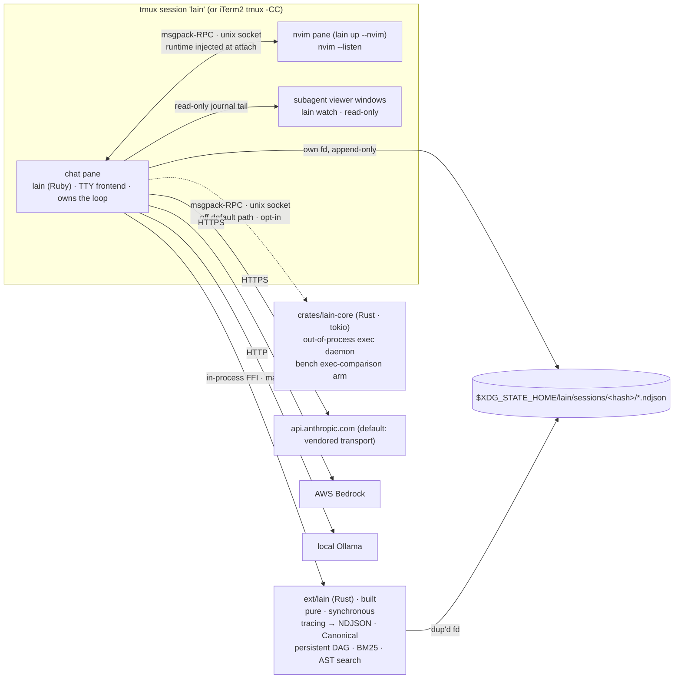
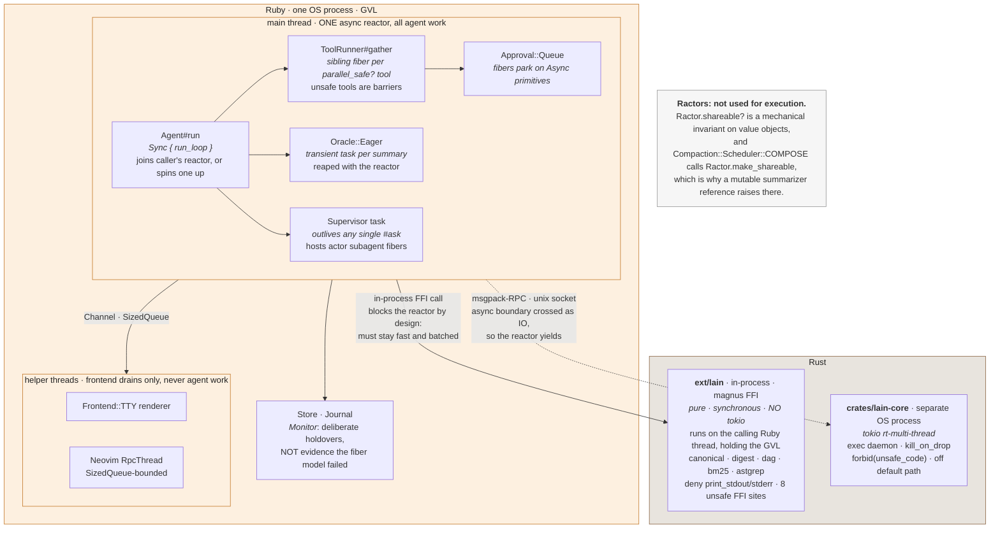
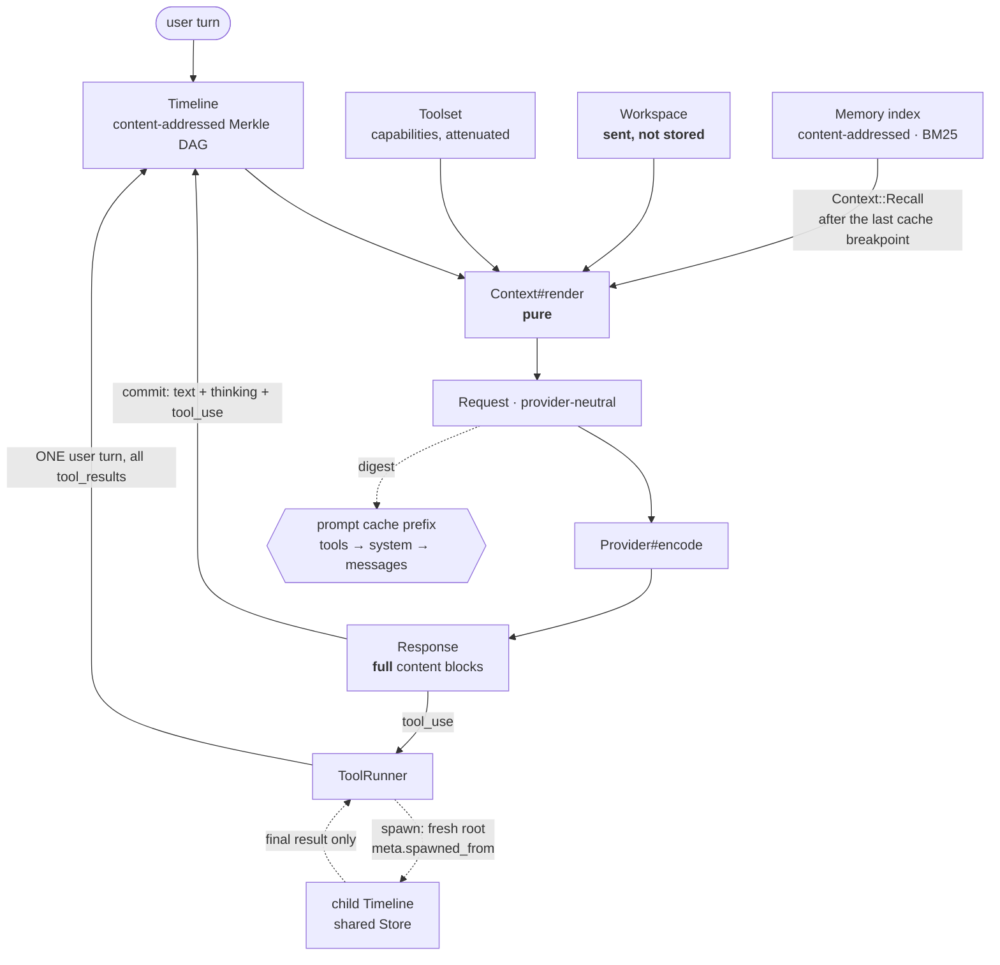
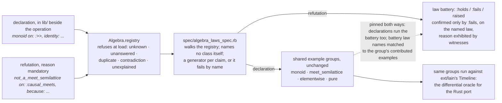
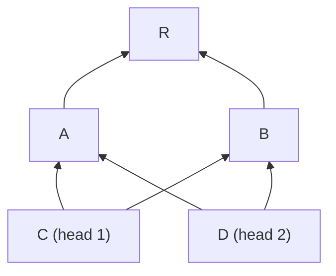
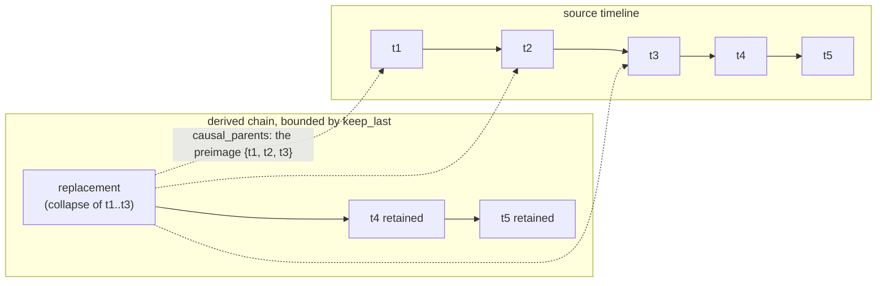

# Architecture

This document is for people changing lain, and it names the files behind each concept at `HEAD`
so you can go from an idea straight to the code. The README is the user-facing view; this one
assumes you are about to edit something.

Where this document and the README disagree, follow this one. Where either disagrees with the
code, follow the code.

## Process topology

`lain` is one Ruby process that owns the loop, and it runs tmux-native. `lain up` creates (or
reattaches to) a tmux session with a `chat` window and a session-scoped status HUD. `lain up
--nvim` splits that window into an `nvim --listen` pane and a `chat` pane pinned to one cwd and
one deterministic socket, so the editor and the chat that attaches to it can never diverge. The
window layer is a multiplexer concern, so the same tmux session renders under iTerm2's `tmux
-CC` on macOS.

Two frontends subscribe to one Journal, and the agent knows about neither. `Frontend::TTY`
(`lib/lain/frontend/tty.rb`) is the chat pane. `Frontend::Neovim`
(`lib/lain/frontend/neovim.rb`) injects its whole runtime (every `lain://` buffer, every
`:Lain*` command, all RPC) into a bare editor at attach time over msgpack-RPC on a Unix socket.
Subagent spawns can open read-only viewer windows (`chat --windows`, each running `lain watch`,
`lib/lain/cli/watch.rb`).

`crates/lain-core` and Neovim talk to `lain` over the same transport, msgpack-RPC on a Unix
socket, which is why they look symmetric below. The Neovim path is live. The `lain-core` path is
dashed because that daemon is off the default chat path today: opt-in `:core` specs and the
bench's exec-comparison arm only. `ext/lain` is in-process and built.



### Runtime boundaries: which language, which scheduler

The diagram above is about processes and panes. This one is about *where your code actually
runs*, which is the question that decides whether a change of yours is allowed to block.



Four consequences worth internalizing before you write code on either side:

- **Everything the agent does shares one OS thread.** Fibers yield only at IO boundaries the
  scheduler controls, which is what makes the parallel-tool fan-out safe with no lock anywhere.
  It also means a non-yielding call anywhere on that reactor stalls all of it, including the
  drain feeding the frontend.
- **An `ext/lain` call blocks the reactor and that is the design.** It is synchronous by the
  placement rule, so it must stay fast and cross the FFI boundary in batches. A per-element call
  inside a DAG walk loses to plain Ruby and stalls the loop while losing.
- **A `lain-core` call does not**, because it is IO. The msgpack-RPC round trip is a socket read
  the scheduler hooks, so the reactor yields to other fibers while the daemon works. That
  asymmetry is the placement rule restated at runtime.
- **The 2 real threads are frontend drains.** Neither runs agent work. Both exist because a
  renderer that falls behind must not block the render path, which is also why `Channel` and
  `Channel::DropOldest` have different overflow policies (below).

Why the posture is `async` fibers rather than threads or Ractors, and the measurements behind
the shellout and flood decisions, are argued in [`docs/concurrency.md`](docs/concurrency.md).

## Data flow

What is *sent* to the model versus what is *stored* in the Timeline is the distinction the whole
design turns on. `Workspace` renders into the `Request` and is never appended to the Timeline.

A subagent gets a fresh root over the shared `Store`. `meta["spawned_from"]` names the parent's
head for causal lineage, and the child's prompt chain never includes the parent's conversation.
Only the child's final result re-enters the parent's Timeline, as an ordinary `tool_result`.



The sections below name the files behind each box.

## Canonical, Event, Store, Timeline

| Concept | Files |
|---|---|
| Deterministic serialization | `lib/lain/canonical.rb` |
| Content addressing (digest mixin) | `lib/lain/content_addressed.rb` |
| The envelope that generalizes `Turn` | `lib/lain/event.rb`, `lib/lain/event/payload.rb` |
| The append-only object database | `lib/lain/store.rb` |
| The (head digest, store) pointer | `lib/lain/timeline.rb` |
| Deep immutability | `lib/lain/freezable.rb` |

`Lain::Canonical` produces deterministic bytes: sorted keys, stable array order, BLAKE3 digest.
Those bytes carry two invariants at once, event identity and prompt-cache stability. That is
the "one function, two invariants" claim in `CLAUDE.md`.

There is no standalone `Turn` class in the current tree. `Lain::Event` (`lib/lain/event.rb`)
is a CloudEvents-shaped envelope with a closed `KINDS` set (`turn spawn message snapshot`).
`Event.turn(...)` does what `Turn.new` used to do, and `Timeline#commit`
(`lib/lain/timeline.rb`) calls exactly that. The Merkle-DAG properties `CLAUDE.md` describes are
unchanged, now built over `Event`.

`Store` (`lib/lain/store.rb`) is the append-only, content-addressed map underneath. A
`Timeline` is only ever a `(head_digest, store)` pair, which is why `#fork` returns `self`:
under immutability, forking and identity are the same operation.

### Two parent edges

The render chain and the causal graph diverge on purpose. `render_parent` is the single
first-parent edge the model sees. `causal_parents` is a set carried by `:spawn` and `:message`
events (subagent lineage, below) that never enters a render chain. `Store#put` checks
referential integrity on both.

### Three meets

The 2 edge kinds and the 2 orders over them give `Timeline` 3 distinct greatest-lower-bound
queries, and they are not interchangeable.

`#meet` (aliased `&`) is the render-edge meet: the deepest common ancestor along the first-parent
walk, returned as a `Timeline`. `#diverge_at` is its head digest, which is all cache-break
localization needs. These stay render-only deliberately, so their answers do not move as causal
edges land.

`#causal_meets` is reachability over *both* edges, git's "all parents". The causal DAG admits no
unique greatest lower bound, so this returns the **set** of maximal common ancestors, in digest
order, the way `git merge-base` does. `Timeline::CausalAncestry` computes it with one
reflexive-transitive closure per head and a single closure over the candidates' parents to
discard the non-maximal ones, rather than a walk per candidate pair.

`#dominator_meet` (TL-3) is the checkpoint primitive: the deepest common dominator of the 2 heads
over the union graph, under a virtual root spanning the closure's forest roots. That is the
latest event every path from the root to both heads must pass through, so it is the latest point
no in-flight branch can bypass, which makes it the answer for synchronization and safe
compaction. A node's dominators are totally ordered, so unlike `#causal_meets` this one is a
genuine meet-semilattice, and its laws run under the same shared property group as the render
meet with dominance injected.

`Timeline::Dominators::Tree` builds it with Cooper, Harvey, and Kennedy's "A Simple, Fast
Dominance Algorithm": immediate dominators by intersect-walks over a topological rank, after
which any meet is a nearest-common-ancestor query on the dominator tree. Their worklist collapses
to a single sweep here, because content addressing forces the union graph acyclic (an event can
only name earlier digests), so one topological pass is already the fixed point. Memoization lives
on the injected `Dominators` keyed by head-digest pair, since `Timeline` values are frozen.

The known caveat is inherent to causal stability rather than a defect: one quiet participant
stalls the frontier. An open subagent branch, spawned but not yet folded back, pins
`#dominator_meet` at or before its spawn point however far the parent advances, until that branch
speaks or closes. Actors' explicit stop is the operational mitigation.

## `Context#render` is a pure function

`Context#render` (`lib/lain/context.rb`, `lib/lain/context/base.rb`) is the pure function
`(Timeline, Toolset, Workspace) -> Request` that `CLAUDE.md` names. Purity means no `Time.now`,
no session ids, and no `Dir.pwd` inside `#render`. Prompt caching imposes the same constraint on
the encoded request, so purity and cache-hit-ability are one requirement. `Workspace` and
`Request` are the 2 collaborators that purity is defined against.

Eleven combinators live under `lib/lain/context/`, each an endomorphism on the message list:

| Combinator | What it does |
|---|---|
| `cache_breakpoints.rb` | places the cache breakpoints; requires `:prompt_caching` |
| `reminder.rb` | folds the `Workspace` into the request tail |
| `prune.rb` | drops all but the last N |
| `compact.rb` | rewrites the head through an injected pure `summarizer` |
| `protected_patterns.rb` | the exclusion policy `compact.rb` partitions its drop set with |
| `dedupe_tool_calls.rb` | collapses repeated identical calls |
| `purge_failed_inputs.rb` | removes inputs whose calls errored |
| `recall.rb` | injects memory hits after the last cache breakpoint |
| `mailbox.rb` | folds inter-actor messages in |
| `message_envelope.rb` | the envelope shape a folded message takes |
| `tail_injection.rb` | appends at the tail without disturbing the cached prefix |

`Context.pipeline` (in `context.rb`) composes the chain, today
`Reminder.new(workspace:) >> CacheBreakpoints.new`, using `Middleware::Composable`'s `>>`
operator (below). `Context::REQUIRES` is derived from that same pipeline, so a capability
declaration cannot drift from what `#render` actually runs.

`Workspace` (`lib/lain/workspace.rb`) carries the sent-not-stored state: todos, staleness
ledger, budget countdown. `Reminder` folds it into the request tail. It is never appended to
the `Timeline`, and that omission is the whole mechanism behind `CLAUDE.md`'s "Workspace is
sent, not stored".

## Compaction, oracles, and memory

Compaction is **on by default** on the live chat path, and it splits across 2 tiers that fail
independently.

**The eager tier is a live model call, off the critical path.** `Oracle::Eager`
(`lib/lain/oracle/eager.rb`) fires one summary per large tool result on its own transient
`Async` task and holds the answer keyed by the result's **source digest**. An immutable source
can never go stale, so the digest is the correct key. The tier is always a **local** model,
never the chat's provider (`CLI::Backend#summary_oracle` wires `Provider::Ollama`
unconditionally): a fire happens per large result, and paying frontier tokens to compress one
would cost more than resending it. Containment is the point of the task boundary. A fire that
raises dies with its task, journals nothing, holds nothing, and never surfaces at the reactor.
With no ambient reactor at all, `#fire` is a graceful no-op returning `nil`, which is what keeps
the handler chain runnable as plain synchronous Ruby.

**The compacting turn itself is pure.** `Context::Compact` takes a `summarizer` answering
`#call(Array<Hash>) -> String`, and on the live path that is a `Compaction::SummarySnapshot`
(`lib/lain/compaction/summary_snapshot.rb`): a frozen copy of what the Eager held as of this
turn. It must be a snapshot rather than the live Eager for 2 reasons. The Eager stays mutable as
fires land, so a `Compact` referencing one is not `Ractor.shareable?` and `Scheduler::COMPOSE`'s
`Ractor.make_shareable` raises on the first compacting turn. And cutting the reference makes the
render deterministic: a fire landing mid-turn cannot change the bytes this turn's prompt is
built from. A digest with no held summary renders an elision line. **Always build one with
`.take`**. A hand-built map passes the content-address validator while missing every lookup,
silently and permanently, and `#hits`/`#misses` report 0/0, which is indistinguishable from a
snapshot over no messages.

The decision machinery is 4 collaborators, split because they answer different questions:

| File | Question |
|---|---|
| `compaction/head.rb` | *What* would be elided this turn, and how big is it, in `Context#render`'s own byte projection |
| `compaction/need.rb` | Is a compaction *warranted* (byte threshold, or approaching the context window) |
| `compaction/cold.rb` | Is the prompt cache *cold*, so the rewrite costs nothing to defer for |
| `compaction/scheduler.rb` | Given those, does one run *now*, and what did it cost |

`Head` exists because that question had 2 answers: `Compact#call` derived its own drop set from
`keep_last` while `Need` measured a head its caller supplied, and a one-message disagreement is
invisible (Need raises the flag over a window Compact declines to drop, every turn, with no
error anywhere). Both now receive the same object. A `Head` paired with a `Compact` **must** keep
`protected_patterns` at `ProtectedPatterns::NONE`; a real policy makes the head a superset of
what is removed and reintroduces exactly that silent disagreement.

`Compaction::Prepared` (`lib/lain/compaction/prepared.rb`) is the third policy, separate from
both: what happens across repeated **idle ticks**. Idle time is a series of ticks, so a naive
compact-on-idle would re-run and re-pay the summarizer once per tick at an unchanged head. The
result is computed once per head digest and held; only a new head invalidates it. The
long-idle gate is the caller's job and is deliberately unenforced here.

**The wiring is where this gets subtle.** `CLI::CompactionMount`
(`lib/lain/cli/compaction_mount.rb`) plugs 3 things into one `Agent.new`, and the third is the
reason it is an object rather than 3 keywords: `Compaction::Source#context_for` is handed the
last turn's input tokens as an Integer, but `Compaction::Cold` needs `cache_read_input_tokens`,
which exists only on a model **response**. So the Source is *also* a `#<<` sink and rides the
Agent's turn-usage journal through a `CLI::JournalTee`. Skip that tee and nothing fails: the
byte threshold and hard cap still fire, but `Cold` is never fed, the `:cold` path is dead, and
every compaction journals `cache_state: forced`, quietly turning a bench comparison arm into an
arm that measures nothing.

`CLI::Backend#pipeline_source` is memoized for the same class of reason and raises
`Backend::Rebound` on a second call with different arguments, because the Source accumulates run
state (`Cold`'s observed warmth, `Eager`'s fired summaries) and a rebuilt one would reset both
every turn while nothing raised. Compaction also gets its **own** `PriceBook` degrading to zero,
so a local model with no list price cannot crash a chat mid-conversation;
`Telemetry::Compaction` carries the model those figures are quoted in, so a zero beside
`qwen3:4b` reads as the fallback it is.

**The oracle tiers generalize this.** An `Oracle::Definition` (template + schema + tier) is
content-addressed, so a heuristic answer and a model answer to the same question are 2 different
oracles at 2 different addresses. `Heuristic` is deterministic Ruby, `Model` is a live call,
`Recorded` replays journaled answers, and `Recorded::Journaling` decorates any tier so every Q&A
rides the existing `Telemetry::OracleAnswer` path. `Summarize`, `PruneScoring`, and `MemorySave`
are the 3 shipped questions.

**Memory** (`lib/lain/memory/`) is a content-addressed index with a `manifest`, a `graph`, and
`bm25`/`hybrid` retrieval, written through `memory/recorder.rb` and read back by
`Context::Recall`, which injects **after the last cache breakpoint** so a recall cannot break the
cached prefix. `Embedder` (`lib/lain/embedder/`) is the batched seam for a real embedding backend
against a deterministic PHI-free one.

## Effects, handlers, Gate, and Middleware

A tool call or model call is built as an `Effect`: frozen `Data` values in `lib/lain/effect.rb`
(`Effect::ToolCall`, `Effect::ModelCall`, `Effect::Approval`). An `Effect::Handler`
(`lib/lain/effect/handler.rb`) interprets it.

Handlers compose by decoration. Each holds an optional `inner` and delegates whatever it does
not handle itself, the same chain-of-responsibility shape `Middleware::Composed` uses one layer
up. `Effect::Handler::Live` (`lib/lain/effect/handler/live.rb`) dispatches a tool.
`Effect::Handler::Gate` (`lib/lain/effect/handler/gate.rb`) wraps an inner handler and asks an
injected `policy` (`ApproveAll`, `DenyAll`, or a real interactive queue) before letting a
tier-gated `ToolCall` through. `Gate` holds no `Toolset` of its own; it asks its `inner` what a
tool name resolves to, so gating and dispatch can never disagree about what a name means.
`Effect::Handler::Mock` and `Effect::Handler::Recorded` are the deterministic-replay handlers
`CLAUDE.md` refers to when it says replay is a recorded handler.

`Lain::Middleware` (`lib/lain/middleware.rb`) is the Rack/Sidekiq/Faraday-idiom public API over
that same composition. `Composable#>>`, `Composed`, and `Base` are a property-tested monoid:
associative, with `Identity` as pass-through.

Four middleware phases ride this API today: model, tool, turn, and repl.
`lib/lain/middleware/journal_requests.rb` and `journal_turns.rb` are the model and turn phases
that write into the session record (disk layout below). `refuse_secret_writes.rb` is a
tool-phase middleware that withholds a credential-shaped `memory_write` before it reaches the
recorder. `skill_dispatch.rb` is the repl-phase middleware a `@role/skill` line folds through.

**Why the model phase exists at all**, rather than pushing instrumentation into Faraday: lain
runs 2 transports that do not share an HTTP stack. `Provider::Anthropic` (the SDK oracle) is on
`net/http` and `connection_pool`; `Provider::AnthropicRaw` (the default path) is Faraday-based.
Faraday middleware can wrap the second and not the first, so it cannot be where cross-transport
instrumentation lives. The model phase is the one layer at which both transports look identical
to the bench, which is why retries, cost accounting, and cache instrumentation live there.

**`Middleware::Timeout` cannot interrupt**, and its doc comment says so at length. Interrupting
arbitrary Ruby needs a watchdog thread, which the no-threads posture rules out. It publishes a
monotonic `env[:deadline]` a cooperative downstream may honor and measures elapsed time at the
boundary, raising `Exceeded` after the fact. Anything you write into a middleware runs inside the
tool's own fiber, so a non-yielding middleware stalls the reactor and nothing can stop it: see
[`docs/concurrency.md`](docs/concurrency.md).

`Agent::ToolRunner` (`lib/lain/agent/tool_runner.rb`) is where `Effect::Handler#middleware_app`
(the adapter that lets a `Handler` terminate a `Middleware::Stack`) gets driven from the loop.
The loop itself, `Lain::Agent` (`lib/lain/agent.rb`) with `Agent::Budget` and
`lib/lain/agent/loop_machine.rb`, is a `state_machines` state machine. A spec generates
[`docs/agent-state-machine.md`](docs/agent-state-machine.md) from it and fails the build on
drift. That document covers `stop_reason` handling, which this one does not repeat.

## Tools, tiers, and the toolset

A `Tool` (`lib/lain/tool.rb`, with 23 classes under `lib/lain/tools/`) declares 2 orthogonal
properties about itself, and both default to the conservative answer so a new tool must opt in
deliberately.

`#requires_approval?` is the **tier** axis, and the tiers are not a list the gate maintains. Tier
1 is direct Ruby with no subprocess. Tier 2 is an argv Array through `Mixlib::ShellOut`. Neither
has a model-controlled command string, so neither gates. Tier 3 is a String command through
`sh -c`, and those override to `true`. The axis that predicts danger is **whether the model
controls the command string**, not read-versus-write, which is why `write_file` does not gate and
`bash` does.

`#parallel_safe?` is the concurrency axis: reads only, no `Session` write-set mutation, no
process-global state. `Agent::ToolRunner#gather` fans a contiguous run of safe tools out as
sibling fibers; every unsafe tool is a barrier that runs alone, in wire order.
`spec/lain/tools/parallel_safety_spec.rb` pins the true-set and false-set to equal the shipped
toolset exactly, so a new tool must choose or fail by name. The reasoning behind the barrier
semantics, and the rejected subset-first alternative, is in
[`docs/concurrency.md`](docs/concurrency.md).

`Toolset` (`lib/lain/toolset.rb`) is a frozen `Enumerable` whose `#only` and `#except` return new
attenuated sets. That is the whole authorization model: possession is the authorization, and
`toolset.only(:read_file, :grep)` is a capability, not a permission check. `Tool::SpawnPolicy`
packages an attenuation for a named `Role`, resolved through `Role::Catalog` so a role's tool set
cannot drift between its definition and a spawn site.

`Tool::Input` (`lib/lain/tool/input.rb`) is ActiveModel: one field declaration yields both the
JSON Schema the model sees and the local validation, so they cannot diverge, and coercion is
free. Its validations check **shape, not safety**; the file's header comment says so, because
they read like security controls and are not.

`Tool::Contracts` (`lib/lain/tool/contracts.rb`) is design-by-contract in the Eiffel sense, and
it answers a different question than the Tool does: the Tool says what a capability *is*,
Contracts says what must be true around using it. The motivating case is `edit_file` requiring
"this file was read this session", an invariant the tool depends on but does not establish, and
one a free-form `bash` tool structurally cannot express. A violated predicate raises. `Tool#call`
is what runs validate → preconditions → `#perform` → postconditions, which is why subclasses
implement `#perform` and never `#call`: routing through the public entry point is what makes the
contract and schema checks unskippable.

## The Provider boundary

`Provider` (`lib/lain/provider.rb`) is one round trip with no loop: `#capabilities`, `#encode`,
`#complete`. Capabilities are machine-checked rather than documented. `Provider::CAPABILITIES`
is a closed list of 9, a `Context` combinator declares `#requires`, and a mismatch resolves
through an explicit policy instead of a silent no-op.

`Capability::Policy.for` (`lib/lain/capability/policy.rb`) implements exactly 2 of them.
`:strict` raises, reusing the provider's own vocabulary in the message. `:degrade` tolerates the
mismatch but records it: one journal entry per degraded capability, and a
`Capability::DegradedSet` (`lib/lain/capability/degraded_set.rb`) naming what the run lost, which
is a value object rather than a bag of symbols precisely so `Capability::Guard` can refuse to
compare 2 runs whose sets differ. There is no `:simulate` policy; client-side approximation of a
missing server capability was considered and is not built.

`Provider::Anthropic` is the official-SDK path kept as the correctness oracle.
`Provider::AnthropicRaw` and `anthropic_encoding.rb` are the forked-transport path being
byte-diffed against it. `Provider::Bedrock` with `bedrock_raw.rb`, and `Provider::Ollama`, are
the other 2 live backends. `Provider::Mock` is the deterministic test double.

Provider-specific detail (setup, capability masks, wire quirks, local smoke-testing) lives in
`docs/providers/` (one doc per provider), and the porting trace in
`docs/porting-providers.md`. Read those rather than looking for it here.

`Lain::Request` and `Lain::Response` are the provider-neutral value objects every provider
translates to and from. `Lain::Usage` is a property-tested commutative monoid. `CacheProfile`
(`lib/lain/cache_profile.rb`) holds the per-provider cache economics that `StatusFeed` (below)
reads real TTL numbers from.

## Repl collaborator graph

`LainCLI#chat` (in `exe/lain`) is a 3-line delegation to `CLI::ChatLaunch`. The exe keeps only
the Thor flag declarations and the `Lain::Error` to `Thor::Error` mapping.

- **`ChatLaunch`** owns the lifecycle bracket and the order it guarantees: resolve `--resume`,
  open the journal, run the conversation, always close. Resume resolves *before* the chronicle
  opens, so a refusal (nothing to resume, an ambiguous selector, a mid-tool head) never orphans
  a fresh journal file. Its collaborator factories are injected, so specs drive the bracket
  without a TTY, a network edge, or global `ENV` mutation.
- **`Wiring`** assembles one chat's collaborators over an already-open `Chronicle`
  (`lib/lain/cli/chronicle.rb`): the toolset (`base_tools` plus a research `Tools::Subagent`, an
  `AskHuman` reply tool, and `RunSkill`), the `Effect::Handler::Gate` wrapping
  `Effect::Handler::Live` (`build_agent`), the `Supervisor` (`lib/lain/supervisor.rb`), the
  `Skill::RoleSpawn` seam (`lib/lain/skill/role_spawn.rb`) a `@role/skill` line folds through,
  and the `Approval::Queue` (`lib/lain/approval/queue.rb`) that `--yolo` bypasses. It hands back
  a built `Agent` and exposes the `ask_human` and `questions` seams `Repl` needs.
- **`Repl`** owns one conversation. It reads `you>` prompts through `CLI::Conductor`
  (`lib/lain/cli/conductor.rb`, the shutdown and signal bracket; see `lib/lain/cli/shutdown.rb`
  and `lib/lain/cli/signals.rb`), routes each line through the repl-phase `Middleware::Stack`
  (`CLI::ReplMiddleware.build`, `lib/lain/cli/repl_middleware.rb`), and runs the ask itself
  (`Agent#ask`) inside an `Async` `Sync` block alongside the approval-watch and human-reply
  fibers. It hosts the `Supervisor`'s reactor task for the conversation's life (`OM-6`: an
  actor's fiber must outlive any single ask) and nests an optional `Frontend::Neovim`
  (`lib/lain/frontend/neovim.rb`) inside the `Frontend::TTY` (`lib/lain/frontend/tty.rb`) run.
- **`HumanReplies`** is the `ask_human` reply surface: a TTY drain loop plus, when `--nvim` is
  attached, an `:LainReply` consumer reading the editor's command inbox. `AskHuman::Notifying`
  (`lib/lain/tools/ask_human.rb`) is the tool both surfaces resolve.
- **`LiveViews`** builds the `--nvim` and `--journal` tee: a `Channel::DropOldest`
  (`lib/lain/channel/drop_oldest.rb`) for the editor and a `StatusFeed`
  (`lib/lain/status_feed.rb`) for the tmux HUD, fanned through one `CLI::JournalTee`
  (`lib/lain/cli/journal_tee.rb`). See the fan-out section below.

`CLI::Backend` (`lib/lain/cli/backend.rb`) is the provider, model, and sampler resolution that
`chat` and `bench record` share.

## Channel, JournalTee, and StatusFeed fan-out

Two consumers, 2 overflow policies, split deliberately.

`Lain::Journal` (`lib/lain/journal.rb`) is the lossless record. It writes synchronously, under
a mutex, to its own fd. The disk-layout section below says what that fd is.

`Lain::Channel` (`lib/lain/channel.rb`) is a `SizedQueue`-backed event queue with blocking
backpressure, which is the right default for a consumer that must not miss an event but can
tolerate throttling its producer. `Channel::DropOldest` (`lib/lain/channel/drop_oldest.rb`) is
the frontend's variant: on overflow it drops the oldest event and publishes a
`Telemetry::Dropped` marker instead of blocking. A blocked producer on the render path would
deadlock if the drain thread ever raised.

`CLI::JournalTee` (`lib/lain/cli/journal_tee.rb`) is the fan-out adapter. One `#<<` writes to
the durable `Journal` first, because that write is the experiment record and must always land.
It then attempts every live-view sink in order, capturing a `ClosedQueueError` rather than
short-circuiting on it (quitting Neovim closes its `Channel`), so one dead sink never starves
the others.

`StatusFeed` (`lib/lain/status_feed.rb`) is one such sink. It derives a small state struct
(cache-warmth deadline, the fleet of live spawns, the human-inbox count) from the events it
observes and republishes it to `.lain/state.json` for the tmux, TTY, and nvim renderers. That
path is a project artifact next to `.git/`, not resolved through `Paths`.

## Subagent, Supervisor, and isolation

`Tools::Subagent` (`lib/lain/tools/subagent.rb`) is an ordinary tool. Possession of it is
authorization to spawn a child `Agent`. The child runs a full, independent loop over the
*shared* `Store` but a *fresh* `Timeline` root, so the parent's prompt never inherits the
child's turns.

Two `Event`s record the causal lineage the render chain omits. A `:spawn` event names the parent
head the child was spawned from, and a `:message` event carries the child's result back.
Neither is in any render chain, so `Timeline#meet` and the first-parent walk are untouched by
spawning. `max_depth` is a hard, transitively-decrementing ceiling enforced at construction
time, not at call time.

`Skill::RoleSpawn` (`lib/lain/skill/role_spawn.rb`) is the sibling seam a `@role/skill` repl
line folds through: same attenuated union, same spooled provider, chosen per call rather than
per toolset.

`Supervisor` (`lib/lain/supervisor.rb`) is the orchestration reactor *above* the `Agent`, and
its doc comment labels this `OM-6`. A model-dispatched `mode: :actor` subagent spawns its fiber
on whatever `Async::Task.current` is live at launch time, so it must be adopted under a task
that outlives any single `Agent#ask`. The `Supervisor` owns that outliving task and is also the
fleet's registry (role, state, and head digest per adoption), which is what a HUD or a graceful
drain (`CLI::Shutdown`) enumerates. `Supervisor::Null` is the wired-nothing default that keeps
a non-actor subagent's refusal exactly as it was without the reactor.

`Supervisor::Restart` (`lib/lain/supervisor/restart.rb`) is supervision-as-replay: a killed actor
comes back from its own session record, not from a re-run. The record replays through
`Bench::Session::Loader`'s verified re-commit (every turn re-derives its content address against
the recorded one, so there is never a second replay implementation), the workspace returns through
`Workspace::Restore` from the last recorded `:snapshot`, and the revived actor is re-adopted.
**Zero provider calls happen on that path**: replay is re-commit, restore is a blob fetch, and the
revival block only seeds an agent at the replayed head. The Store is in-memory, so snapshot blob
bytes would otherwise die with the killed process; a sidecar carries them, since the `:snapshot`
event only *names* each file's bytes by digest.

### Isolation

`Isolation` (`lib/lain/isolation.rb`) answers a separate question: what host-side execution
context a worker leases. One message, `acquire(worker_id) -> Lease`. A `Lease` carries a
`WorkerEnv` (the cwd and env a tool resolves paths against) and a `#release` that reclaims
whatever the acquire provisioned. The 2 are separated so a strategy can enrich the leased
`WorkerEnv` without reshaping the base.

Two **backends** answer it directly:

| Backend | What a lease is |
|---|---|
| `Isolation::Null` | the shared process. The control arm still acquires and releases, so it honors the same lifecycle a fan-out arm uses |
| `Isolation::Worktree` | an isolated `git worktree` checkout per worker, with `GIT_CONTEXT_SCRUB` applied |

Three **decorators** wrap either backend. They are decorators rather than `worker_env_for`
overrides because each owns a `release` that must compose with the inner backend's own release:

- `Isolation::DbIndex` provisions one database per declared service per worker.
- `Isolation::Compose` brings up a per-worker `docker compose` stack.
- `Isolation::Journal` records lease acquisition and release as telemetry.

`Isolation::Services` (`lib/lain/isolation/services.rb`) is what they read: a `.lain/services.rb`
Ruby DSL on the same `.lain/` convention as `Prompt::Slots` and `Skill::Catalog`, `instance_eval`'d
with no sandbox (shape-not-safety, as `Tool::Input` reads), whose surface is `postgres` and
`redis`. An absent file loads to an empty collection, which makes both decorators Null by empty
enumeration rather than by a nil check: **no declared services means no docker or `createdb`
command runs at all**, and the lease is simply the inner one.

`Isolation::Compose` is worth reading before you touch it, because 3 of its decisions are
safety-critical:

- **The stack is per worker; the services are per stack.** One `docker compose -p lain_<hash>
  up -d` and one `down -v` per worker regardless of how many services are declared. Each
  declaration only discovers its own published host port.
- **It never `down -v`s a stack it did not create.** `down -v` destroys volumes, so before `up`
  it probes `docker compose -p <project> ps -q`; a non-empty result means the namespaced name is
  occupied and it **refuses loudly** rather than adopting a stack it cannot prove is its own.
  Having proved the name empty, everything under it afterwards is ours, so teardown on a partial
  `up` and on release is always safe. It also scrubs `COMPOSE_PROJECT_NAME` and `COMPOSE_FILE`,
  which would otherwise redirect the explicit `-p`/`-f` into a destructive misfire.
- **Credentials stay in the lease.** Discovered service URLs live only in the leased `WorkerEnv`
  (sent-not-stored, exactly like `Workspace`) and never reach a turn's content or a digest. A
  provisioned service's journalable identity is its name plus the worker key, never its URL.

**Wiring status.** `--isolation` has a door at both entry points. `CLI::IsolationBackend`
(`lib/lain/cli/isolation_backend.rb`) is the one resolver: it turns a flag name into a concrete
backend and constructs `Worktree` (`:126`), `DbIndex` (`:164`), and `Compose` (`:173`),
decorating by need. `lain chat` declares the flag at `exe/lain:378` and `CLI::Wiring`
(`cli/wiring.rb:150`) hands the resolved backend to the `Supervisor` it builds at `:122`;
`lain bench arms` declares it at `exe/lain:182` and resolves through `Bench::CLI#arm_isolation`
(`bench/cli.rb:247`).

What is still short of a consumer is the **reach on the chat side**: only an actor-mode subagent
leases, and no chat path constructs one, which `exe/lain:377-381` says in its own help text — so
the flag resolves a real backend that nothing in chat asks for a lease from. The library
defaults are unchanged, and describe the un-flagged caller rather than the CLI: `Supervisor`
defaults to `Isolation::Null` (`supervisor.rb:44`), and `Arm#run` to `Arm::NoIsolation`
(`arm/single_thread.rb:46` and its three siblings; `arm/driver.rb:39`).

Where the cancellation guarantees come from is covered in
[`docs/concurrency.md`](docs/concurrency.md), alongside the fibers-not-threads argument.

## Session NDJSON and WAL disk layout

`Paths` (`lib/lain/paths.rb`) is the one naming authority. A live session's NDJSON file lands
under `$XDG_STATE_HOME/lain/sessions/<project-hash>/` (`Paths#sessions_dir`, where
`project_hash` is the first 12 hex chars of `SHA256(expand_path(project_dir))`) as a timestamped
file that `Journal.open` creates.

Its companion write-ahead log sits beside it. `Paths.wal_for(ndjson_path)` strips whatever
extension the NDJSON path carries and appends `.wal`, so `<stem>.ndjson` gets `<stem>.wal`.
`CLI::Chronicle#spool` (the writer) and `CLI::Resume`'s salvager (the reader) both derive that
path from the same session file, so they can never name different files.

`Journal` (`lib/lain/journal.rb`) is the NDJSON writer: one event per line, synchronous, under
a mutex, on its own fd, never stderr. A serialization failure is caught and replaced in-line
with a self-describing `journal_error` record rather than tearing a line or dropping the event.

`SessionRecord` (`lib/lain/session_record.rb`) defines the on-disk shape written *through* that
journal: a `session` header written first with `head: nil` (open), then one `turn` record per
committed `Event`, plus live-only record types (`Telemetry::Message`, `SessionClosed`,
`RunInterrupted`) that an older reader skips by construction.

`SessionRecord::Scribe` (`lib/lain/session_record/scribe.rb`) is the live writer attached to an
already-open `Journal`. `SessionRecord::Replay` reloads a session. `SessionRecord::Salvage`
(`lib/lain/session_record/salvage.rb`) recovers a paid-for-but-uncommitted response from the
`.wal` when a session resumes open after a crash. It is the reader side of
`Provider::ResponseWal` (`lib/lain/provider/response_wal.rb`), which frames each round trip's
*raw* wire bytes (not a re-serialization) between an RS-delimited header and terminator record,
so a salvage pass can re-parse exactly what the provider sent even if the process died
mid-turn.

`Bench::Session` (`lib/lain/bench/session.rb`) is the format's other writer. A recorded bench
run and a live chat are byte-compatible on purpose, so one loader reads both.

## Arms, bench, grading, and cost

`Lain::Arm` (`lib/lain/arm.rb`) makes an orchestration topology a value on a deliberately minimal
seam: `#run(task, spawn_seam:, isolation:, grader:) -> Arm::Run`. The `Run` carries the arm, the
recorded `Timeline`, the `Grader::Grade`, wall-clock seconds, and the journal-sourced `Ledger`
that prices it. Four arms ship (`arm/{single_thread,orchestrator_worker,dual_ledger,adaptive_router}.rb`),
with `arm/synthesis.rb` and `arm/ledger_state.rb` as one topology's collaborators rather than the
base's, because a seam that grows every child's knobs stops being a seam. `Arm::Driver`
(`arm/driver.rb`) runs a task list across arms and is where an `isolation:` backend is injected.

`Ledger` (`lib/lain/ledger.rb`) is where the Merkle DAG pays for itself. It aggregates over
**unique reachable digests** across the given Timelines, because summing along branches
double-counts a shared prefix. Two subtleties live in its doc comment: turns are deduplicated,
but *payments* are not (one reachable digest may carry several `Index::Entry`s, e.g. a retry), and
spend on a rewound branch no longer reachable from any head is genuinely off the books.
`PriceBook` (`lib/lain/price_book.rb`) prices the 4 token classes in `BigDecimal`, never Float.

`Compare` (`lib/lain/compare.rb`, `compare/table.rb`) folds n runs into a per-metric
`Distribution` (n, mean, median, min, max) and **raises on fewer than 2 runs**, because one run of
each is not a distribution. `Capability::Guard` (`lib/lain/guard.rb`) refuses a comparison whose
runs degraded differently.

`Grader` (`lib/lain/grader.rb`) has one output, a `Grade` of `score`, `pass`, and `why`, and a
blank `why` raises at construction because an unreadable judgment is unusable. `Fixture` is
deterministic assertions with no model; `Rubric` is an LLM judge in a separate context window.
`Verified` (`grader/verified.rb`) decorates a finding-producing grader and filters each finding
through an injected `Refuter`, journaling the refuted ones too, so `Refuter::Recorded` can replay
the verdicts. `Recall`, `ToolSteering`, and `FrustrationRepair` are the other shipped graders, and
`grader/journaling.rb` is the decorator that puts any of them on the telemetry path.

`Bench` (`lib/lain/bench.rb`) splits into `dry_replay.rb` (re-render from a recorded timeline,
free and byte-diffable), `live_replay.rb` (re-run against the API), `variance.rb`, and 5 sweeps
(`sweep.rb`, `arm_sweep.rb`, `decider_sweep.rb`, `disclosure_sweep.rb`, `plan_sweep.rb`).
`bench/speculative.rb` is the branch search the content-addressed DAG makes cheap: `#fork` is
identity over a shared Store, so N branches start from the same immutable node and it is the
divergence, not the fork, that costs anything.

## The algebra: laws as architecture

The bench's whole premise is "swap a strategy, run both, compare". Swapping is only meaningful
if composition is lawful: if the prompt you get depends on how a pipeline was bracketed, or a
session total depends on the order you folded it, then 2 runs differ by accident of assembly
and the comparison measures nothing. So lain names the algebraic structure of its operations
explicitly, holds every implementation to each structure's laws, and asserts the deliberate
*violations* as first-class refutations with recorded reasons.

None of this needs math past what a working programmer already has. Each concept below links to
[`docs/GLOSSARY.md`](docs/GLOSSARY.md), which gives the general definition before the
lain-specific use. One prerequisite runs under everything here: laws are statements about
*values*, so they are only checkable because `Event` and `Timeline` are
[regular types](docs/GLOSSARY.md#regular-type): deeply frozen, equality by content,
`Ractor.shareable?` as the mechanical no-mutable-state test.

### Claims are code, and one spec sweeps them

`Lain::Algebra` (`lib/lain/algebra.rb`) is the vocabulary. `STRUCTURES` is a closed list of 5
(`monoid`, `commutative_monoid`, `meet_semilattice`, `elementwise`, `pure`), and a claim is a
declaration written in `lib/`, beside the operation it is about:

```ruby
include Algebra::Monoid
monoid on: :>>, identity: Algebra.later { Context::Identity }
```

(`Algebra.later` defers a unit that does not exist yet at declaration time: `Context::Identity`
is an instance built after the class body closes. A bare `Proc` is refused so laziness is never
accidental.)

The negative form has equal rank, and its reason is mandatory. This one is real, from
`lib/lain/timeline.rb`:

```ruby
not_a_meet_semilattice on: :causal_meets,
                       because: "the causal ancestry order has no unique greatest lower bound -- a " \
                                "criss-cross fan-in leaves incomparable maximal common ancestors, so " \
                                "this answers with the SET of them (git merge-base's shape) and a " \
                                "set-valued operator makes no semilattice claim"
```

The registry refuses malformed claims at load: an unknown structure, an operation the class does
not answer, a duplicate, a declaration facing a refutation (`Contradiction`), a refutation with
no stated reason (`Unexplained`: an unexplained negative tells a later reader only that somebody
once knew something). Claims are per-*operation*, not per-class, because `Timeline` has 3 meet-ish
operations and only 2 are semilattices; `include MeetSemilattice` on the class would be a lie.

`spec/algebra_laws_spec.rb` walks the registry and names no class of its own: declare a
structure anywhere in `lib/` and it is swept. A claim costs its author a generator in
`spec/support/algebra_generators.rb`, keyed by class and operation. No generator, no proof: the
coverage examples fail by name on a claim with no generator, on a generator for a claim nobody
makes, and on an empty population, which would turn `all?` into "true, of nothing" and the
sweep into a green certificate of silence.

Declarations run the shared example groups in `spec/support/shared_examples/` **unchanged**.
Refutations cannot reuse those groups (RSpec has no "expect this group to fail"), so a refuted
operation runs a battery transcribed from the group it names, with 3 outcomes: `:holds`,
`:fails`, or the exception raised. A refutation is confirmed only by `:fails`, because a
negative confirmed by an *error* proves nothing: run `#causal_meets` through the semilattice
laws naively and associativity dies of `NoMethodError` on `Array`, which says nothing about
associativity.

Transcribing 1 law set twice invites drift, so the battery is pinned to its group in both
directions. Every declaration also runs through the battery, where a battery law stronger than
the group's fails a known-good instance at once; and the battery's law names are checked against
the example names the shared group actually contributed, so a gutted or renamed battery law
cannot quietly stop judging while everything stays green. A refutation carries 2 further
obligations: its generator names the law it turns on (`refutes:`), so it cannot be confirmed by
whichever law happened to break, and its reason is exhibited by executable witnesses rather than
merely recorded (`#causal_meets` is shown answering 2 incomparable ancestors;
`PurgeFailedInputs` is shown giving 1 message 2 different images). For some structures the
positive group and the battery are literally 1 object with 2 readings, so those laws exist
once; where RSpec forces a second transcription, the pinning is what holds the copies together.
This is [property-based testing](docs/GLOSSARY.md#property-based-testing) with the claims made
enumerable, so no hand-kept list in a spec can drift from what `lib/` asserts.



### Monoids: composition that cannot depend on bracketing

A [monoid](docs/GLOSSARY.md#monoid) is an associative operation with an identity: string
concatenation with `""`, list append with `[]`, function composition with `id`. Associativity is
the operationally interesting law: it says grouping is irrelevant, so a *pipeline is fully
described by its sequence*. 4 instances carry the claim:

| Where | Operation | Unit | The bug the law rules out |
|---|---|---|---|
| `Context::Combinator` (`context/base.rb`) | `>>` | `Context::Identity` | the rendered prompt depending on how the combinator chain was bracketed |
| `Usage` (`usage.rb`) | `+` | `Usage::ZERO` | a session total depending on fold order (commutative as well, so *no* order dependence at all) |
| `Compaction::Strategy::Replacement` (`compaction/strategy/replacement.rb`) | `+` | `DROP` | an "empty replacement" message the provider would reject; the unit *vanishes* instead of rendering blank |
| `Middleware` (`middleware.rb`) | `>>` | `Middleware::Identity` | a stack behaving differently depending on assembly order of sub-stacks (property-tested against the same shared group; it predates the registry) |

The payoff is the [free monoid](docs/GLOSSARY.md#free-monoid). Since bracketing is irrelevant, a
strategy *description* is exactly its finite sequence of combinators, and the descriptions form
the free monoid on the combinator set. Distinct descriptions can name the same strategy
(compose with `Identity`; prune twice), so the strategy space proper is the image of the
description space, but descriptions are what the bench enumerates: fix a generator list, bound
the length, and `lain bench sweep` walks the words mechanically. That enumerable space is what
the algebra buys the bench.

### Homomorphisms: which collapses distribute, and which must not

The next question, in plain terms: *does processing 2 adjacent spans separately give the same
answer as processing them joined?* Symbolically `f(a · b) = f(a) · f(b)`, a
[monoid homomorphism](docs/GLOSSARY.md#monoid-homomorphism). For compaction strategies this is
the honest classifier:

- `Compaction::Strategy::Elide` **is** one, held to both halves of the law (empty span to unit,
  concatenation to concatenation of collapses) by example groups included directly in its spec.
  The registry's swept form of the same fact is its `elementwise` claim, which the theorem below
  makes equivalent.
- `Compaction::Strategy::Summarizing` is **refuted**: summarizing a concatenation is not the
  concatenation of summaries, and 1 span answers 1 block where its halves answer 2. The
  refutation guards a real refactor: rewrite `Summarizing` to summarize each message
  independently (parallelizable, cacheable per message) and every example-based test stays
  green while the output quietly stops being a summary of a *conversation*. The registry entry
  makes that tidy-up fail loudly.

A theorem does real work here. Single messages are the span monoid's *generators*: every span
factors uniquely as a concatenation of them. A homomorphism is therefore pinned down by its
values on single messages, and, because the domain is free, any per-message map extends to a
homomorphism: `flat_map` is that extension. The 2 directions together make "is a homomorphism"
and "is a per-message map, concatenated" the same condition. `Algebra::Elementwise` is that
universal property implemented as a module. You supply the action on single messages (`each:`)
and it generates the whole-span method as `span.flat_map { attested(_1) }`, so the law cannot
be broken through that door, and `is_a?(Elementwise)` is the classification with no separate
label to drift. Two refinements matter in practice:

- The per-element map is `M -> [M]`, zero-or-more, not `M -> M`: `Context::DedupeToolCalls`
  drops a whole message when purging empties it, and concatenation is what makes that a drop
  rather than a hole.
- `given:` names a whole-span *analysis* computed once and handed to every element
  (`elementwise on: :call, each: :without_stale, given: :stale_tool_use_ids`). For that family
  the plain homomorphism law is false even when the declaration is honest, because splitting
  the span splits the analysis, so the sweep judges it by the conditional law
  `call(S) == S.flat_map { each(_1, analysis(S)) }` instead.

`Context::PurgeFailedInputs` records the true negative the only way the design permits, by *not*
including the module and filing the refutation directly, and its witness is worth reading: a
span `[m, error, m]` whose first and last messages are `==` gives them different images in 1
call, so no function of `(element, analysis)` can reproduce it, whatever the analysis.

Related, 1 level down: what a strategy answers from `#ranges` is an
[interval partition](docs/GLOSSARY.md#interval-partition) of the collapsible span: ascending,
non-overlapping, non-empty ranges, with the gaps between them retained verbatim. Those
conditions are well-formedness, refused in 1 place (a private `Partition` value in
`Strategy::Base`) because the derivation folds the ranges straight into writes, with no
per-index membership check downstream to catch a bad answer. The partition framing also settles
what a pin is: a cut point. `Source::Derived::PinCuts` splits the span around a pinned turn
rather than lifting it out, so the pin survives in place between the 2 replacements either side.

### Three meets, one lattice question

A [meet-semilattice](docs/GLOSSARY.md#meet-semilattice) is a partial order where any 2 elements
have a greatest lower bound, their *meet* (necessarily unique when it exists; that is what
"greatest" means in a partial order). `gcd` over integers is one, and so are `min` over numbers
and longest-common-prefix over paths. The laws
(`spec/support/shared_examples/meet_semilattice.rb`) are
[idempotence](docs/GLOSSARY.md#idempotence), commutativity, and associativity, and knowing
whether an operation obeys them tells you whether "the" meeting point is even a coherent phrase.

`git merge-base` is the instructive example because it is 2-faced. On linear or first-parent
history it is a genuine meet: "where do these 2 histories last agree?". In general it is not,
and git's own `--all` flag is the confession: a criss-cross merge leaves several maximal bases
and no greatest one. `Timeline` answers the question 3 ways, and the registry records which
side of that line each falls on:

- `#meet`: first-parent render edges only. The chain is linear, so the meet exists and is
  unique. **Declared** a semilattice.
- `#causal_meets`: reachability over both edge kinds. **Refuted**: a criss-cross fan-in leaves
  incomparable maximal common ancestors, so no greatest lower bound exists at all, and the
  honest answer is the *set* of maximal ones, `git merge-base --all`'s shape.
- `#dominator_meet`: the deepest common [dominator](docs/GLOSSARY.md#dominator-immediate-dominator-dominator-tree)
  over the union graph. **Declared**: a node's dominators are totally ordered, so uniqueness
  comes back, which is exactly what a checkpoint primitive needs.

The criss-cross that separates them, arrows pointing to parents as the
[DAG](docs/GLOSSARY.md#directed-acyclic-graph-dag)'s edges do:



`causal_meets(C, D)` is `{A, B}`: both are common ancestors, neither is an ancestor of the
other, and any singleton answer would be arbitrary. `dominator_meet(C, D)` is `R`, the latest
event *every* path to both heads passes through, and therefore the latest point no in-flight
branch can bypass: the safe place to synchronize or compact. Same graph, different question,
and only the lattice-lawful ones may be used where the code assumes a unique answer.

### The negatives are design decisions

The pattern above (Summarizing's refuted homomorphism, `causal_meets`' refuted lattice) is
deliberate policy: where a structure's *absence* is a design decision, that absence is asserted
with the same machinery as a presence, because a negative living only in a comment rots silently
while the spec suite stays green. Two more instances shape the compaction design:

**Derivation is not monotone.** Timelines are ordered by prefix, and the tempting model is that
compaction respects that order: extend the source, and the derived chain extends too, sharing
its prefix. It does not (`derive(T1) <= derive(T2)` fails even when `T1 <= T2`), for 2
independent reasons: a retained turn re-committed under a different parent chain gets a
different digest, and the `keep_last` window slides. (In the glossary's categorical terms:
derivation is not a [functor](docs/GLOSSARY.md#functor) between the prefix orders.) The wrong
model has a name, `Derivation#extend` holding the last derived head, and 2 specs go red if
anyone "fixes" the code toward it. Full re-derivation stays affordable because the derived
chain is bounded by `keep_last`, not by history length.

**The preimage is the record.** A compaction maps source turns to derived events, and a
replacement's `causal_parents` records which source turns collapsed into it: the
[fiber](docs/GLOSSARY.md#fiber-preimage) of the map over that replacement, in the glossary's
vocabulary (no relation to Ruby's `Fiber`). A retained event's preimage is the singleton you
can read off the event itself, so its causal set is stored empty: nothing collapsed here.
Replacements' preimages plus retained turns cover the source span exactly once, and nothing
else is stored: no side table of "what became what", because the derived chain *is* the mapping
read backwards, which is what lets `Compaction::DerivationAudit` re-derive an edge and compare.
A causal parent the `Store` has not seen raises, so a preimage is never silently incomplete.
This is also why a strategy is deliberately **not** an
[endomorphism](docs/GLOSSARY.md#endomorphism) on message arrays: a bare
`#call(messages) -> messages` would compose beautifully and destroy the preimage.



The fifth structure is `pure` (`Algebra::Pure`): a claim that an operation reaches no mutable
state. `Strategy::Identity` and `Elide` carry it; `Summarizing#blocks` is refuted because it
holds an oracle (a live model call, per the compaction section above: equal inputs need not
answer equal outputs), which is precisely why re-deriving its edges needs the journalled answer
rather than the edge alone. The registry is also a production dependency here:
`Compaction::DerivationAudit` reads it at runtime to classify a drifted edge (declared pure
means a derivation bug, refuted pure means an incomplete replay, unclaimed means it refuses to
attribute until someone declares or refutes). The refutation documents the dependency where a
spec, and now the audit, can enforce it.

### What this buys, and how to add a claim

For a new operation with compositional shape (a `>>`, a `+`, a merge, a collapse), the
checklist is short:

1. Name the structure and its unit in the code, beside the operation, with the declaration
   verbs (`monoid on:`, `meet_semilattice on:`, `elementwise on:`, `pure on:`).
2. Supply a generator in `spec/support/algebra_generators.rb`; the sweep fails by name without
   one.
3. If the structure is deliberately absent, refute it instead: a reason, the law the refutation
   turns on, and witnesses that exhibit the reason.
4. Stop there. The sweep picks the claim up on its own, and a hand-kept spec list would only
   drift.

What the discipline buys, concretely: a strategy-description space the bench can enumerate
rather than curate (the free monoid); bracketing ruled out as a source of prompt variation
(associativity certifies the composition operator, and `Context#render`'s purity is what
extends that to the request bytes); token totals independent of fold order (commutativity); a
compaction audit with no bookkeeping tables (preimages); a checkpoint primitive that is
provably unique where the naive one provably is not (dominators versus causal meets); and a
Rust port whose acceptance test is *the same unchanged law suite* the Ruby version passes,
which is how a port is known to be a swap rather than a rewrite.

## Everything else, mapped

Subsystems without a section above, each self-documented in its own index file:

| Area | Files | What it is |
|---|---|---|
| Skills and roles | `lib/lain/skill/`, `lib/lain/role/` | config values, not behavior. A role is an attenuation plus a prompt slot; `Role::Catalog` is the one place its tool set can change |
| Prompt slots | `lib/lain/prompt/` | the `.lain/slots/` fills and the shipped ERB templates `Slots.load` renders the system prompt from |
| Plans and Gherkin | `lib/lain/plan/`, `lib/lain/gherkin/` | a content-addressed IR for acceptance criteria a grader can attest against |
| Approval | `lib/lain/approval/` | the queue tier-3 calls park in, with 3 racing surfaces (TTY, dunst, `auto_approver`) |
| Structural search | `lib/lain/structural/` | the Ruby side of `ext/lain`'s AST/tree-sitter search |
| Friction and dogfood | `lib/lain/friction/`, `lib/lain/improvement.rb`, `lib/lain/consolidation.rb` | offline passes that read a finished journal back into knob guidance, harness-improvement notes, and memory |
| Desktop notify | `lib/lain/notify.rb` | the `dunstify` approval surface, and why its `-A` blocking behavior forced a backstop timeout |
| Session and worker env | `lib/lain/session.rb`, `lib/lain/worker_env.rb` | the read-set/write-set a tool resolves against, and the per-tool cwd that is never `Dir.chdir`'d |
| Telemetry | `lib/lain/telemetry.rb`, `lib/lain/telemetry/` | the index holds the `Journalable` duck, the `Guards` namespace, and `Telemetry.fixed_point`; one file per record group holds 34 of the kinds that answer the duck, 21 of those with a `Telemetry::Guards` construction contract. **This subtree is not the whole vocabulary** — see below |

**How many journal record types there are, and how to re-derive it.** Two mechanisms produce
NDJSON records, so any single number needs its criterion stated.

*Classes answering `#to_journal` through `Telemetry::Journalable`* — the criterion is
`klass < Lain::Telemetry::Journalable`, which counts inheritance and not just `include`
(`Telemetry::RequestResent` subclasses the `RequestSent` **event** in `telemetry/turn_stream.rb`
and is the one a grep for `include` misses). That is **53** classes, each with a distinct
`journal_type` string: 34 inside `lib/lain/telemetry/` and **19 defined elsewhere** — `Approval::GateDecision`,
`Approval::Gate::Adjudicator::GateEvidence`, `Epic::IssueTransition`, `Epic::StageTransition`,
`Compaction::Source::CompactionDecision`, `Compaction::Source::DerivationRefused`,
`Compaction::Cold::CacheColdConfirmed`, `Compaction::Prepared::CompactionPrepared`,
`Supervisor::DrainTimedOut`, `Supervisor::Restart::Restarted`,
`Supervisor::Restart::WorkspaceBlob`, `Tools::Subagent::Refused`,
`Tools::Subagent::Stagger::{Dispatched,Released}`, `Arm::DualLedger::LedgerTransition`,
`CLI::FleetWindows::WindowsCapped`, `Improvement`, and the two
`Tool::SpawnPolicy::PrefixStrategy::SiblingTemplate` records. Re-derive with
`ObjectSpace.each_object(Class).select { |k| k < Lain::Telemetry::Journalable }` after
`require "lain"`.

*Records written as plain Hashes, with no `Journalable` class behind them* — at least ten more:
`session` / `turn` / `rewound` (`session_record.rb:31-33`, and `bench/session.rb:73-74` writes the
first two for the bench), `journal_error` (`journal.rb:261`, `approval/queue.rb:211`),
`approval_decision` (a hand-written `#to_journal` at `approval/queue.rb:88-93`),
`goal_iteration` / `goal_pin` / `goal_pin_missed` (`cli/goal_driver.rb:244,318,310`), and
`live_replay` / `live_replay_turn` (`bench/live_replay.rb:95,84`). That list is a **floor**: it is
what a sweep of `"type" =>` literals in `lib/` turned up once content blocks and JSON Schema
fragments were excluded, not a proof of completeness. A reader of the NDJSON should discriminate
on the `type` string and always have an `else`.

## `ext/lain` vs `crates/lain-core`: the placement rule

The rule, verbatim from `CLAUDE.md`: **anything async, I/O-bound, or isolation-relevant lives
out of process (`crates/lain-core`, msgpack-RPC over a Unix socket); data-structure work lives
in-process (`ext/lain`, magnus, pure and synchronous).** `ext/lain/CLAUDE.md` restates the same
line and adds the mechanical reason: driving an async runtime from inside an FFI call while
holding the GVL is a known footgun, and an in-process sandbox is not a sandbox.

`ext/lain` denies `clippy::print_stdout` and `clippy::print_stderr` at the crate root, matching
what `spec/output_discipline_spec.rb` enforces on the Ruby side. It does not forbid `unsafe`:
`lib.rs` has 8 `unsafe` sites, all confined to the magnus and libc FFI boundary (`libc::dup`
and `File::from_raw_fd` for the tracing fd, and magnus calls like `classname` and `as_slice`).
`#![forbid(unsafe_code)]` lives on `crates/lain-core` instead, whose `main.rs` carries it at the
crate root alongside the same print denies.

`ext/lain/src/` today holds `canonical.rs` and `digest.rs` (the Rust side of `Canonical`
hashing), `dag.rs` and `event.rs` (the persistent Merkle DAG), and `bm25.rs`, `astgrep.rs`, and
`treesitter.rs` (pure, synchronous data-structure work: in-memory BM25 and the AST/structural
search backing `lib/lain/structural/`).

**Which structures earn a binding**, and why `Timeline` is the honest first candidate: Ruby has
no persistent map with structural sharing *between versions*, so a speculative branch that
snapshots state pays `Hash#dup` at O(n) where a HAMT forks in O(1). That asymptotic gap is the
argument, and "Rust is faster" is not. The gap is **latent today**: `Cargo.toml` says so
explicitly, because the Store mutates one map in place and no Timeline retains a prior version,
so the current O(1) `fork` comes from the handle plus content addressing rather than from the
HAMT. The binding earns rule 2 of `CLAUDE.md`'s five only once speculative branching snapshots
the map. Pure Ruby ships first behind the same interface, and the `Regular` / `MeetSemilattice`
property tests must pass unchanged against both implementations, which is what makes a port a
swap rather than a rewrite, and why the Ruby version is not deleted.

Watch the shareability trap when that lands: a magnus-wrapped object is not `Ractor.shareable?`
for free, and `Ractor.shareable?(turn)` staying `true` is spec'd mechanically. Treat that spec as
the port's acceptance test.

`crates/lain-core` is a separate binary. `main.rs` is a msgpack-RPC daemon on a Unix socket
whose path arrives via argv, because path *policy* stays in Ruby (`Paths#runtime_dir`) and the
daemon never computes its own. `exec.rs` and `rpc.rs` are the out-of-process,
isolation-relevant exec boundary the placement rule reserves for this side.

`lib/lain/core.rb` is the Ruby half: `Core::Child` owns the daemon's process lifecycle, and
`Core::Client` owns the wire, with one reader-loop fiber demuxing an `msgid -> Promise` map over
out-of-order completions. Both `ext/lain` and `crates/lain-core` are real, built crates today.
