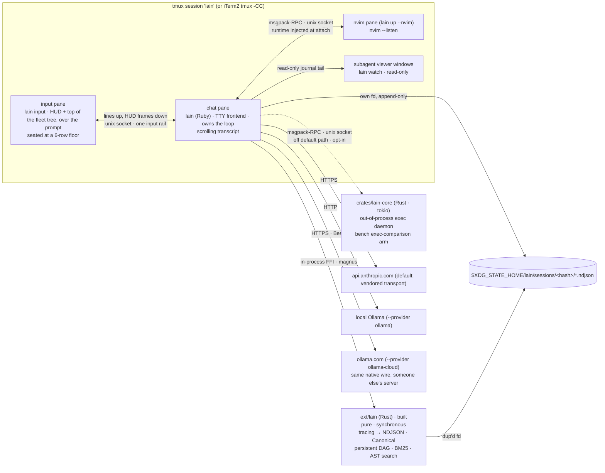
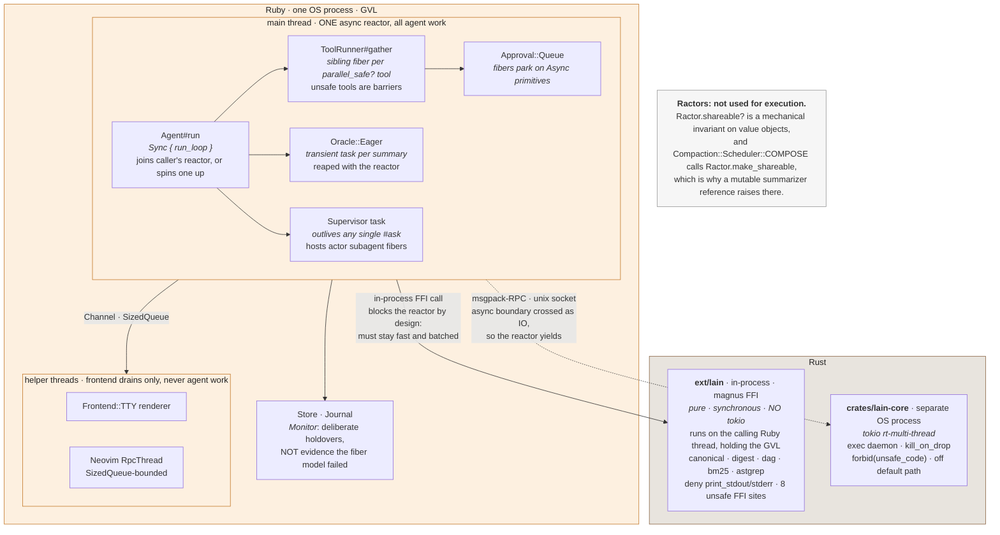
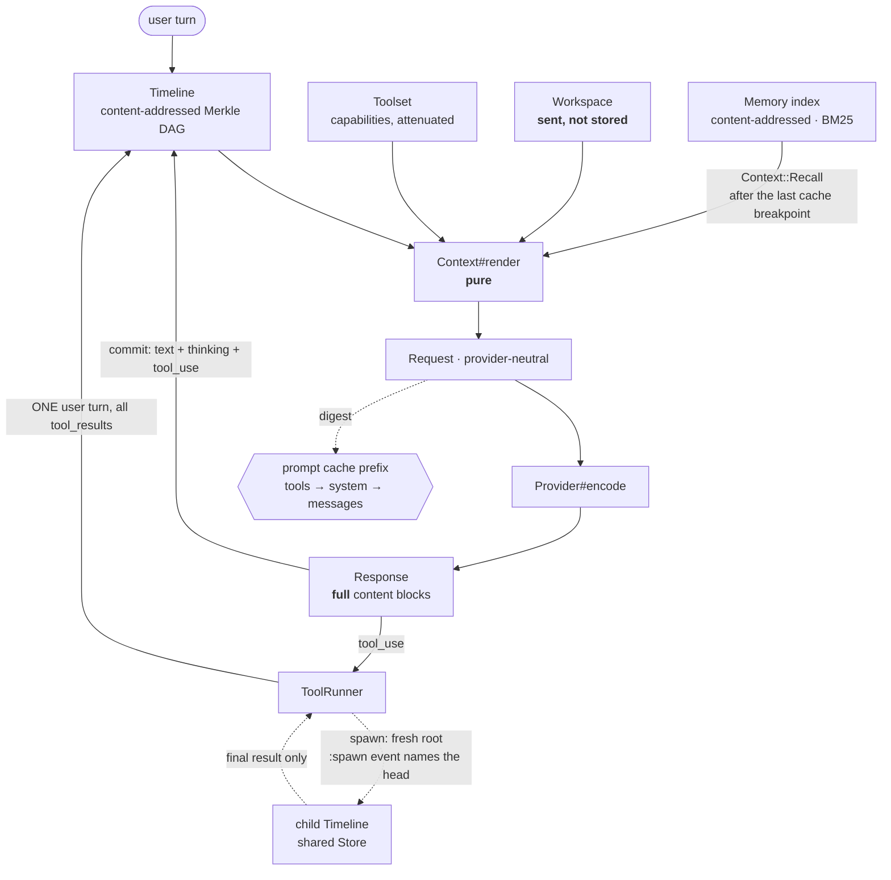
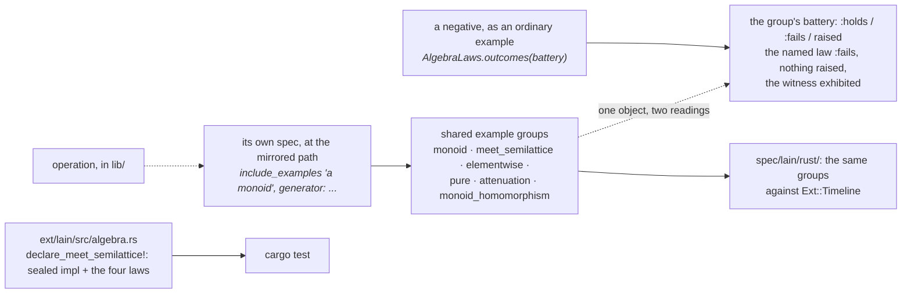
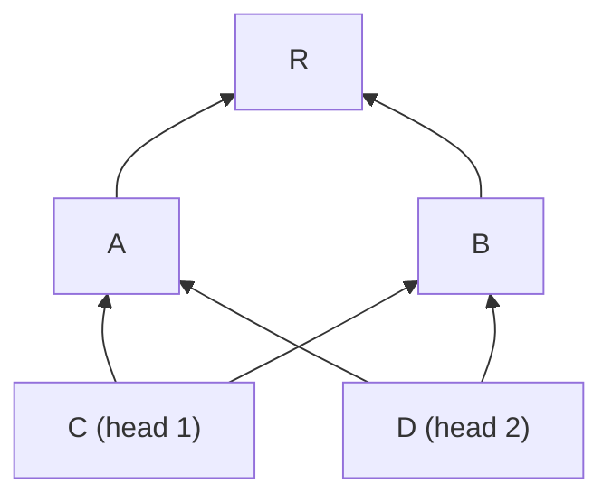
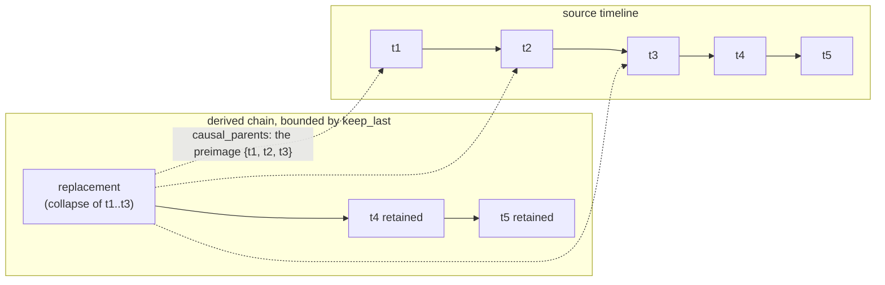

# Architecture

This document is for people changing lain, and it names the files behind each concept at `HEAD`
so you can go from an idea straight to the code. The README is the user-facing view; this one
assumes you are about to edit something.

Where this document and the README disagree, follow this one. Where either disagrees with the
code, follow the code.

## Process topology

`lain` is one Ruby process that owns the loop, and it runs tmux-native. `lain up` creates (or
reattaches to) a tmux session with a `chat` window and a session-scoped status HUD. The window
is **three panes**: `lain up --nvim` (the default) cuts an `nvim --listen` pane, splits a `chat`
pane beside it, and splits an **input pane** beneath that chat pane. `--no-nvim` drops only the
editor; the chat is still a transcript over an input pane. All of them are pinned to one cwd and
one deterministic nvim socket, so the editor and the chat that attaches to it can never diverge.
The window layer is a multiplexer concern, so the same tmux session renders under iTerm2's `tmux
-CC` on macOS.

The split exists because the chat pane is a **scrolling transcript**: anything drawn into it
scrolls away, so a prompt and a live HUD cannot share it. The input pane runs `lain input`
(`Frontend::InputPane`, `lib/lain/frontend/input_pane.rb`), which draws the HUD and the top of
the fleet tree above the prompt and refreshes them without a keypress, and feeds what the human types back
to `lain chat --input socket:NAME` over a Unix socket (`CLI::InputSocket`,
`lib/lain/cli/input_socket.rb`) at
`${XDG_RUNTIME_DIR:-/tmp}/lain/input-<project-hash>-<name>.sock`. Both panes derive that path
identically before either process starts, so it carries no pid. `Up::INPUT_PANE_HEIGHT` is 6
rows and is a **floor rather than a fixed height**: a `window-layout-changed` hook re-seats the
pane only when something drove it under the floor, so a human who grows it keeps the larger size.
Below `Up::SEATED_WINDOW_HEIGHT` (13 rows) the hook backs off and lets tmux's own arithmetic run.

Two frontends subscribe to one Journal, and the agent knows about neither. `Frontend::TTY`
(`lib/lain/frontend/tty.rb`) is the chat pane. `Frontend::Neovim`
(`lib/lain/frontend/neovim.rb`) injects its whole runtime (every `lain://` buffer, every
`:Lain*` command, all RPC) into a bare editor at attach time over msgpack-RPC on a Unix socket.
Subagent spawns can open read-only viewer windows (`chat --windows`, each running `lain watch`,
`lib/lain/cli/watch.rb`).

`crates/lain-core` and Neovim talk to `lain` over the same transport, msgpack-RPC on a Unix
socket, which is why they look symmetric below. The Neovim path is live. The `lain-core` path is
dashed because that daemon is off the default chat path today: opt-in `:core` specs and the
bench's exec-comparison arm only. `ext/lain` is in-process and built.


```mermaid
flowchart LR
  subgraph sess["tmux session 'lain' (or iTerm2 tmux -CC)"]
    TTY["chat pane<br/>lain (Ruby) · TTY frontend · owns the loop<br/>scrolling transcript"]
    IN["input pane<br/>lain input · HUD + top of the fleet tree, over the prompt<br/>seated at a 6-row floor"]
    NVIM["nvim pane (lain up --nvim)<br/>nvim --listen"]
    WATCH["subagent viewer windows<br/>lain watch · read-only"]
  end
  IN <-->|lines up, HUD frames down<br/>unix socket · one input rail| TTY
  TTY <-->|msgpack-RPC · unix socket<br/>runtime injected at attach| NVIM
  TTY -->|read-only journal tail| WATCH
  TTY -->|in-process FFI · magnus| EXT["ext/lain (Rust) · built<br/>pure · synchronous<br/>tracing → NDJSON · Canonical<br/>persistent DAG · BM25 · AST search"]
  TTY -.->|msgpack-RPC · unix socket<br/>off default path · opt-in| CORE["crates/lain-core (Rust · tokio)<br/>out-of-process exec daemon<br/>bench exec-comparison arm"]
  TTY -->|HTTPS| ANTH["api.anthropic.com (default: vendored transport)"]
  TTY -->|HTTP| OLL["local Ollama (--provider ollama)"]
  TTY -->|HTTPS · Bearer| OCL["ollama.com (--provider ollama-cloud)<br/>same native wire, someone else's server"]
  TTY -->|own fd, append-only| J[("$XDG_STATE_HOME/lain/sessions/&lt;hash&gt;/*.ndjson")]
  EXT -->|dup'd fd| J
```

### Runtime boundaries: which language, which scheduler

The diagram above is about processes and panes. This one is about *where your code actually
runs*, which is the question that decides whether a change of yours is allowed to block.


```mermaid
flowchart TB
  subgraph RUBY["Ruby · one OS process · GVL"]
    subgraph REACTOR["main thread · ONE async reactor, all agent work"]
      LOOP["Agent#run<br/><i>Sync { run_loop }</i><br/>joins caller's reactor, or spins one up"]
      GATHER["ToolRunner#gather<br/><i>sibling fiber per parallel_safe? tool</i><br/>unsafe tools are barriers"]
      SUP["Supervisor task<br/><i>outlives any single #ask</i><br/>hosts actor subagent fibers"]
      EAGER["Oracle::Eager<br/><i>transient task per summary</i><br/>reaped with the reactor"]
      APPR["Approval::Queue<br/><i>fibers park on Async primitives</i>"]
    end
    subgraph THREADS["helper threads · frontend drains only, never agent work"]
      TTYT["Frontend::TTY renderer"]
      NVIMT["Neovim RpcThread<br/>SizedQueue-bounded"]
    end
    LOCKS["Store · Journal<br/><i>Monitor</i>: deliberate holdovers,<br/>NOT evidence the fiber model failed"]
  end

  subgraph RUST["Rust"]
    EXT["<b>ext/lain</b> · in-process · magnus FFI<br/><i>pure · synchronous · NO tokio</i><br/>runs on the calling Ruby thread, holding the GVL<br/>canonical · digest · dag · bm25 · astgrep<br/>deny print_stdout/stderr · 8 unsafe FFI sites"]
    CORE["<b>crates/lain-core</b> · separate OS process<br/><i>tokio rt-multi-thread</i><br/>exec daemon · kill_on_drop<br/>forbid(unsafe_code) · off default path"]
  end

  LOOP --> GATHER --> APPR
  LOOP --> EAGER
  LOOP --> SUP
  REACTOR -->|"in-process FFI call<br/>blocks the reactor by design:<br/>must stay fast and batched"| EXT
  REACTOR -.->|"msgpack-RPC · unix socket<br/>async boundary crossed as IO,<br/>so the reactor yields"| CORE
  REACTOR --> LOCKS
  REACTOR -->|"Channel · SizedQueue"| THREADS

  RACTOR["<b>Ractors: not used for execution.</b><br/>Ractor.shareable? is a mechanical invariant on value objects,<br/>and Compaction::Scheduler::COMPOSE calls Ractor.make_shareable,<br/>which is why a mutable summarizer reference raises there."]

  classDef ruby fill:#fdf0e0,stroke:#c47a2c,color:#222
  classDef rust fill:#e8e4de,stroke:#8a6544,color:#222
  classDef note fill:#f6f6f6,stroke:#999,color:#333
  class RUBY,REACTOR,THREADS ruby
  class RUST rust
  class RACTOR note
```

Four consequences worth internalizing before you write code on either side:

- **Everything the agent does shares one OS thread.** Fibers yield only at IO boundaries the
  scheduler controls, which is what makes the parallel-tool fan-out safe with no lock anywhere.
  It also means a non-yielding call anywhere on that reactor stalls all of it, including the
  drain feeding the frontend.
- **An `ext/lain` call blocks the reactor and that is the design.** It is synchronous by the
  placement rule, so it must stay fast and cross the FFI boundary in batches. A per-element call
  inside a DAG walk loses to plain Ruby and stalls the loop while losing.
- **A `lain-core` call does not**, because it is IO. The msgpack-RPC round trip is a socket read
  the scheduler hooks, so the reactor yields to other fibers while the daemon works. That
  asymmetry is the placement rule restated at runtime.
- **The 2 real threads are frontend drains.** Neither runs agent work. Both exist because a
  renderer that falls behind must not block the render path, which is also why `Channel` and
  `Channel::DropOldest` have different overflow policies (below).

Why the posture is `async` fibers rather than threads or Ractors, and the measurements behind
the shellout and flood decisions, are argued in [`docs/concurrency.md`](docs/concurrency.md).

## Data flow

What is *sent* to the model versus what is *stored* in the Timeline is the distinction the whole
design turns on. `Workspace` renders into the `Request` and is never appended to the Timeline.

A subagent's chain lives in the shared `Store` and starts at a fresh root by default, so the child's
prompt chain never includes the parent's conversation; the `inherit` prefix arm is the exception,
starting the child on the parent's head to share its cached prefix. Causal lineage is not on any
turn: a `:spawn` event names the parent's head as `spawned_from`, the completion `:message` names
that spawn and the child's final turn, and the session file records each child turn as a
`child_turn` record, once per digest -- a turn equal to one already written gets none, which is why
a reader walks the Store rather than the records. `Bench::Session::Lineages` reads a file's
completed lineages back from the rebuilt Store for `lain consolidate`, `lain improve` and
friction's `Grader::ToolCallIndex`; `lain watch`'s `LineageFilter` follows the same message records
live, and the fleet surfaces key on the spawn digest.
Only the child's final result re-enters the parent's Timeline, as an ordinary `tool_result`.


```mermaid
flowchart TB
  U([user turn]) --> TL
  TL["Timeline<br/>content-addressed Merkle DAG"] --> CTX
  TS["Toolset<br/>capabilities, attenuated"] --> CTX
  WS["Workspace<br/><b>sent, not stored</b>"] --> CTX
  MEM["Memory index<br/>content-addressed · BM25"] -->|Context::Recall<br/>after the last cache breakpoint| CTX
  CTX["Context#render<br/><b>pure</b>"] --> REQ["Request · provider-neutral"]
  REQ --> ENC["Provider#encode"] --> RESP["Response<br/><b>full</b> content blocks"]
  RESP -->|commit: text + thinking + tool_use| TL
  RESP -->|tool_use| TR["ToolRunner"]
  TR -->|ONE user turn, all tool_results| TL
  TR -.->|spawn: fresh root<br/>:spawn event names the head| CH["child Timeline<br/>shared Store"]
  CH -.->|final result only| TR
  REQ -.->|digest| C{{"prompt cache prefix<br/>tools → system → messages"}}
```

The sections below name the files behind each box.

## Canonical, Event, Store, Timeline

| Concept | Files |
|---|---|
| Deterministic serialization | `lib/lain/canonical.rb` |
| Content addressing (digest mixin) | `lib/lain/content_addressed.rb` |
| The envelope that generalizes `Turn` | `lib/lain/event.rb`, `lib/lain/event/payload.rb` |
| The append-only object database | `lib/lain/store.rb` |
| The (head digest, store) pointer | `lib/lain/timeline.rb` |
| Deep immutability | `lib/lain/freezable.rb` |

`Lain::Canonical` produces deterministic bytes: sorted keys, stable array order, BLAKE3 digest.
Those bytes carry two invariants at once, event identity and prompt-cache stability. That is
the "one function, two invariants" claim in `CLAUDE.md`.

There is no standalone `Turn` class in the current tree. `Lain::Event` (`lib/lain/event.rb`)
is a CloudEvents-shaped envelope with a closed `KINDS` set (`turn spawn message snapshot`).
`Event.turn(...)` does what `Turn.new` used to do, and `Timeline#commit`
(`lib/lain/timeline.rb`) calls exactly that. The Merkle-DAG properties `CLAUDE.md` describes are
unchanged, now built over `Event`.

`Store` (`lib/lain/store.rb`) is the append-only, content-addressed map underneath. A
`Timeline` is only ever a `(head_digest, store)` pair, which is why `#fork` returns `self`:
under immutability, forking and identity are the same operation.

### Two parent edges

The render chain and the causal graph diverge on purpose. `render_parent` is the single
first-parent edge the model sees. `causal_parents` is a set carried by `:spawn` and `:message`
events (subagent lineage, below) that never enters a render chain. `Store#put` checks
referential integrity on both.

### Three orders, and where each lives

The 2 edge kinds give one Store's DAG 3 orders, each with its own greatest-lower-bound question,
and they are not interchangeable. A `Timeline` is an *element* of these orders, not their owner: an
order belongs to the Store the Timelines point into, so it answers questions about 2 of them rather
than living on either. Two Timelines over different Stores share no DAG, and every order refuses
them by name (`Dag::CrossStore` in Ruby, `Ext::Timeline::CrossStore` from the Rust orders) rather than
answering the bottom.

**The render order is a Ruby module**, `Dag::RenderAncestry` (`lib/lain/dag/render_ancestry.rb`),
because the production `Timeline` is Ruby. `.meet` is the deepest common ancestor along the
first-parent walk, returned as a `Timeline`; `.diverge_at` is its head digest, which is all
cache-break localization needs; `.below?` is `Timeline#ancestor_of?`, which stays on the Timeline
because a chain walk is the Timeline's own vocabulary. They stay render-only deliberately, so their
answers do not move as causal edges land. Nothing in `lib/` calls `.meet` or `.diverge_at` yet:
cache-break localization is specified here and not wired.

**Dominance and causal ancestry are Rust types**, and Rust is their only implementation, by ruling.
`ext/lain/src/algebra.rs` names the 3 orders as zero-sized types. `RenderAncestry` and `Dominance`
implement a `MeetSemilattice` trait whose private supertrait nothing outside `algebra.rs` can name,
and which that file writes only through the `declare_meet_semilattice!` macro, in the same expansion
that emits the four law tests over the type, so no type can claim the structure without the laws
being stated over it. `CausalAncestry` implements
`MaximalLowerBounds` instead, so "not a semilattice" is a fact the compiler holds: a function generic
over the trait cannot be instantiated at it. Ruby reaches the orders by name as
`Lain::Ext::Dag::RenderAncestry.meet`/`.below?`, `Lain::Ext::Dag::Dominance.meet`/`.below?` and
`Lain::Ext::Dag::CausalAncestry.meets`, and as `Ext::Timeline#meet`, `#dominator_meet`,
`#dominates?` and `#causal_meets`. The `Ext::Dag` classes register the very functions those
`Ext::Timeline` methods delegate to (`Timeline::meet_via::<S>` and `below_via::<S>`, generic over the
trait, and `causal_meets`), so the 2 spellings cannot come to answer differently. Mind the
names: `Lain::Dag` is the Ruby module and `Lain::Ext::Dag` the Rust one, and a bare `Dag::` written
lexically inside `module Ext` resolves to the Rust one.

`causal_meets` is reachability over *both* edges, git's "all parents". The causal DAG admits no
unique greatest lower bound, so it returns the **set** of maximal common ancestors, in digest
order, the way `git merge-base` does.

`dominator_meet` is the **checkpoint primitive**: the deepest common dominator of the 2 heads over
the union graph, under a virtual root. That is the latest event every path from the root to both
heads must pass through, so it is the latest point no in-flight branch can bypass, which makes it
the answer for synchronization and safe compaction. A node's dominators are totally ordered, so
unlike `causal_meets` this one is a genuine meet-semilattice. **It is specified and unwired**:
nothing in `lib/` calls it, and a caller would have to hold `Ext::Timeline`s, which the production
path does not build. `ext/lain/src/graph.rs` builds the union graph scoped to the closure of the pair
it is asked about and hands it to `petgraph`'s `simple_fast`, which is Cooper, Harvey, and Kennedy's
"A Simple, Fast Dominance Algorithm", so the crate builds the graph and never the solver.

The known caveat is inherent to causal stability rather than a defect: one quiet participant
stalls the frontier. An open subagent branch, spawned but not yet folded back, pins
`dominator_meet` at or before its spawn point however far the parent advances, until that branch
speaks or closes. Actors' explicit stop is the operational mitigation.

## `Context#render` is a pure function

`Context#render` (`lib/lain/context.rb`, `lib/lain/context/base.rb`) is the pure function
`(Timeline, Toolset, Workspace) -> Request` that `CLAUDE.md` names. Purity means no `Time.now`,
no session ids, and no `Dir.pwd` inside `#render`. Prompt caching imposes the same constraint on
the encoded request, so purity and cache-hit-ability are one requirement. `Workspace` and
`Request` are the 2 collaborators that purity is defined against.

Eleven combinators live under `lib/lain/context/`, each an endomorphism on the message list:

| Combinator | What it does |
|---|---|
| `cache_breakpoints.rb` | places the cache breakpoints; requires `:prompt_caching` |
| `reminder.rb` | folds the `Workspace` into the request tail |
| `prune.rb` | drops all but the last N |
| `compact.rb` | rewrites the head through an injected pure `summarizer` |
| `protected_patterns.rb` | the exclusion policy `compact.rb` partitions its drop set with |
| `dedupe_tool_calls.rb` | collapses repeated identical calls |
| `purge_failed_inputs.rb` | removes inputs whose calls errored |
| `recall.rb` | injects memory hits after the last cache breakpoint |
| `mailbox.rb` | folds inter-actor messages in |
| `message_envelope.rb` | the envelope shape a folded message takes |
| `tail_injection.rb` | appends at the tail without disturbing the cached prefix |

`Context.pipeline` (in `context.rb`) composes the default chain,
`Reminder.new(workspace:) >> CacheBreakpoints.new`, with `Context::Combinator#>>` (a monoid; see
the algebra section below). There is no constant snapshot of its capabilities: `Context#requires`
is derived from whichever pipeline is actually in effect, injected or default, so a capability
declaration cannot drift from what `#render` runs.

**The pipeline has a name.** `lain chat --context-pipeline <name>` selects one from
`CLI::ContextPipeline::PIPELINES` (`lib/lain/cli/context_pipeline.rb`): `default` (which is
`reminder+cache-breakpoints`), `reminder`, `cache-breakpoints`, `prune`, `dedupe-tool-calls` and
`purge-failed-inputs`, joined by `+` and folded with `>>` left to right, so order is a semantic. A
word **replaces** the default rather than adding to it — `prune` alone sends no reminders and marks
no cache breakpoints — and an unknown, empty or repeated part refuses by name. Combinators needing a
collaborator only a run can supply (`Recall`, `Compact`, `Mailbox`, `PinnedMessages`) are not words.
The name is resolved once, in `CLI::Backend#context`, into the pipeline a `Context` is built with;
`#render` reads nothing new, so purity holds. The `Context` carries `pipeline_name`, and the session
header records it as `context_pipeline` **only when one was named**: an unset flag writes no key,
so every header already on disk stays byte-identical, while an explicit `default` is recorded and so
can be told apart from an unset flag.

The name is inherited where a pipeline is: a spawned child's `Context` comes from the same
`backend.context` factory, and `Context#with_system` swaps the persona while keeping the pipeline
and its name, so a child renders through its parent's pipeline. On replay,
`Bench::Session::Loader` re-resolves a recorded `context_pipeline` (a name it cannot resolve is a
corrupt record), so a named session dry-replays under its own pipeline, and `Bench::Variance`
refuses to compare recordings whose pipelines render different stages. `--resume` and `--fork` do
not inherit the recorded name; the new launch's flag decides.

`Workspace` (`lib/lain/workspace.rb`) carries the sent-not-stored state: todos, staleness
ledger, budget countdown. `Reminder` folds it into the request tail. It is never appended to
the `Timeline`, and that omission is the whole mechanism behind `CLAUDE.md`'s "Workspace is
sent, not stored".

## Compaction, oracles, and memory

Compaction is **on by default** on the live chat path, and it splits across 2 tiers that fail
independently.

**The eager tier is a live model call, off the critical path.** `Oracle::Eager`
(`lib/lain/oracle/eager.rb`) fires one summary per large tool result on its own transient
`Async` task and holds the answer keyed by the result's **source digest**. An immutable source
can never go stale, so the digest is the correct key. The tier is always a **local** model,
never the chat's provider (`CLI::Backend#summary_oracle` wires `Provider::Ollama`
unconditionally): a fire happens per large result, and paying frontier tokens to compress one
would cost more than resending it. Containment is the point of the task boundary. A fire that
raises dies with its task, journals nothing, holds nothing, and never surfaces at the reactor.
With no ambient reactor at all, `#fire` is a graceful no-op returning `nil`, which is what keeps
the tool phase runnable as plain synchronous Ruby. What fires it is `Compaction::SummaryObserver`
(`lib/lain/compaction/summary_observer.rb`), an observer `Agent::ToolRunner` hands each completed
`tool_result`; it is the write half of the key `Compaction::SummarySnapshot` reads.

**The compacting turn itself is pure.** `Context::Compact` takes a `summarizer` answering
`#call(Array<Hash>) -> String`, and on the live path that is a `Compaction::SummarySnapshot`
(`lib/lain/compaction/summary_snapshot.rb`): a frozen copy of what the Eager held as of this
turn. It must be a snapshot rather than the live Eager for 2 reasons. The Eager stays mutable as
fires land, so a `Compact` referencing one is not `Ractor.shareable?` and `Scheduler::COMPOSE`'s
`Ractor.make_shareable` raises on the first compacting turn. And cutting the reference makes the
render deterministic: a fire landing mid-turn cannot change the bytes this turn's prompt is
built from. A digest with no held summary renders an elision line. **Always build one with
`.take`**. A hand-built map passes the content-address validator while missing every lookup,
silently and permanently, and `#hits`/`#misses` report 0/0, which is indistinguishable from a
snapshot over no messages.

The decision machinery is 4 collaborators, split because they answer different questions:

| File | Question |
|---|---|
| `compaction/head.rb` | *What* would be elided this turn, and how big is it, in `Context#render`'s own byte projection |
| `compaction/need.rb` | Is a compaction *warranted* (byte threshold, or approaching the context window) |
| `compaction/cold.rb` | Is the prompt cache *cold*, so the rewrite costs nothing to defer for |
| `compaction/scheduler.rb` | Given those, does one run *now*, and what did it cost |

`Head` exists because that question had 2 answers: `Compact#call` derived its own drop set from
`keep_last` while `Need` measured a head its caller supplied, and a one-message disagreement is
invisible (Need raises the flag over a window Compact declines to drop, every turn, with no
error anywhere). Both now receive the same object. A `Head` paired with a `Compact` **must** keep
`protected_patterns` at `ProtectedPatterns::NONE`; a real policy makes the head a superset of
what is removed and reintroduces exactly that silent disagreement.

**A committed compaction is held, not re-decided.** The Timeline is never rewritten: a compacting
turn renders a derived chain, and what it commits is **policy state**, a `Telemetry::CompactionCut`
(`lib/lain/telemetry/compaction_cut.rb`) over
`digest, head, strategy, kind, parent, supersedes, collapses, plan_step_completions`: the source
`digest` it collapsed up to, the `head` it was committed at, the `strategy` arm that collapsed it,
and the ranges this cut *newly* collapsed with their replacements. Earlier ranges are its
`parent`'s, linked by the parent record's content address, so a record's size stays flat however
many advances precede it. A cut is addressed by its own content rather than by its source digest,
because a re-collapse can share a digest with the last cut it replaces.
`Session#record_compaction_cut` keeps and journals it beside the pin-set, refusing a cut whose
parent it never recorded, and `SessionRecord::Replay` folds it back.

**`head` is the turn the committing render STOOD ON**, `Event.stands_on`: the model's own turn at
the head, or, where the render added a user turn that was refused before any model saw it, the
turn *beneath* that withdrawn prompt. Pinning it to the asked prompt instead made every withdrawn
ask re-commit the same cut, because the prompt it named left the chain with it.

**`kind` is one of `advance`, `collapse` and `handoff`**, and `supersedes` is what tells them
apart structurally. An `advance` carries only the newly collapsed ranges and supersedes nothing.
A `collapse` names at least two cut addresses in `supersedes` and re-summarizes what they render
between them. A `handoff` supersedes every cut that held. Both validations are on the record, so
an `advance` with a non-empty `supersedes` is not writable.

Every later turn, `Compaction::Source::HeldCut` picks the latest recorded cut that meets three
conditions: its commit head is on the head's chain, it was committed by this run's arm, and its
seam falls short of the keep_last boundary. The Source then derives from the source root with that
cut's lineage held. Its ranges are written from the records, the strategy is offered only the span
after it, and `Head` measures only that span. So a signal that clears renders the same replacement
bytes rather than the full history, a summary is paid for once and survives `--resume` (the
strategy's memo does not), and the cached prefix stops moving.

The cut **advances** only when a later compaction's pipeline is chosen past it; a summary that
failed collapses nothing, cannot shrink the render, and commits nothing. It **retreats** when
`/rewind`, `/fork`, a resend or a resume moves the head below its commit head. Such a head is a
forward run from there, so it renders what that forward run sent, and the next `context_derived`
names no cut, or the one that does hold. A cut freezes the replacement it committed, so an eager
summary landing later inside its range changes nothing already sent.

A completed plan step stays **pending** until a compaction commits. `Session#plan_step_completed?`
is a level that stays up until the next `todo_write`, and the render right after that write is
usually warm and defers. So a step fires on every render until a commit consumes it: a timing
defer keeps it pending and the first cold render compacts. The commit records the
`Session#plan_step_completions` it consumed on its cut, which is how a resume sees a consumed step
as consumed.

**Held cuts re-collapse.** Once more than one cut is held, a signal with nothing newly droppable
past them used to have nowhere to go, and the summaries accumulated one per advance forever. Now
`HeldCut#collapsible?` is true at two held cuts, `Source#movable?` admits a move on it alone, and
`Source::Derived#collapsed` offers the strategy the `HeldCut::Stretch` — the held replacements
plus whatever was retained between them, as this chain renders it — and commits one `collapse`
superseding them all. Readers fold the superseded cuts out; a `collapse` that would not shrink is
declined and journaled as `would_not_shrink` like any other; and replay refuses a `collapse`
naming an address its file lacks. A pin placed inside a range a held cut already collapsed still
does not bring that turn back, and that one remains an open decision.

**When no cut can make room at all, the fallback is a handoff.** `Compaction::Source::Fallback`
(`lib/lain/compaction/source/fallback.rb`) fires only after a provider has refused a prompt whole
(`WindowExceeded`) *and* the source is stuck — nothing droppable, or the refused render already
held the newest cut. It spends exactly one summarizer call, through `Oracle::Handoff`
(`lib/lain/oracle/handoff.rb`), whose schema is five required strings: `goal`, `progress`,
`files_and_decisions`, `open_todos`, `next_step`. The rendered state document replaces everything
before the current ask and **keeps three things**: the ask itself, an unanswered `tool_use` /
`tool_result` pair (the Messages API refuses a split pair), and the pins. It is recorded like any
other cut — one record of `kind: handoff`, the document positioned where the replaced history
began and the later ranges collapsing to empty content — and replayed like one, so `--resume`
renders what the live run sent. `--compact-fallback` chooses between it and `Fallback::None`, and
a chain that has handed off does not regain the `keep_last` tail by advancing past it.

`Compaction::Prepared` (`lib/lain/compaction/prepared.rb`) is the third policy, separate from
both: what happens across repeated **idle ticks**. Idle time is a series of ticks, so a naive
compact-on-idle would re-run and re-pay the summarizer once per tick at an unchanged head. The
result is computed once per head digest and held; only a new head invalidates it. The
long-idle gate is the caller's job and is deliberately unenforced here.

**The wiring is where this gets subtle.** `CLI::CompactionMount`
(`lib/lain/cli/compaction_mount.rb`) plugs 3 things into one `Agent.new`, and the third is the
reason it is an object rather than 3 keywords: `Compaction::Source#context_for` is handed the
last turn's input tokens as an Integer, but `Compaction::Cold` needs `cache_read_input_tokens`,
which exists only on a model **response**. So the Source is *also* a `#<<` sink and rides the
Agent's turn-usage journal through a `CLI::JournalTee`. Skip that tee and nothing fails: the
byte threshold and hard cap still fire, but `Cold` is never fed, the `:cold` path is dead, and
every compaction journals `cache_state: forced`, quietly turning a bench comparison arm into an
arm that measures nothing.

`CLI::Backend#pipeline_source` is memoized for the same class of reason and raises
`Backend::Rebound` on a second call with different arguments, because the Source accumulates run
state (`Cold`'s observed warmth, `Eager`'s fired summaries) and a rebuilt one would reset both
every turn while nothing raised. Compaction also gets its **own** `PriceBook` degrading to zero,
so a local model with no list price cannot crash a chat mid-conversation;
`Telemetry::Compaction` carries the model those figures are quoted in, so a zero beside
`qwen3:4b` reads as the fallback it is.

**The oracle tiers generalize this.** An `Oracle::Definition` (template + schema + tier) is
content-addressed, so a heuristic answer and a model answer to the same question are 2 different
oracles at 2 different addresses. `Heuristic` is deterministic Ruby, `Model` is a live call,
`Recorded` replays journaled answers, and `Recorded::Journaling` decorates any tier so every Q&A
rides the existing `Telemetry::OracleAnswer` path. `Summarize`, `PruneScoring`, and `MemorySave`
are the 3 shipped questions.

**Memory** (`lib/lain/memory/`) is a content-addressed index with a `manifest`, a `graph`, and
`bm25`/`hybrid` retrieval, written through `memory/recorder.rb` and read back by
`Context::Recall`, which injects **after the last cache breakpoint** so a recall cannot break the
cached prefix. `Embedder` (`lib/lain/embedder/`) is the batched seam for a real embedding backend
against a deterministic PHI-free one. Each `hybrid` arm truncates to `Hybrid::CANDIDATES` hits
before RRF sees a rank, a bound whose reason does not depend on any corpus.

**Memory is durable and project-wide.** `Memory::ProjectStore`
(`lib/lain/memory/project_store.rb`) is one append-only `store.ndjson` per project, under
`$XDG_STATE_HOME/lain/memory/<project-hash>/`, written under a sibling lock file so concurrent
chats and `lain consolidate` can all append. `ProjectStore::Loaded` folds it last-write-wins by
id and derives a `version` from the folded digests. `#view` opens a fresh chat on the current
fold, so a new chat sees what earlier chats and the consolidation clerk wrote; `#resumed`
re-addresses a replayed recorder's own items instead of re-reading the file, so a resume
reproduces the roots its own file recorded rather than inheriting what other chats wrote
meanwhile. A session's view is its `Memory::Recorder`: the items the store resolved at load time,
plus this chain's own writes, re-folded by `#follow` on a `/rewind`. Two records carry it into the
session file, and they are not the same quantity: `memory_loaded` is written once and names the
**store version** this session opened on, with the item bodies, so the file is self-contained;
`memory_root` is written once per committed turn and names the live index's content address at
that turn.

`lain consolidate` writes through the same store, so its `court_clerk` pass is durable rather
than in-process. Its own journal lands under `$XDG_STATE_HOME/lain/consolidation/<project-hash>/`,
a sibling of `sessions/`, so a clerk pass never appears in a chat listing. The scaffolds it builds
are **masked fail-closed**: every rendered turn's text goes through `Sensitivity::Regions` and
`Sensitivity::Masking` before it reaches a provider, because nobody is at a surface to release a
region. Only the record's bytes are masked; the digests lain's own frame wraps them in stay
intact, so the clerk can still cite what it read.

### Project memory and compaction are different subsystems

They are named apart on purpose, and neither reads the other.

| | project memory | compaction |
|---|---|---|
| what it is | durable facts written with `memory_write` or by `lain consolidate` | a derived, rebuildable view of one chat's own history |
| lives in | `Memory::ProjectStore`, `$XDG_STATE_HOME/lain/memory/<project-hash>/` | `Compaction::Source` state, and `compaction_cut` records in the session file |
| scope | the project, across chats | one chain |
| records | `memory_loaded`, `memory_root`, `memory_write` tool turns | `compaction_cut` (`advance`, `collapse`, `handoff`) |

A handoff state document is never written to project memory, and the consolidation clerk never
reads a compaction replacement. Both directions are pinned structurally by
`spec/memory_compaction_separation_discipline_spec.rb`: nothing under `lib/lain/compaction/`
names `Memory::ProjectStore`, and a consolidation scaffold never carries a cut's replacement
text.

## Effects, handlers, Gate, and Middleware

A tool call or model call is built as an `Effect`: frozen `Data` values in `lib/lain/effect.rb`
(`Effect::ToolCall`, `Effect::ModelCall`, `Effect::Approval`). An `Effect::Handler`
(`lib/lain/effect/handler.rb`) interprets it.

**There are 2 interpreters and they do not compose.** `Effect::Handler::Live`
(`lib/lain/effect/handler/live.rb`) runs the tool for real, converting anything the tool raises
into an `is_error` result at the one boundary the loop trusts; `Effect::Handler::Mock` answers
canned results, which is what specs swap in. Same effects, 2 interpretations. A handler
**terminates** the tool phase's `Middleware::Stack` and never decorates another handler: everything
that may refuse, park or observe a call before it runs is a middleware in front of it, so the whole
path a call takes is one inspectable list with the interpreter at the end.

`Agent::ToolRunner#dispatch` is the one place the 2 meet, and it **resolves the tool once**. The
name is fetched from the runner's `Toolset`, and that object rides the env as `:tool` through every
layer; a name the set does not hold arrives as `Toolset::Unheld`, a Null Object that refuses by
name. At the interpreter end the runner reads the set again and calls the handler only if the name
still resolves to the **very object** the stack judged, or was unheld at both reads (so `Live` refuses
it by name, or `Mock` answers it canned). Approval can take as long as a human takes,
and a `/mode` flip in that window may withdraw the capability being asked about; the identity check
refuses that call exactly as it refuses a name the set never held, and refuses a `:tool` some layer
swapped in the same way. That covers the agent whose toolset the flip rebinds; a child's toolset is
fixed when it is spawned, so a child's call parked across a flip is not withdrawn by it.

`Middleware::Gate` (`lib/lain/middleware/gate.rb`) is the approval layer. It holds no `Toolset`: it
judges the tool the env carries, on 2 axes OR'd together — the tier the tool declares
(`#requires_approval?`) and the path this call names (`Sensitivity::Policy#gates?`) — and asks an
injected `policy` (`ApproveAll`, `DenyAll`, or a real interactive queue). Its guarantee is
**positional**: what it approved is what runs only while it is the last layer before the
interpreter, since a layer after it could rewrite the tool or the input. `Middleware::Sensitivity`
sits just ahead of it and refuses a *denied* path outright, because a denied path is not approvable
and a policy's answer is a Boolean, which is approvable by construction.

**One builder assembles every agent's tool stack.** `CLI::ToolGuard` (`lib/lain/cli/tool_guard.rb`)
builds it for a chat's agent (`.stack`), for each of that chat's children (`ToolGuard::Spawned`, the
builder the spawn seam carries, reading the parent's board when the child is built), and for a run
with no chat (`.detached`, whose gate approves deliberately: nobody is at a surface to answer). The
layers, in order: `RefuseSecretWrites`, `RedactSecretReads`, `WithholdSecretPaths`,
`GuardTestLayout`, then `Sensitivity`, then `Gate`. `Middleware::Gate.closes!` refuses any stack
that does not end Sensitivity → Gate; `ToolGuard` holds every stack it builds to it, and
`Tools::Subagent` holds whatever a seam's builder hands a child to it before any of the child's
tools can run. Under the `handler_union` spawn posture the child renders the shared union, so
`Middleware::RefuseUnpermitted` is inserted just outside `Sensitivity` to refuse a tool the child
was not attenuated to, before a human is ever asked about it.

`Lain::Middleware` (`lib/lain/middleware.rb`) is the Rack/Sidekiq/Faraday-idiom public API these
layers are written against: `Middleware::Base#call(env, &app)` passes a call on through
`#downstream` or answers it, and composition is **membership in a `Middleware::Stack`** — an ordered
list with `#use`, `#insert_before`, `#insert_after` and `#to_a` — rather than an operator, because
the ordering is the footgun and a list is the shape that stays inspectable.

Four middleware phases ride this API today: model, tool, turn, and repl.
`lib/lain/middleware/journal_requests.rb` and `journal_turns.rb` are the model and turn phases
that write into the session record (disk layout below). `refuse_secret_writes.rb` is a
tool-phase middleware, the first of `CLI::ToolGuard`'s six layers, that withholds a
credential-shaped `memory_write` before it reaches the recorder. `skill_dispatch.rb` is the
repl-phase middleware a `@role/skill` line folds through.

**Why the model phase exists at all**, rather than pushing instrumentation into Faraday: lain
runs 2 transports that do not share an HTTP stack. `Provider::Anthropic` (the SDK oracle) is on
`net/http` and `connection_pool`; `Provider::AnthropicRaw` (the default path) is Faraday-based.
Faraday middleware can wrap the second and not the first, so it cannot be where cross-transport
instrumentation lives. The model phase is the one layer at which both transports look identical
to the bench, which is why retries, cost accounting, and cache instrumentation live there.

**No middleware here can interrupt what runs inside it.** Interrupting arbitrary Ruby needs a
watchdog thread, which the no-threads posture rules out, so a middleware wanting to bound how long
a downstream takes can only publish a value into `env` (a monotonic deadline, say) for a
cooperative downstream to honor, and check afterward whether it was. Anything you write into a
middleware runs inside the tool's own fiber, so a non-yielding middleware stalls the reactor and
nothing can stop it: see [`docs/concurrency.md`](docs/concurrency.md).

`Agent::ToolRunner` (`lib/lain/agent/tool_runner.rb`) is where the tool phase gets driven from the
loop: `#dispatch` runs the stack with the handler as its innermost block.
The loop itself, `Lain::Agent` (`lib/lain/agent.rb`) with `Agent::Budget` and
`lib/lain/agent/loop_machine.rb`, is a `state_machines` state machine. A spec generates
[`docs/agent-state-machine.md`](docs/agent-state-machine.md) from it and fails the build on
drift. That document covers the wire's `stop_reason` handling, which this one does not repeat;
the harness's own typed reasons for a *stopped ask* are below.

### Why an ask stopped, and what happens to the prompt

`Agent::StopReason` (`lib/lain/agent/stop_reason.rb`) classifies whatever the ask raised against
its whole cause chain and answers one of `stopped`, `ceiling`, `over_window`, `stalled_stream`
and `transport`, defaulting to `torn` when nothing matches. That symbol is what
`Telemetry::RunInterrupted` records, over the closed
`REASONS = %i[interrupted grace_expired stopped ceiling over_window transport stalled_stream torn]`
— the first two come from Ctrl-C and the shutdown window rather than from an ask. It is a
different enum from `Lain::StopReason`, which is the model's own wire-level stop.

**The prompt is withdrawn only for a provably pre-wire failure.** `Agent#withdrawing` retreats
the Timeline for `WindowExceeded` and `Lain::PreWire` alone, and only while that prompt is still
the head. Everything else leaves the prompt **stranded**: unanswered at the head, and folded into
the next ask. `Agent#prompted` cuts one user turn carrying both texts from the stranded turn's
parent rather than stacking a second prompt, and the chat says so, naming `/rewind 1` as the way
to leave the earlier one out.

**The `tool_use` turn settles before any tool runs.** `Middleware.settles!` refuses a turn-phase
stack whose members answer only `#call`, and `Agent#account` calls `turn_middleware.settle` — so
`Middleware::JournalTurns` writes the turn to the session file — before the usage record and
before the round's first tool starts, all inside the same cancellation-shielded commit atom. A
session killed while a tool runs therefore resumes, and no later record can cite a turn the file
lacks. That is what retired the child-only settle handles and `Bench::Session::Lineages::InFlight`.

## Modes: a mode is scope × approval

`Lain::Mode` (`lib/lain/mode.rb`) is `Data.define(:scope, :approval, :layers)`, and the first two
are the axes:

| axis | values | what it decides |
|---|---|---|
| scope (`mode/scope.rb`) | `checkout`, `plan` | *where* a write or a command may land |
| approval (`mode/approval.rb`) | `ask`, `auto` | *who* answers for a gated call |

`checkout` is the project's own working tree, unconfined. `plan` confines the paths a tool
**names** — `write_file`/`edit_file`'s `path`, `bash`'s `cwd` — to a leased spike, refusing
anything else by name and pointing at `/mode checkout`. `Isolation::Spike`
(`lib/lain/isolation/spike.rb`) cuts that spike as a worktree on `lain/plan/<key>` from a commit
of the checkout's tracked state, built through a temporary index so the real index, stash and
reflog are untouched; outside a git repository `Isolation::Scratch` hands out an empty directory
instead. **It is confinement, not a sandbox**: a human-approved shell command's own words can
still write anywhere, because only the named location is checked.

`ask` and `auto` are the same ladder — `Escalation::Triage`, then the rule chain — and differ
only at the bottom rung: `ask` parks on `Approval::Surfaces`, `auto` takes `Remainder`. So a
triage deny or a rule deny still refuses under `auto`. A scope never changes the toolset, so a
flip cannot move the tool block a prompt cache keys on.

Layers (`mode/layer.rb`) are the orthogonal, non-exclusive third member: `auto_approve`, `goal`,
`notify`, `vi`. Only `auto_approve` answers `alters_outcome?`, and it is the one that adds the
`auto_approver` model judge at the ladder's last rung — a different thing from approval `auto`,
which removes the rung instead.

`Mode::Switch` (`mode/switch.rb`) is the live slot, and it journals **only a move**: switching to
the mode already in force writes nothing. The posture table, `Permits::All`/`Only`, `READ_ONLY`,
`ToolsetBuild::PosturePermits`, `Subagent::Seam#permits`, the `deny_all` gate-policy entry and
the `manual` and `accept_edits` tokens are all gone; `/mode` refuses the two retired words by
name rather than as typos.

## Tools, tiers, and the toolset

A `Tool` (`lib/lain/tool.rb`, with 23 classes under `lib/lain/tools/`) declares 2 orthogonal
properties about itself, and both default to the conservative answer so a new tool must opt in
deliberately.

`#requires_approval?` is the **tier** axis, and the tiers are not a list the gate maintains. Tier
1 is direct Ruby with no subprocess. Tier 2 is an argv Array through `Mixlib::ShellOut`. Neither
has a model-controlled command string, so neither gates. Tier 3 is a String command through
`sh -c`, and those override to `true`. The axis that predicts danger is **whether the model
controls the command string**, not read-versus-write, which is why `write_file` does not gate and
`bash` does.

`#parallel_safe?` is the concurrency axis: reads only, no `Session` write-set mutation, no
process-global state. `Agent::ToolRunner#gather` fans a contiguous run of safe tools out as
sibling fibers; every unsafe tool is a barrier that runs alone, in wire order.
`spec/lain/tools/parallel_safety_spec.rb` pins the true-set and false-set to equal the shipped
toolset exactly, so a new tool must choose or fail by name, and
`spec/lain/tools/parallel_commutation_spec.rb` proves the claim those tools are making: every
unordered pair of the 10 non-spawning safe tools runs in both orders, each order as 2 single-use
responses back to back, and the `tool_result` content, the `is_error` flag, and the `Session`
read-set all agree. Both orders are serial by construction, because a run of 1 is never gathered —
comparing 2 gathered fan-outs would be a timing probe that proves nothing. The reasoning behind the
barrier semantics, and the rejected subset-first alternative, is in
[`docs/concurrency.md`](docs/concurrency.md).

`Toolset` (`lib/lain/toolset.rb`) is a frozen `Enumerable` whose `#only` and `#except` return new
attenuated sets. That is the whole authorization model: possession is the authorization, and
`toolset.only(:read_file, :grep)` is a capability, not a permission check. `Tool::SpawnPolicy`
packages an attenuation for a named `Role`, resolved through `Role::Catalog` so a role's tool set
cannot drift between its definition and a spawn site.

Two Toolsets are `==` when their canonical schema bytes match. The digest is computed eagerly in
`#initialize`, since the object freezes itself on the next line, and it is *schema* equality rather
than behavioral equality: 2 tools with identical schemas and different `#perform` bodies compare
equal, which is the equality prompt caching already lives by. That equality is what let the
[attenuation](docs/GLOSSARY.md#object-capability-attenuation) laws be stated at all —
`spec/lain/toolset_spec.rb` includes the `"an attenuation"` group over `#only` with `#except` as its
dual. The security reading
sits in `toolset.rb`'s doc comment where a reader meets the operations: a capability once dropped
cannot be regained by the holder, there is no join, and union exists only at construction, below the
trust boundary, in `Tools::Subagent#child_union`. Monotonicity is what makes that checkable, and it
is bounded by the **request** rather than by the receiver, over the surface that actually authorizes
a call (`#fetch`, the one message `Agent::ToolRunner` resolves a call with, and `#include?` beside it)
rather than the surface a reader looks at.

The 2 spawn postures are 2 enforcement semantics for one attenuation, and CE-4 compares their cache
economics, which is honest only if they agree on everything else.
`spec/lain/tools/subagent_posture_equivalence_spec.rb` pins that: identical delivered `tool_result`
blocks over allowed calls, and one designed divergence on a disallowed one — `:schema` never renders
the name, so `Toolset#fetch` raises with nothing journaled, while `:handler_union` renders the union
and `Middleware::RefuseUnpermitted`, in the child's tool stack, answers an `is_error` result and
journals a `refused` record. The
consequence worth remembering is that **under `:handler_union` the rendered schema does not
determine the capability set**: 2 children with different `only` sets render byte-identical tools
blocks, which is what makes the sibling cache sharing the posture exists for possible.

**Every tool result has a static byte ceiling**, and they are one table rather than a constant
per tool: `Tool::Bounds::CEILINGS` (`lib/lain/tool/bounds.rb`) maps all 16 result-returning tools
to the same `RESULT_BYTES` of 16 KiB, measured on the bytes the model sees. The number is sized
to the smallest local window, not to a model: at the worst measured density one result is about
40% of a 32k window. The same file holds the four bound *shapes* a tool chooses between —
`Enumeration` (a row cap with an in-band notice), `Fill` (byte-bounded rows with a trailer),
`Artifact` (refuses whole, no payload) and `Handback` (hands the overrun back for a caller or a
human to decide). `web_fetch` is an `Artifact`, and it is measured on the **readable text** its
nokogiri converter produces rather than on the markup; `raw: true` asks for the markup instead.

`Tool::Input` (`lib/lain/tool/input.rb`) is ActiveModel: one field declaration yields both the
JSON Schema the model sees and the local validation, so they cannot diverge, and coercion is
free. Its validations check **shape, not safety**; the file's header comment says so, because
they read like security controls and are not.

`Tool::Contracts` (`lib/lain/tool/contracts.rb`) is design-by-contract in the Eiffel sense, and
it answers a different question than the Tool does: the Tool says what a capability *is*,
Contracts says what must be true around using it. The motivating case is `edit_file` requiring
"this file was read this session", an invariant the tool depends on but does not establish, and
one a free-form `bash` tool structurally cannot express. A violated predicate raises. `Tool#call`
is what runs validate → preconditions → `#perform`, which is why subclasses implement `#perform`
and never `#call`: routing through the public entry point is what makes the contract and schema
checks unskippable.

### Triaging a bash command

`Shell::Parse` (`lib/lain/shell/parse.rb`) reports what tree-sitter's bash grammar saw, and just
as importantly what it did not; `Shell::Verdict` (`lib/lain/shell/verdict.rb`) reads that report
and answers one question — *is this command syntactically literal and fully understood?* — never
*is it safe*. An allow hands over a **term** (`[["grep", "-r", "foo", "."], ["wc", "-l"]]`) and
deliberately not the original string, because re-running an accepted string through `sh -c` turns
every parser/shell disagreement into a live bypass. `Shell::Pipeline` runs that term through
`Open3.pipeline_r` with no shell anywhere.

Parse carries three independent signals, and the third is the one a designer forgets:

1. **Broken** — an ERROR *or* a MISSING node, in one query. `has_error()` alone was measured
   letting `")"`, `"def"`, `"1 +"` and `"[1,"` through as silent zero-matches.
2. **Uncovered bytes** — every non-whitespace byte must sit inside a span the parser recognizes.
   This is the signal that does not depend on the grammar admitting a mistake: tree-sitter-bash
   #315 parses `$FOO/$BAR/` into a corrupted `command_name` of `"$FOO/$"` with zero ERROR and zero
   MISSING nodes, and only the swallowed `$` at byte 5 gives it away.
3. **Kinds and separators** — the vocabulary a verdict allowlists over.

**Coverage is not a "compound syntax cannot hide here" guarantee.** tree-sitter-bash does not
model `time` as a keyword, so a leading command word the grammar does not know degrades its whole
tail to plain `word` nodes in an ordinary `command`: `time { echo PWNED; }`, `time if true; then
ls; fi` and `time rm -rf /tmp/x` all reach FULL coverage with the blandest possible kind set, and
the last of them execs faithfully. Swept as a leading token, twelve reserved words reach
covered-and-unbroken (`}`, `coproc`, `do`, `done`, `elif`, `else`, `esac`, `fi`, `in`, `then`,
`time`, `]]`); `coproc` is benign only because no such binary exists, where `/usr/bin/time` does.
Nor is it only the leading stage — `echo hi; time { rm x; }`, `ls | time rm x` and `true && time
rm -rf /tmp/x` are all fully covered — so a name check reads EVERY stage's `argv.first`. The
residual risk is therefore a *program name*, which is a judgement, and it lives in Verdict's
`PROGRAM_RUNNERS` denylist rather than as a "suspicious leading word" heuristic in the parser.

The reconstructed argv is the tree's word splitting and none of a shell's interpretation, so four
things belong to whoever executes it: quotes survive verbatim (dequoting is interpretation); a
redirection is an argv term inside the command node and is DROPPED outside it (`echo a >b c`
yields `["echo", "a"]`, and only `kinds` reporting `redirected_statement` tells you `c` is gone);
a heredoc body is blanketed rather than tokenised; and a NUL byte parses clean into an ordinary
word, which `exec` then refuses.

Verdict's three tiers are node kinds (an allowlist, never a metacharacter denylist), program
names, and **word text** — a glob, a tilde, a brace and a backslash have no node kind at all, so
`rm *` parses identically to `ls -la`. There is a fourth thing to count: tree-sitter-bash lexes a
newline as whitespace, so `echo hi\nrm -rf /tmp/x` arrives as two stages and an EMPTY separator
list. Reading separator texts cannot see it; N stages against N−1 pipes can.

## The secret boundary

The split is forced by *when the answer is available*: a path classifier can answer before a file
is opened, a region detector cannot until it has the bytes. So there are three places, and
tier-1 `read_file`/`grep`/`glob`/`list_files` check nothing themselves.

| where | object | question |
|---|---|---|
| gate on the effect | `Sensitivity::Policy` | may this CALL happen? |
| filter on the result | `Middleware::WithholdSecretPaths` → `Sensitivity::Filter` | which rows may the model see? |
| mask on the content | `Middleware::RedactSecretReads` → `Sensitivity::Masking` | which BYTES may leave? |

The invariant is **one compiled `[sensitivity]` table per run, and one object that answers about
a path**. The claim that stood here before — "`Policy` holds the only `Filter.new` in `lib/`" —
was true and too narrow: a second FILTER was hard to build, but a second CLASSIFIER was not, and
`/survey` built one from its own later re-read of `.lain/config.toml`. A session outlives that
file: a turn may rewrite it — `write_file` is tier-1, and `.lain/config.toml` classifies *ordinary*,
because the table names secrets and not itself — and so may a human in the next pane. So the listing walked one table while the gate beside
it held another — both halves working, nothing wrong to look at.

`Wiring::BoardBuild` therefore compiles the table once and hands the classifier to `Policy`, and
`Switchboard#surface_kwargs` hands `/survey` **the Policy itself**: it answers `gates?`,
`denial`, `filter` and `classify`, four phrasings of one question, so the survey walks through
the gate rather than beside it. Two places still build a classifier of their own, both over that
same compiled table and both deliberate: `BoardBuild::Classifiers` mints one **per gated bash
call**, because a bash call names its own working directory and the triage rung must anchor the
argv it reads on THAT one, and it holds an eager session-anchored one as the fallback for a `cwd`
it cannot resolve — built eagerly so a wiring bug raises at startup rather than leaving the rung
inert in silence.

`Filter.new` happens in exactly one place in `lib/`, inside `Policy#initialize`, and every reader
takes the filter that came with the gate. That is a discipline rather than an impossibility —
`Filter` is a public constructor over anything answering `#classify` — and it is the discipline
that keeps a gate from refusing a path the listing beside it enumerates.

Both gate and filter turn on **not ordinary**, never on `Verdict#gated?`, which is false for a
DENIED path and would wave `~/.ssh/id_rsa` through while withholding `.env`.

**A `[sensitivity]` pattern can be anchored at the project root.** A leading `/` anchors there
exactly as a leading `~/` anchors at home, and a bare pattern stays a basename glob; a
path-shaped bare pattern is refused at load rather than silently matching nothing. An anchored
pattern is a **literal, clean path** — no glob character, no empty, `.` or `..` segment — because
the rule it states is subtree containment, not matching: under `denied` or `gated`, `/vault`
covers `vault` and everything beneath it, with or without the trailing slash. Under `exempt` an
anchored pattern names **exactly one file**, a directory is refused, and what the exemption lifts
is the human read prompt and nothing else: an ordinary-by-exemption verdict still fails the
automatic shell approver's own test, so one fixture's exemption cannot approve `cat` of every
`.env` in the tree.

`Policy::PATH_FIELDS` is the whole of what the boundary knows about tools — which input field
names a path, per tool. That coupling cannot be abolished (something must know `bash` names a
directory in `cwd` while `read_file` names a file in `path`), so it is data in one place, pinned
by a spec that fails BY NAME when a new path-taking tool ships. That spec has no allowlist:
an earlier edition scoped out the three AST readers, which made a green suite state three
bypasses as intended — and `ast_search path=.env pattern="$A = $B"` returns the captured values,
byte-for-byte what `read_file` returns.

### Detection: measured, with the residual written down

`Sensitivity::Regions` runs two detectors over the same bytes — the credential shapes from
`CredentialPatterns.for(:content)`, and a Shannon-entropy run detector for tokens no issuer
prefix names. Entropy is TRIAGE, not a verdict. A region is the assignment's **value alone**, so
masking leaves a `.env` still legible as a `.env` and partial approval falls out for free.

The gate exists because the patterns alone were unusable: measured over this repo before it
(`**/*.md` less `references/repos/` and `.claude/`, plus `lib/**/*.rb` and `spec/**/*.rb`) they
matched **70.9%, 86.0% and 95.4%** of files — `^ident = value` IS Ruby assignment syntax, so a
name-agnostic assignment shape matches source code by construction. An assignment now yields a
region only when its NAME hints at a credential over a value with SUBSTANCE, or its VALUE is
secret-SHAPED. The name is matched as a substring, because `DATABASE_PASSWORD` has no word
boundary before `PASSWORD`; a value-shape test alone would not do, because a named passphrase is
low-entropy — exactly the secret a shape test structurally cannot see.

With the gate, the substance floor and the thresholds, over the same three globs:

| corpus | files with a region | regions | pattern / entropy |
|---|---|---|---|
| markdown | 28 of 134 (20.9%) | 57 | 7 / 50 |
| `lib/**/*.rb` | 36 of 602 (6.0%) | 53 | 52 / 1 |
| `spec/**/*.rb` | 63 of 581 (10.8%) | 262 | 218 / 44 |

The floor sits at the recall-preserving end of its plausible range: at 8 rather than 6 it buys
back 2, 4 and 20 regions of noise (mostly 6–7 byte fragments like `test")`) and pays for them
with `hunter2`. What remains in `lib/` is Ruby whose variable happens to be named `token`,
`session` or `pass` over a substantial value — not a credential among them; the entropy residual
is blake3 fixtures in `spec/`, correctly hash-shaped, and long URLs and paths in markdown,
because `/`, `-` and `_` are all base64url characters. Recorded rather than special-cased: a
documented residual beats a rule nobody can reason about, and every region has a release path
whose cost is one decision, held to one by the digest.

Note that `regions.rb` and its spec are IN that corpus. Measuring a change to the detector
against a corpus containing the detector is how a review once produced a false finding: an edit
that shortened the file by 11 bytes moved two region offsets by 11 and read as behaviour.

A **JWT is three regions**, because `.` is not in the token charset — and the header of every
HS256 JWT is the identical byte string `eyJhbGciOiJIUzI1NiIsInR5cCI6IkpXVCJ9`, so under
content-addressed identity, releasing one JWT pre-releases that segment for every future JWT at
that path. The payload and signature are unaffected. Joining `.`-separated runs into one region
was measured and NOT taken: on its own it makes a JWT report ZERO regions, since the base64
shape test does not admit `.` either, and fixing that widens what counts as base64 everywhere.

Detection costs ~0.27ms/KB on ordinary source, linear, with no adversarial blowup (a 1MB base64
line is 578ms). So it runs per read without a budget under a few hundred KB.

### The release ledger

`Sensitivity::Ledger` holds what this RUN has released, keyed by **(path, digest)**, and the path
half is the containment. A region is its value alone, so identical bytes in one file are one
secret and one decision covers both — but across files they are not, and content addressing
cannot tell them apart (the JWT header above is the proof). The trade is deliberate: a lockfile
hash approved in one crate of a monorepo is asked about again in the next, which is the direction
this boundary errs in everywhere — a spurious match costs one prompt, a release that travels
costs a secret.

**A relative path raises rather than being normalized.** Nothing here opens or stats anything, so
"any spelling is merely its own key" holds for absolute spellings (`/repo/./.env` and `/repo/.env`
are two keys — fail-closed, one extra prompt, no merge) and is FALSE for a relative one:
`config/.env` under a parent's cwd and under a child worktree's cwd are two files behind one key.
Normalizing cannot fix it, because the ledger is per-RUN and reaches every child through the board
thunk, so there is no single cwd to normalize against. Raising needs no cwd at all, and the arm
holding the effect and the worker cwd can resolve before it calls.

Reading **reconciles** in the same call: `#outstanding` drops the releases for digests the file no
longer holds. Command-query separation would split that, and the failure mode of the second call
being forgotten is that a secret deleted and later restored is sent without anyone being asked.
Reconciling is sound only over a COMPLETE detection, so `complete:` is a stated precondition with
its own keyword — and `complete: false` opts OUT of the containment: under it a deleted region
stays released, so delete-then-restore at that path is re-sent unasked. That is unavoidable
(nothing can reconcile what it did not look at) but it compounds, and a file read only ever under
a size cap never reconciles at all.

The ledger is run-scoped, mutable, and owned beside the run's one `Approval::Queue` and one
`Sensitivity::Policy`. There is deliberately no persistence path and no Null: remembering "yes,
send `.env.local`" across runs is exactly what `Approval::Risk::Classification#rememberable?`
declines to keep, and a Null would answer "nothing outstanding" forever — a release control that
releases everything, wearing the Null Object idiom as camouflage.


## The Provider boundary

`Provider` (`lib/lain/provider.rb`) is one round trip with no loop: `#capabilities`, `#encode`,
`#complete`. Capabilities are machine-checked rather than documented. `Provider::CAPABILITIES`
is a closed list of 9, a `Context` combinator declares `#requires`, and a mismatch resolves
through an explicit policy instead of a silent no-op.

`Capability::Policy.for` (`lib/lain/capability/policy.rb`) implements exactly 2 of them.
`:strict` raises, reusing the provider's own vocabulary in the message. `:degrade` tolerates the
mismatch but records it: one journal entry per degraded capability, and a
`Capability::DegradedSet` (`lib/lain/capability/degraded_set.rb`) naming what the run lost, which
is a value object rather than a bag of symbols precisely so `Capability::Guard` can refuse to
compare 2 runs whose sets differ. There is no `:simulate` policy; client-side approximation of a
missing server capability was considered and is not built.

`Provider::AnthropicReference` is the official-SDK path kept as the correctness oracle, and it
lives in `spec/support/provider_oracles/` rather than `lib/`. `Provider::Anthropic` and
`anthropic_encoding.rb` are the forked-transport path being byte-diffed against it, and the one
`--provider anthropic` actually builds. `Provider::Ollama` is the other live backend.
`Provider::Mock` is the deterministic test double.

**The round trip is deployment-neutral, and `Provider::Ollama` is where that stops being an
abstract claim.** It serves 2 arms — `--provider ollama` against a local `ollama serve`, and
`--provider ollama-cloud` against `ollama.com` — as one class holding an
`Ollama::Deployment` (`Local` or `Cloud`), not as 2 provider classes. `ollama.com` speaks the same
native `/api/chat`, so the encoder, the decoder and the wire bytes are identical across the pair
and only the endpoint, the credential and the model class differ. What the deployment owns is
exactly what locality used to answer for free: where to dial, whether a Bearer is carried, whether
https is required, how wide admission may open, and whether a probe endpoint (`/api/ps` for a
resident runner, `/api/show` for the weights' trained maximum) means anything on that host. The
2 arms consequently differ at the bench in hosted-ness and model class and nothing else — but
**they are not comparable on determinism**: measured 2026-08-24, `temperature 0` with a fixed seed
returns 3 distinct completions from 3 warm runs on the cloud host, so the local arm's
reproducibility does not transfer (`references/ollama/cloud.md`).

Provider-specific detail (setup, capability masks, wire quirks, local smoke-testing) lives in
`docs/providers/` (one doc per provider), and the porting trace in
`docs/porting-providers.md`. Read those rather than looking for it here. Two cross-provider
transport records live there too: `docs/providers/stall-clock.md` (why the inter-chunk stall
clock is split between a Faraday middleware and the `on_data` proc, and the five places its
async raise can land) and `docs/providers/ollama.md`'s "Two context numbers" section.

`Lain::Request` and `Lain::Response` are the provider-neutral value objects every provider
translates to and from. `Lain::Usage` is a property-tested commutative monoid. `CacheProfile`
(`lib/lain/cache_profile.rb`) holds the per-provider cache economics that `StatusFeed` (below)
reads real TTL numbers from.

## Repl collaborator graph

`LainCLI#chat` (in `exe/lain`) is a 3-line delegation to `CLI::ChatLaunch`. The exe keeps only
the Thor flag declarations and the `Lain::Error` to `Thor::Error` mapping.

- **`ChatLaunch`** owns the lifecycle bracket and the order it guarantees: resolve `--resume`,
  open the journal, run the conversation, always close. Resume resolves *before* the chronicle
  opens, so a refusal (nothing to resume, an ambiguous selector, a mid-tool head) never orphans
  a fresh journal file. Its collaborator factories are injected, so specs drive the bracket
  without a TTY, a network edge, or global `ENV` mutation.
- **`Wiring`** assembles one chat's collaborators over an already-open `Chronicle`
  (`lib/lain/cli/chronicle.rb`): the toolset (`base_tools` plus a research `Tools::Subagent`, an
  `AskHuman` reply tool, and `RunSkill`), the agent over a bare `Effect::Handler::Live` with the
  tool stack `CLI::ToolGuard` builds over the run's `Switchboard` in front of it (`#agent_over`),
  the `Supervisor` (`lib/lain/supervisor.rb`), the
  `Skill::RoleSpawn` seam (`lib/lain/skill/role_spawn.rb`) a `@role/skill` line folds through,
  and the `Approval::Queue` (`lib/lain/approval/queue.rb`) that gates tool calls. It hands back
  a built `Agent` and exposes the `ask_human` and `questions` seams `Repl` needs.
- **`Repl`** owns one conversation. It reads `you>` prompts through `CLI::Conductor`
  (`lib/lain/cli/conductor.rb`, the shutdown and signal bracket; see `lib/lain/cli/shutdown.rb`
  and `lib/lain/cli/signals.rb`), routes each line through the repl-phase `Middleware::Stack`
  (`CLI::ReplMiddleware.build`, `lib/lain/cli/repl_middleware.rb`), and runs the ask itself
  (`Agent#ask`) inside an `Async` `Sync` block alongside the approval-watch and human-reply
  fibers. It hosts the `Supervisor`'s reactor task for the conversation's life (`OM-6`: an
  actor's fiber must outlive any single ask) and nests an optional `Frontend::Neovim`
  (`lib/lain/frontend/neovim.rb`) inside the `Frontend::TTY` (`lib/lain/frontend/tty.rb`) run.
- **`Repl::ConversationScope`** (`lib/lain/cli/repl/conversation_scope.rb`) owns how long a
  surface lives, and the answer is **the whole conversation**. It opens the reply surfaces and
  the approval watchers once, against the repl's own task rather than any ask's, and closes them
  on every exit path. The per-dispatched-line `Repl::LineScope` it replaced is deleted: a surface
  that lived for one line could not answer a question that outlived it.
- **`HumanReplies`** is the `ask_human` reply surface: a TTY drain loop plus, when `--nvim` is
  attached, an `:LainReply` consumer reading the editor's command inbox. `AskHuman`
  (`lib/lain/tools/ask_human.rb`), built with a `notify:` seam, is the tool both surfaces resolve.

### One input rail, and one reader of stdin

Every line a human types reaches the chat through `Frontend::InputRail`
(`lib/lain/frontend/input_rail.rb`), whatever produced it: `Frontend::StdinPump`
(`lib/lain/frontend/stdin_pump.rb`) for a plain `lain chat`, `CLI::InputSocket` for the `lain
input` pane, and the editor's gesture consumer for nvim. `StdinPump` is **the one reader of
stdin**: on a tty it drives the line editor, and off a tty it reads a private `dup` of fd 0 with
`$stdin` reseated onto `/dev/null`, so a shelled-out child cannot move a shared file offset under
it. The stdin-arbitration machinery this replaced — `Repl::LineScope`, `LineEditor::READS`,
`Conductor#owning_stdin`, and the three typeahead special cases in `Frontend::TTY` — is gone.

Two rules live on the rail rather than in any surface. **Generation**: a line whose generation
predates the prompt it arrives at was begun before that prompt was drawn, so it is held and can
never be the answer to a prompt a run is waiting on. That one rule replaced the typeahead special
cases. **Order**: the rail is also the prompt *queue*, so an answer-kind prompt (`[y/N]`,
`human>`) is inserted ahead of a still-waiting `you>` and everything else joins the tail, with
`#about` deduplicating the announcement when two readers ask about the same parked call. A prompt
that has to wait says so, and one decided elsewhere before it ever drew says how it was decided.

`/stop` rides the same rail. A line reading exactly `/stop` is lifted off it as a stop signal
**only** when an ask is in flight and the prompt is not an idle `you>`; otherwise it stays an
ordinary line and the registered command answers it, saying that nothing is running. The
countdown offers `s` for the same thing while a run is parked. Stopping interrupts the task
hosting `Agent#ask`, records `run_interrupted` with reason `stopped`, writes **no**
`session_closed`, and returns to `you>` in the same session.
- **`LiveViews`** builds the `--nvim` and `--journal` tee: a `Channel::DropOldest`
  (`lib/lain/channel/drop_oldest.rb`) for the editor and a `StatusFeed`
  (`lib/lain/status_feed.rb`) for the tmux HUD, fanned through one `CLI::JournalTee`
  (`lib/lain/cli/journal_tee.rb`). See the fan-out section below.

`CLI::Backend` (`lib/lain/cli/backend.rb`) is the provider, model, and sampler resolution every
model-calling command shares.

### `RunProfile`: one resolved backend per chat

`CLI::RunProfile` (`lib/lain/cli/run_profile.rb`) is `Data.define(:provider, :model, :api_base,
:num_ctx, :num_batch, :typed)`. The sixth member is the one that makes the rest work: `typed`
names which of the five flags the human actually put on argv, which is only knowable because
`exe/lain` declares them with **no Thor `default:`** — a default would materialize the key and
make a typed flag indistinguishable from an unset one.

`ModelFlags` (in `exe/lain`) is the single band that declares those five, plus the sampling and
throughput flags, on every command that calls a model: `chat`, `epic submit`, `bench record`,
`bench arms`, `consolidate` and `improve`. It replaced `EpicSubmit::Adjudication.flags` and the
backend halves of `RECORD_FLAGS` and `ARMS_FLAGS`, and `JournalPassFlags` now composes it rather
than carrying a provider default of its own.

A chat writes its resolved profile into the session header (`#to_header`, over every field but
`model`, which the header already carries). `#over` then lays a recorded profile under a typed
one, so resolution is **typed → recorded → environment → built-in**: `--resume`, `--fork`, `/fork`
and `/btw` default to the backend the header records, which is why a fork's pane command carries
no backend flags and therefore no secret. **A flag the human types wins loudly**:
`CLI::Resume::MismatchNotices` prints one line per disagreeing field — *"recorded with `<label>`
`<recorded>`; continuing with `<current>` (the current flags win)"* — rather than switching
backends in silence.

## Channel, JournalTee, and StatusFeed fan-out

Two consumers, 2 overflow policies, split deliberately.

`Lain::Journal` (`lib/lain/journal.rb`) is the lossless record. It writes synchronously, under
a mutex, to its own fd. The disk-layout section below says what that fd is.

`Lain::Channel` (`lib/lain/channel.rb`) is a `SizedQueue`-backed event queue with blocking
backpressure, which is the right default for a consumer that must not miss an event but can
tolerate throttling its producer. `Channel::DropOldest` (`lib/lain/channel/drop_oldest.rb`) is
the frontend's variant: on overflow it drops the oldest event and publishes a
`Telemetry::Dropped` marker instead of blocking. A blocked producer on the render path would
deadlock if the drain thread ever raised.

`CLI::JournalTee` (`lib/lain/cli/journal_tee.rb`) is the fan-out adapter. One `#<<` writes to
the durable `Journal` first, because that write is the experiment record and must always land.
It then attempts every live-view sink in order, capturing a `ClosedQueueError` rather than
short-circuiting on it (quitting Neovim closes its `Channel`), so one dead sink never starves
the others.

`StatusFeed` (`lib/lain/status_feed.rb`) is one such sink. It derives a small state struct
(cache-warmth deadline, the fleet of live spawns as both a count and a tree, the human-inbox
count) from the events it observes and republishes it for the tmux, TTY, and nvim renderers.

### The fleet is a tree, and the spawn body is why it is built from two records

`StatusFeed::Fleet` (`lib/lain/status_feed/fleet.rb`) folds every spawn the feed has carried into
the tree `lain://status` draws and the input pane's header shows the top of. **The tree is not
built from the `:spawn` event's body**, and that is the ruling the rest of it rests on: a spawn's
digest is an *address* — a bench arm joins two runs on it, `lain watch` follows it, an actor is
told by it — so growing its body by a prompt's first line would re-address every spawn in the
project for the sake of a status line. What a live view needs rides in
`Telemetry::ChildProgress` (`lib/lain/telemetry/child_progress.rb`) **beside** the spawn, naming
it, and the spawn stays byte-identical.

That record has **two shapes and one class**. The dispatch one carries what does not change —
`role`, `task_line`, and the `worker` key its lease was cut under. Each later one carries only
what moved, `turns` and `head`, so a fifteen-turn child costs one task line rather than fifteen.
A reader folds them onto one row by `spawn`, which is what makes the omissions safe: a fold takes
only the fields a record actually carries, because a turn record names no role and taking its nil
would erase what the dispatch said. `Tools::Subagent::Progress`
(`lib/lain/tools/subagent/progress.rb`) writes them, wrapping the child's turn observer so the
durable promotion happens **first** — a row claiming three turns where the session record holds
four is worse than a row with no count.

**`head` is the tree's parent edge.** A `:spawn` names the head it came from and not the spawn
that owns that head, so a grandchild is placeable only against the heads its parent has reported;
a spawn whose `spawned_from` matches no reported head is a root. Two costs of the address ruling
are known and written down in the fold: identical twins share one `:spawn` digest and therefore
one row, and the parent edge is resolved once, at launch.

**Both surfaces render from one `StatusFeed::Fleet::Row`**, so the columns cannot come to differ
between them; each keeps only its own lead, a bullet for the markdown buffer and none for the
header.

**Clamping is shared, not one surface's habit.** `Row#listed` is what both call, and it clamps
the whole drawn line — the lead, the indent and every column — to 80 terminal columns, measured
by grapheme cluster through `Ext::Prompt.width` rather than by character. A character bound on
the task alone could not do it: 96 characters of CJK draw 214 columns, and only here is the
whole line known.

**Exactly one thing differs deliberately: the age.** `lain://status` shows it and the pane's
header does not. The header *is* the frame the chat publishes to the pane, and the pane redraws
whenever the frame changes — so an age column would make the frame differ from itself once a
second and buy a redraw a second. The started instant is published either way, so a surface that
can afford the redraw shows it; nvim rewrites the whole buffer regardless.

Every cell of every row goes through `Tools::AskHuman::InboxRow.one_line` — line breaks and tabs
to spaces, then whole ANSI sequences removed, then the control and format characters. The order
is forced: strip the ESC first and `[1A` is left behind as visible junk. That is what stops a
model-written task line from repainting the surface above it.

**Where the published struct lives.** The state file `StatusFeed` writes used to sit in
`.lain/`, argued as a project artifact next to `.git/`; it is machine state by behaviour — rewritten
every turn, with nothing in `lib/` writing a `.gitignore` for it — so every session left permanent
`git status` noise in the user's repository (F50). It now resolves to
`$XDG_STATE_HOME/lain/status/<project-hash>/state.json`, the same `<state_home>/<kind>/<hash>` shape
`Epic::Home.container` and `Paths#sessions_dir` already use, which puts `ProjectDir`
(`lib/lain/project_dir.rb`) on both sides of the line it draws: it names the `.lain/` tree AND reads
`Paths` for the one file that left it. `ProjectDir#state_path` is the
one Ruby resolver *for that file*: `StatusFeed`, `CLI::Up`'s HUD and `Frontend::TTY`'s prompt all
default through it, and `spec/lain/project_dir_spec.rb` parses every file in `lib/` with Ripper and
fails on any expression that recomposes the path, in any spelling. It is now the authority for the
whole `.lain/` tree too — `config.toml`, `prompt.toml`, the slot and skill directories, `epics/`,
`/meta/`'s two destinations and both DSL files are named readers on it. The
`<state_home>/<kind>/<key>` recipe that names the sessions, status, epics, worktrees, workspace, gc
and consent containers is `Paths#container`, one layer down beside the `state_home` and
`project_hash` it composes; `ProjectDir#container` is the door for a caller holding a project root
rather than a key, and supplies the key. The Ripper scan grew with all of it and watches every one
of those names, plus `ProjectDir#dir` itself — the one reader that hands out the project directory
without spelling it. Neither owner file needs an exemption: the recipe, named once where its
ingredients live, mentions only one of them. The shipped tmux and nvim plugins hold the same
convention in shell and Lua and are the deliberate remaining consumers of the state path.

## Subagent, Supervisor, and isolation

`Tools::Subagent` (`lib/lain/tools/subagent.rb`) is an ordinary tool. Possession of it is
authorization to spawn a child `Agent`. The child runs a full, independent loop over the
*shared* `Store` but a *fresh* `Timeline` root, so the parent's prompt never inherits the
child's turns.

Two `Event`s record the causal lineage the render chain omits. A `:spawn` event names the parent
head the child was spawned from, and a `:message` event carries the child's result back.
Neither is in any render chain, so the render order (`Dag::RenderAncestry`) and the first-parent
walk are untouched by spawning. A child's tool stack is its parent's, built by the same
`CLI::ToolGuard` over the parent's board, so a child is guarded and gated as its parent is, and a
child's refused path lands in the same session journal. `max_depth` is a hard, transitively-decrementing ceiling enforced at construction
time, not at call time.

Those two events are the **record**, and they are deliberately not the whole of what a watching
human needs. What a child is *for* and how far it has got ride beside them in
`Telemetry::ChildProgress`, so the spawn's address never moves — the fleet-tree section above has
the argument.

`Skill::RoleSpawn` (`lib/lain/skill/role_spawn.rb`) is the sibling seam a `@role/skill` repl
line folds through: same attenuated union, same spooled provider, chosen per call rather than
per toolset.

`Supervisor` (`lib/lain/supervisor.rb`) is the orchestration reactor *above* the `Agent`, and
its doc comment labels this `OM-6`. A model-dispatched `mode: :actor` subagent spawns its fiber
on whatever `Async::Task.current` is live at launch time, so it must be adopted under a task
that outlives any single `Agent#ask`. The `Supervisor` owns that outliving task and is also the
fleet's registry (role, state, and head digest per adoption), which is what a HUD or a graceful
drain (`CLI::Shutdown`) enumerates. `Supervisor::Null` is the wired-nothing default that keeps
a non-actor subagent's refusal exactly as it was without the reactor.

`Supervisor::Restart` (`lib/lain/supervisor/restart.rb`) is supervision-as-replay: a killed actor
comes back from its own session record, not from a re-run. The record replays through
`Bench::Session::Loader`'s verified re-commit (every turn re-derives its content address against
the recorded one, so there is never a second replay implementation), the workspace returns through
`Workspace::Restore` from the last recorded `:snapshot`, and the revived actor is re-adopted.
**Zero provider calls happen on that path**: replay is re-commit, restore is a blob fetch, and the
revival block only seeds an agent at the replayed head. The Store is in-memory, so snapshot blob
bytes would otherwise die with the killed process; a sidecar carries them, since the `:snapshot`
event only *names* each file's bytes by digest.

### Isolation

`Isolation` (`lib/lain/isolation.rb`) answers a separate question: what host-side execution
context a worker leases. One message, `acquire(worker_id) -> Lease`. A `Lease` carries a
`WorkerEnv` (the cwd and env a tool resolves paths against) and a `#release` that reclaims
whatever the acquire provisioned. The 2 are separated so a strategy can enrich the leased
`WorkerEnv` without reshaping the base.

Two **backends** answer it directly:

| Backend | What a lease is |
|---|---|
| `Isolation::Null` | the shared process. The control arm still acquires and releases, so it honors the same lifecycle a fan-out arm uses |
| `Isolation::Worktree` | an isolated `git worktree` checkout per worker, with `GIT_CONTEXT_SCRUB` applied |

Three **decorators** wrap either backend. They are decorators rather than `worker_env_for`
overrides because each owns a `release` that must compose with the inner backend's own release:

- `Isolation::DbIndex` provisions one database per declared service per worker, named from the worker key.
- `Isolation::Compose` brings up a per-worker `docker compose` stack.
- `Isolation::Journal` records lease acquisition and release as telemetry.

`Isolation::Services` (`lib/lain/isolation/services.rb`) is what they read: a `.lain/services.rb`
Ruby DSL on the same `.lain/` convention as `Prompt::Slots` and `Skill::Catalog`, `instance_eval`'d
with no sandbox (shape-not-safety, as `Tool::Input` reads), whose surface is `postgres` and
`compose`. A `redis` line is refused by name and pointed at a container: it was the one service
that allocated its resource from state shared across a backend's workers rather than naming it
from the worker key, so a second backend in one run handed out a colliding index. An absent file loads to an empty collection, which makes both decorators Null by empty
enumeration rather than by a nil check: **no declared services means no docker or `createdb`
command runs at all**, and the lease is simply the inner one. The loading half of that -- the
`ProjectDir`-relative `DSL_PATH`, the exist-guard, the `Builder.build(source, path)` dispatch and
the frozen enumeration -- is `DslCatalog` (`lib/lain/dsl_catalog.rb`), shared with
`Summarizer::Catalog`; a subclass names only where its file is and who evaluates it.

`Isolation::Compose` is worth reading before you touch it, because 3 of its decisions are
safety-critical:

- **The stack is per worker; the services are per stack.** One `docker compose -p lain_<hash>
  up -d` and one `down -v` per worker regardless of how many services are declared. Each
  declaration only discovers its own published host port.
- **It never `down -v`s a stack it did not create.** `down -v` destroys volumes, so before `up`
  it probes `docker compose -p <project> ps -q`; a non-empty result means the namespaced name is
  occupied and it **refuses loudly** rather than adopting a stack it cannot prove is its own.
  Having proved the name empty, everything under it afterwards is ours, so teardown on a partial
  `up` and on release is always safe. It also scrubs `COMPOSE_PROJECT_NAME` and `COMPOSE_FILE`,
  which would otherwise redirect the explicit `-p`/`-f` into a destructive misfire.
- **Credentials stay in the lease.** Discovered service URLs live only in the leased `WorkerEnv`
  (sent-not-stored, exactly like `Workspace`) and never reach a turn's content or a digest. A
  provisioned service's journalable identity is its name plus the worker key, never its URL.

**Wiring status.** `--isolation` has a door at both entry points. `CLI::IsolationBackend`
(`lib/lain/cli/isolation_backend.rb`) is the one resolver: it turns a flag name into a concrete
backend and constructs `Worktree` (`:126`), `DbIndex` (`:164`), and `Compose` (`:173`),
decorating by need. `lain chat` declares the flag at `exe/lain:378` and `CLI::Wiring`
(`cli/wiring.rb:150`) hands the resolved backend to the `Supervisor` it builds at `:122`;
`lain bench arms` declares it at `exe/lain:182` and resolves through `Bench::CLI#arm_isolation`
(`bench/cli.rb:247`).

What is still short of a consumer is the **reach on the chat side**: only an actor-mode subagent
leases, and no chat path constructs one, which `exe/lain:377-381` says in its own help text — so
the flag resolves a real backend that nothing in chat asks for a lease from. The library
defaults are unchanged, and describe the un-flagged caller rather than the CLI: `Supervisor`
defaults to `Isolation::Null` (`supervisor.rb:44`), and `Arm#run` to `Arm::NoIsolation`
(`arm/single_thread.rb:46` and its three siblings; `arm/driver.rb:39`).

Where the cancellation guarantees come from is covered in
[`docs/concurrency.md`](docs/concurrency.md), alongside the fibers-not-threads argument.

## Session NDJSON and WAL disk layout

`Paths` (`lib/lain/paths.rb`) is the one naming authority *for XDG-resolved session artifacts* —
the project-relative `.lain/` tree is `ProjectDir`'s, and the two never overlap. A live session's
NDJSON file lands
under `$XDG_STATE_HOME/lain/sessions/<project-hash>/` (`Paths#sessions_dir`, where
`project_hash` is the first 12 hex chars of `SHA256(expand_path(project_dir))`) as a timestamped
file that `Journal.open` creates.

Its companion write-ahead log sits beside it. `Paths.wal_for(ndjson_path)` strips whatever
extension the NDJSON path carries and appends `.wal`, so `<stem>.ndjson` gets `<stem>.wal`.
`CLI::Chronicle#spool` (the writer) and `CLI::Resume`'s salvager (the reader) both derive that
path from the same session file, so they can never name different files.

`Journal` (`lib/lain/journal.rb`) is the NDJSON writer: one event per line, synchronous, under
a mutex, on its own fd, never stderr. A serialization failure is caught and replaced in-line
with a self-describing `journal_error` record rather than tearing a line or dropping the event.

`SessionRecord` (`lib/lain/session_record.rb`) defines the on-disk shape written *through* that
journal: a `session` header written first with `head: nil` (open), then one `turn` record per
committed `Event`, plus live-only record types (`Telemetry::Message`, `Telemetry::ChildTurn`,
`SessionClosed`, `RunInterrupted`) that an older reader skips by construction. `ChildTurn` is a
*spawned* chain's turn: a child's `ask_human` question and the subagent lineage's `final` edge
both cite one, and no render-chain `turn` record can carry it (the fold re-commits every one of
those onto a single chain), so it gets its own type and its own `render_parent` field.

`SessionRecord::Scribe` (`lib/lain/session_record/scribe.rb`) is the live writer attached to an
already-open `Journal`. `SessionRecord::Replay` reloads a session. `SessionRecord::Salvage`
(`lib/lain/session_record/salvage.rb`) recovers a paid-for-but-uncommitted response from the
`.wal` when a session resumes open after a crash. It is the reader side of
`Provider::ResponseWal` (`lib/lain/provider/response_wal.rb`), which frames each round trip's
*raw* wire bytes (not a re-serialization) between an RS-delimited header and terminator record,
so a salvage pass can re-parse exactly what the provider sent even if the process died
mid-turn.

`Bench::Session` (`lib/lain/bench/session.rb`) is the format's other writer. A recorded bench
run and a live chat are byte-compatible on purpose, so one loader reads both.

## Arms, bench, grading, and cost

`Lain::Arm` (`lib/lain/arm.rb`) makes an orchestration topology a value on a deliberately minimal
seam: `#run(task, spawn_seam:, isolation:, grader:) -> Arm::Run`. The `Run` carries the arm, the
recorded `Timeline`, the `Grader::Grade`, wall-clock seconds, and the journal-sourced `Ledger`
that prices it. Four arms ship (`arm/{single_thread,orchestrator_worker,dual_ledger,adaptive_router}.rb`),
with `arm/synthesis.rb` and `arm/ledger_state.rb` as one topology's collaborators rather than the
base's, because a seam that grows every child's knobs stops being a seam. `Arm::Driver`
(`arm/driver.rb`) runs a task list across arms and is where an `isolation:` backend is injected.

`Ledger` (`lib/lain/ledger.rb`) is where the Merkle DAG pays for itself. It aggregates over
**unique reachable digests** across the given Timelines, because summing along branches
double-counts a shared prefix. Two subtleties live in its doc comment: turns are deduplicated,
but *payments* are not (one reachable digest may carry several `Index::Entry`s, e.g. a retry), and
spend on a rewound branch no longer reachable from any head is genuinely off the books.
`PriceBook` (`lib/lain/price_book.rb`) prices the 4 token classes in `BigDecimal`, never Float.

`Compare` (`lib/lain/compare.rb`, `compare/table.rb`) folds n runs into a per-metric
`Distribution` (n, mean, median, min, max) and **raises on fewer than 2 runs**, because one run of
each is not a distribution. `Capability::Guard` (`lib/lain/guard.rb`) refuses a comparison whose
runs degraded differently.

`Grader` (`lib/lain/grader.rb`) has one output, a `Grade` of `score`, `pass`, and `why`, and a
blank `why` raises at construction because an unreadable judgment is unusable. `Fixture` is
deterministic assertions with no model; `Rubric` is an LLM judge in a separate context window.
`Verified` (`grader/verified.rb`) decorates a finding-producing grader and filters each finding
through an injected `Refuter`, journaling the refuted ones too, so `Refuter::Recorded` can replay
the verdicts. `Recall`, `ToolSteering`, and `FrustrationRepair` are the other shipped graders, and
`grader/journaling.rb` is the decorator that puts any of them on the telemetry path.

`Bench` (`lib/lain/bench.rb`) splits into `dry_replay.rb` (re-render from a recorded timeline,
free and byte-diffable), `live_replay.rb` (re-run against the API), `variance.rb`, and 5 sweeps
(`sweep.rb`, `arm_sweep.rb`, `decider_sweep.rb`, `disclosure_sweep.rb`, `plan_sweep.rb`).
`bench/speculative.rb` is the branch search the content-addressed DAG makes cheap: `#fork` is
identity over a shared Store, so N branches start from the same immutable node and it is the
divergence, not the fork, that costs anything.

## The algebra: laws as architecture

The bench's whole premise is "swap a strategy, run both, compare". Swapping is only meaningful
if composition is lawful: if the prompt you get depends on how a pipeline was bracketed, or a
session total depends on the order you folded it, then 2 runs differ by accident of assembly
and the comparison measures nothing. So lain names the algebraic structure of its operations
explicitly, holds each implementation to its structure's laws in that implementation's own spec,
and asserts the deliberate *violations* as examples that show the law failing.

None of this needs math past what a working programmer already has. Each concept below links to
[`docs/GLOSSARY.md`](docs/GLOSSARY.md), which gives the general definition before the
lain-specific use. One prerequisite runs under everything here: laws are statements about
*values*, so they are only checkable because `Event` and `Timeline` are
[regular types](docs/GLOSSARY.md#regular-type): deeply frozen, equality by content,
`Ractor.shareable?` as the mechanical no-mutable-state test.

### Laws live in the subject's spec

A law is stated once, as an RSpec shared example group under `spec/support/shared_examples/`, and
an operation is held to it where a reader of that operation will find it: its own spec, at its
mirrored path, includes the group with a population. From `spec/lain/usage_spec.rb`:

```ruby
include_examples "a monoid",
                 operation: ->(a, b) { a + b },
                 identity: described_class.zero,
                 generator: usage_generator
```

The groups: `"a monoid"` and `"a commutative monoid"` (`monoid.rb`), `"a meet semilattice under
ancestry"` (`meet_semilattice.rb`), `"an elementwise map"` (`elementwise.rb`), `"a pure operation"`
(`pure.rb`), `"an attenuation"` (`attenuation.rb`), and `"a monoid homomorphism"` with its negative
reading `"not a monoid homomorphism"` (`monoid_homomorphism.rb`). There is no registry and no
declaration in `lib/`: the claim *is* the inclusion, so an operation nobody holds to a law makes no
claim, and deleting the operation deletes the spec that proved it.

**The population is the part that can lie.** A law over an empty population is "true, of
nothing", and a population built by the operation under test bends along with it —
`spec/lain/context/base_spec.rb` draws single leaves rather than chains folded with `>>` for exactly
that reason. So a group guards its own population where it can (the elementwise group requires a
span the call genuinely rewrites, and one in which some element repeats), and where sampling would
miss a hard case the spec says so and adds an exhaustive read beside it:
`spec/lain/interval_partition_spec.rb` enumerates all 34 partial interval partitions of `0..3`
and checks every pair and triple, because the shared group samples ten draws per law.

**A negative is an ordinary example.** RSpec has no "expect this group to fail", so the groups
whose negative matters ship their laws as a *battery* the group itself runs (`AlgebraLaws::Pure`,
`AlgebraLaws::Elementwise`, `AlgebraLaws::MonoidHomomorphism`, `AlgebraLaws::Attenuation`), and a
spec showing an operation is NOT the structure reads that battery directly, through
`AlgebraLaws.outcomes` (`spec/support/shared_examples/law_outcomes.rb`) wherever a law might raise. Each law answers `:holds`, `:fails`, or the
exception it raised, kept apart: the example requires the law it turns on to be `:fails` and no law
to have raised, because a negative confirmed by an *error* proves nothing. Where the group and the
battery are one object with 2 readings, the positive and the negative cannot drift, since there is
only one transcription. And the example **exhibits its witness**: `PurgeFailedInputs` is shown giving
2 `==` messages 2 different images in one call.

**An order in Rust carries its claim as a type** (the DAG section above): `MeetSemilattice` is sealed,
and `declare_meet_semilattice!` is the only way to write its impl, in the same expansion that
emits the four law tests, named after the Ruby group's four laws. A set-valued order implements
`MaximalLowerBounds` instead, so its refutation is the impl that does not exist. The binding's
specs under `spec/lain/rust/` then include the Ruby group against `Ext::Timeline`.


```mermaid
flowchart LR
  OP["operation, in lib/"] -.-> SPEC
  SPEC["its own spec, at the mirrored path<br/><i>include_examples 'a monoid', generator: ...</i>"] --> GROUPS
  GROUPS["shared example groups<br/>monoid · meet_semilattice · elementwise ·<br/>pure · attenuation · monoid_homomorphism"]
  NEG["a negative, as an ordinary example<br/><i>AlgebraLaws.outcomes(battery)</i>"] --> BATTERY
  BATTERY["the group's battery: :holds / :fails / raised<br/>the named law :fails, nothing raised,<br/>the witness exhibited"]
  GROUPS -.->|"one object, two readings"| BATTERY
  RUST["ext/lain/src/algebra.rs<br/>declare_meet_semilattice!: sealed impl + the four laws"] --> CARGO["cargo test"]
  GROUPS --> BIND["spec/lain/rust/: the same groups<br/>against Ext::Timeline"]
```

### Monoids: composition that cannot depend on bracketing

A [monoid](docs/GLOSSARY.md#monoid) is an associative operation with an identity: string
concatenation with `""`, list append with `[]`, function composition with `id`. Associativity is
the operationally interesting law: it says grouping is irrelevant, so a *pipeline is fully
described by its sequence*. 4 operations are held to it, each in its own spec:

| Where | Operation | Unit | The bug the law rules out |
|---|---|---|---|
| `Context::Combinator` (`context/base.rb`) | `>>` | `Context::Identity` | the rendered prompt depending on how the combinator chain was bracketed |
| `Usage` (`usage.rb`) | `+` | `Usage.zero` | a session total depending on fold order (commutative as well, so *no* order dependence at all) |
| `Compaction::Strategy::Base` (`compaction/strategy/base.rb`) | `\|` | `Strategy::Identity` | 2 policies over one span deriving differently depending on which was written first (commutative as well: ranges fold in ascending index order regardless of operand order) |
| `Mode::LayerSet` (`mode/layer.rb`) | `\|` | `LayerSet.empty` | the layers a human enabled depending on the order they were enabled in (commutative as well) |

`Middleware` is deliberately **not** in the table. A stack is composed by membership in a
`Middleware::Stack`, an ordered list, rather than by an operator, so there is no bracketing for a
law to rule out.

The payoff is the [free monoid](docs/GLOSSARY.md#free-monoid). Since bracketing is irrelevant, a
strategy *description* is exactly its finite sequence of combinators, and the descriptions form
the free monoid on the combinator set. Distinct descriptions can name the same strategy
(compose with `Identity`; prune twice), so the strategy space proper is the image of the
description space, but descriptions are what a bench *can* enumerate: fix a generator list,
bound the length, and the words are walkable mechanically. `--context-pipeline` is the first door
onto that space — a `+`-joined word over a fixed list of five stages — but **no command walks the
words**. `lain bench sweep` (`bench/sweep.rb`) is the offline recall@k *retrieval* eval over the
committed gold corpus — five retrieval arms, no combinator. So the enumerable space is what the
algebra buys the bench, and spending it is unwritten work rather than shipped work.

### Homomorphisms: which collapses distribute, and which must not

The next question, in plain terms: *does processing 2 adjacent spans separately give the same
answer as processing them joined?* Symbolically `f(a · b) = f(a) · f(b)`, a
[monoid homomorphism](docs/GLOSSARY.md#monoid-homomorphism). For compaction strategies this is
the honest classifier:

- `Compaction::Strategy::Elide` **is** one, held to both halves of the law (empty span to unit,
  concatenation to concatenation of collapses) and to the elementwise group, which the theorem
  below makes equivalent, both in `spec/lain/compaction/strategy/elide_spec.rb`.
- `Compaction::Strategy::Summarizing` is **not**: summarizing a concatenation is not the
  concatenation of summaries, and 1 span answers 1 block where its halves answer 2.
  `spec/lain/compaction/strategy/summarizing_spec.rb` includes `"not a monoid homomorphism"` and
  shows the elementwise battery's concatenation law failing on it. The negative guards a real
  refactor: rewrite `Summarizing` to summarize each message independently (parallelizable,
  cacheable per message) and every example-based test stays green while the output quietly stops
  being a summary of a *conversation*. Those examples make that tidy-up fail loudly.

A theorem does real work here. Single messages are the span monoid's *generators*: every span
factors uniquely as a concatenation of them. A homomorphism is therefore pinned down by its
values on single messages, and, because the domain is free, any per-message map extends to a
homomorphism: `flat_map` is that extension. The 2 directions together make "is a homomorphism"
and "is a per-message map, concatenated" the same condition. So each elementwise operation writes
its whole-span method by hand as one `flat_map` over a per-message map, and the elementwise group
holds that line to the property with 2 laws: `concatenates?` catches the whole-span method drifting
from the per-element map it names, and `functional?` catches a per-element map that consults
position or carries state between elements, which a correct concatenation cannot save. Two
refinements matter in practice:

- The per-element map is `M -> [M]`, zero-or-more, not `M -> M`: `Context::DedupeToolCalls`
  drops a whole message when purging empties it, and concatenation is what makes that a drop
  rather than a hole.
- An `analysis:` names a whole-span *analysis* computed once and handed to every element
  (`DedupeToolCalls` is included with `each: :without_stale, analysis: :stale_tool_use_ids`). For
  that family the plain homomorphism law is false even when the map is honest, because splitting
  the span splits the analysis, so the group judges it by the conditional law
  `call(S) == S.flat_map { each(_1, analysis(S)) }` instead.

`Context::PurgeFailedInputs` is the true negative, shown in `purge_failed_inputs_spec.rb` by the
elementwise battery's "gives two equal elements equal images within one call" law failing, and its
witness is worth reading: a span
`[m, error, m]` whose first and last messages are `==` gives them different images in 1 call, so no
function of `(element, analysis)` can reproduce it, whatever the analysis.

Related, 1 level down: what a strategy answers from `#ranges` is an
[interval partition](docs/GLOSSARY.md#interval-partition) of the collapsible span: ascending,
non-overlapping, non-empty ranges, with the gaps between them retained verbatim. Those
conditions are well-formedness, refused in 1 place because the derivation folds the ranges straight
into writes, with no per-index membership check downstream to catch a bad answer. That place is now
`Lain::IntervalPartition` (`lib/lain/interval_partition.rb`), a public value carrying 7 refusals,
each stated on its own terms so a message names the fault a reader has to fix rather than whichever
later check tripped over it. It sits at lib level because it has 3 callers and only 1 is a strategy:
`Strategy::Base#ranges` validates the hook's proposal, `Source::Derived::PinCuts` builds the runs a
set of cut points leaves, and `Strategy::Composed` asks 2 proposals for their common refinement. The
partition framing also settles what a pin is: a cut point. `PinCuts` splits the span around a pinned
turn rather than lifting it out, so the pin survives in place between the 2 replacements either side.

Combining 2 strategies over one span was designed in `chunk-derived-context-timeline.md` and deferred
as speculative generality; Joel un-deferred it on 2026-07-29 because building it is what proves the
extraction, and `Compaction::Strategy::Composed` (`elide | summarize`) is that consumer. It is
**partial** on purpose: 2 strategies compose only over disjoint stretches, and an overlap refuses
naming both operands and the shared indices, because collapsing one range twice writes 2 replacement
events over 1 preimage. "Disjoint" is asked of the value: the 2 proposals' `#meet` has no ranges.
The dispatch back is stateless, which it has to be — a strategy stays frozen and `Ractor.shareable?`
— so each proposed range carries its proposer as a frozen `Range` subclass, `IntervalPartition`
answers an already-inclusive range by identity, and the fold hands back the very object it was given.
`Base#blocks_for(messages, range)` is where the range enters, and `Source::Derived::PinCuts` forwards
it, since PinCuts wraps every operator-supplied strategy and is the only path a strategy reaches in
production. `#blocks` keeps its 1-argument shape, because an elementwise map is a function of the
message alone: a range is a parameter no elementwise map can use, and widening the hook would have
put it in every one. `Elide`, `Summarizing` and `Identity` are untouched by the widening, which is
the test of whether it was done at the right level.

### Three orders, one lattice question

A [meet-semilattice](docs/GLOSSARY.md#meet-semilattice) is a partial order where any 2 elements
have a greatest lower bound, their *meet* (necessarily unique when it exists; that is what
"greatest" means in a partial order). `gcd` over integers is one, and so are `min` over numbers
and longest-common-prefix over paths. The laws
(`spec/support/shared_examples/meet_semilattice.rb`) are
[idempotence](docs/GLOSSARY.md#idempotence), commutativity, associativity, and "a meet sits below
both operands", and knowing whether an operation obeys them tells you whether "the" meeting point is
even a coherent phrase.

`git merge-base` is the instructive example because it is 2-faced. On linear or first-parent
history it is a genuine meet: "where do these 2 histories last agree?". In general it is not,
and git's own `--all` flag is the confession: a criss-cross merge leaves several maximal bases
and no greatest one. One Store's DAG answers the question 3 ways, each an order of its own, and
where each one's claim is held says which side of that line it falls on:

- **Render ancestry**, `Dag::RenderAncestry` (Ruby): first-parent render edges only. The chain is
  linear, so the meet exists and is unique. Held to the group in
  `spec/lain/dag/render_ancestry_spec.rb`, and against `Ext::Timeline#meet` in
  `spec/lain/rust/timeline_spec.rb`.
- **Causal ancestry**, `Lain::Ext::Dag::CausalAncestry` (Rust): reachability over both edge kinds.
  **Not a semilattice**: a criss-cross fan-in leaves incomparable maximal common ancestors, so no
  greatest lower bound exists at all, and the honest answer is the *set* of maximal ones,
  `git merge-base --all`'s shape. The type implements `MaximalLowerBounds` and never
  `MeetSemilattice`, and `spec/lain/rust/causal_meets_spec.rb` includes no law group for the same
  reason.
- **Dominance**, `Lain::Ext::Dag::Dominance` (Rust): the deepest common
  [dominator](docs/GLOSSARY.md#dominator-immediate-dominator-dominator-tree) over the union graph.
  A node's dominators are totally ordered, so uniqueness comes back, which is exactly what a
  checkpoint primitive needs. Declared through the macro, so `cargo test` runs the four laws, and
  `spec/lain/rust/dominator_meet_spec.rb` runs the Ruby group with dominance injected as the order.

The criss-cross that separates them, arrows pointing to parents as the
[DAG](docs/GLOSSARY.md#directed-acyclic-graph-dag)'s edges do:


```mermaid
flowchart BT
  A --> R["R"]
  B --> R
  C["C (head 1)"] --> A
  C --> B
  D["D (head 2)"] --> A
  D --> B
```

`causal_meets(C, D)` is `{A, B}`: both are common ancestors, neither is an ancestor of the
other, and any singleton answer would be arbitrary. `dominator_meet(C, D)` is `R`, the latest
event *every* path to both heads passes through, and therefore the latest point no in-flight
branch can bypass: the safe place to synchronize or compact. Same graph, different question,
and only the lattice-lawful ones may be used where the code assumes a unique answer — which, for
the 2 Rust orders, the compiler now enforces rather than a reader.

A fourth meet lives outside the DAG. `IntervalPartition#meet` is the common refinement of 2
partitions of one span, and it is the pairwise **intersection** of their ranges rather than the union
of their cut points. The distinction is not pedantry: these partitions are partial, a gap is a
stretch no range claims and the derivation retains verbatim, so a cut-point reading fills the gaps
and proposes a collapse neither operand asked for. It also breaks both properties the meet exists
for — meeting with the uncut partition stops answering the other operand, and the result stops
refining its own operands. The order it is a meet of is `#refines?`, and its spec holds it to the
group over an exhaustive population rather than a sampled one: all 34 partial interval partitions of
`0..3`, small enough to enumerate outright, with every pair and triple checked beside the group's
sampled draws.

### Attenuation: an operation that only ever takes away

`"an attenuation"` is the one law group whose motivation is a security property rather than a
compositional one. `spec/lain/toolset_spec.rb` includes it over `Toolset#only`, with `#except` as its
dual. The dual rides on the same inclusion instead of being a second one, because `except(x)` *is*
`only(names - x)` and that equation is one of the laws.

7 laws, and 2 of them are **raises**: chaining `except` over the same names, and attenuating outside
the previous request. The partiality is the structure rather than a rough edge on it, and pinning the
raises is what keeps the operation from looking total. The alternative reading of the chained
`except` — "run it twice from the parent" — is `f(p) == f(p)`, determinism wearing idempotence's
clothes, and it would hold no matter what the operation did.

Monotonicity is where the absent join is checked, and the sentence to take away is that a capability
the *receiver* lacked is not the security property, while a capability the **attenuation dropped**
is. Bounding a result by the receiver's names is nearly free and certifies nothing, since `only`
fetches out of the receiver's own index. The law is `observed(only(s, r)) ⊆ r`, probed with the
dropped names as well as the kept ones, and `observed` reaches the surface that authorizes rather
than the surface that reads: a `Toolset` honest in `#names`, `#each`, `#to_schema` and `#digest` and
lying in `#include?` and `#fetch` passed every other law in the group while a dropped tool dispatched
end to end. That escape is now a spec, run through the real `Agent::ToolRunner` and
`Effect::Handler::Live`.

There is no join, and no negative example for one either: a law group that no operation is held to
would be a claim with no consumer, so the reading lives in `toolset.rb`'s doc comment and
monotonicity is what holds it: union exists only at construction, below the trust boundary, where
`Tools::Subagent#child_union` assembles a child's set out of tools the parent already holds. The
claim covers the model-facing surface and says nothing about the Ruby object graph —
`only(:subagent).fetch("subagent").attenuates_from` hands back the whole un-attenuated union, and a
spec pins both halves so neither drifts into the other.

### The negatives are design decisions

The pattern above (Summarizing's failing homomorphism, causal ancestry's missing semilattice impl)
is deliberate policy: where a structure's *absence* is a design decision, that absence is asserted
as executably as a presence — an example that makes the law fail, or a type that cannot take the
impl — because a negative living only in a comment rots silently while the spec suite stays green.
Two more instances shape the compaction design:

**Derivation is not monotone.** Timelines are ordered by prefix, and the tempting model is that
compaction respects that order: extend the source, and the derived chain extends too, sharing
its prefix. It does not (`derive(T1) <= derive(T2)` fails even when `T1 <= T2`), for 2
independent reasons: a retained turn re-committed under a different parent chain gets a
different digest, and the `keep_last` window slides. (In the glossary's categorical terms:
derivation is not a [functor](docs/GLOSSARY.md#functor) between the prefix orders.) The wrong
model has a name, `Derivation#extend` holding the last derived head, and 2 specs go red if
anyone "fixes" the code toward it. Full re-derivation stays affordable because the derived
chain is bounded by `keep_last`, not by history length. A **held compaction cut** changes what
the negative means without making it false: the cut is a source digest passed in, not a derived
head held, and while it holds with nothing new collapsing the derived chain *does* extend as the
source does, because the replacement's bytes and parent chain are identical turn to turn. That
monotonicity between advances is the cut's purpose, and `derivation_spec.rb` and
`source_spec.rb` pin it beside the uncut negative. With a cut held, the derived chain is bounded
by the held replacements plus the turns since the cut, not by `keep_last` alone; the
content-addressed Store writes only the new ones.

**The preimage is the record.** A compaction maps source turns to derived events, and a
replacement's `causal_parents` records which source turns collapsed into it: the
[fiber](docs/GLOSSARY.md#fiber-preimage) of the map over that replacement, in the glossary's
vocabulary (no relation to Ruby's `Fiber`). A retained event's preimage is the singleton you
can read off the event itself, so its causal set is stored empty: nothing collapsed here.
Replacements' preimages plus retained turns cover the source span exactly once, and nothing
else is stored: no side table of "what became what", because the derived chain *is* the mapping
read backwards, which is what makes re-deriving an edge and comparing it possible at all.
A causal parent the `Store` has not seen raises, so a preimage is never silently incomplete.
This is also why a strategy is deliberately **not** an
[endomorphism](docs/GLOSSARY.md#endomorphism) on message arrays: a bare
`#call(messages) -> messages` would compose beautifully and destroy the preimage.


```mermaid
flowchart LR
  subgraph SRC["source timeline"]
    t1 --> t2 --> t3 --> t4 --> t5
  end
  subgraph DER["derived chain, bounded by keep_last"]
    r["replacement<br/>(collapse of t1..t3)"] --> k4["t4 retained"] --> k5["t5 retained"]
  end
  r -. "causal_parents: the preimage {t1, t2, t3}" .-> t1
  r -.-> t2
  r -.-> t3
```

Purity is held the same way, by `"a pure operation"`: an operation that reaches no mutable state.
`Strategy::Identity`, `Elide` and `ElideToolObservations` are held to it in their specs;
`Summarizing#blocks` and `SummarizeConversation` are shown failing it, because each holds an oracle
(a live model call, per the compaction section above: equal inputs need not answer equal outputs),
which is precisely why re-deriving their edges needs the journalled answer rather than the edge
alone. The negative is a spec, not a runtime classification: nothing in `lib/` reads a purity
claim back to classify a drifted edge.

### How to hold an operation to a law

For a new operation with compositional shape (a `>>`, a `+`, a merge, a collapse), the
checklist is short:

1. Find the law's group in `spec/support/shared_examples/`. If there is none, write one: named
   laws, and a battery the group runs if the structure's absence is ever going to matter.
2. Write the `include_examples` in the operation's own spec, at its mirrored path, with the
   population inline — a generator or a thunk over a list. Make it non-empty, include the draws
   that bend the law hardest, and do not build it only through the operation under test.
3. If the structure is deliberately absent, write an ordinary example instead: run the battery
   through `AlgebraLaws.outcomes`, require the law it turns on to be `:fails` and nothing to have
   raised, and exhibit the witness that shows why.
4. For an order implemented in Rust, add it in `ext/lain/src/algebra.rs`: write its
   `impl MeetSemilattice` by hand and invoke `declare_meet_semilattice!(Order, tests: …, population: …)`
   beside it, which writes the sealed marker and the four law tests over that population — or
   implement `MaximalLowerBounds` for a set-valued one — then include the Ruby group in the binding's
   spec under `spec/lain/rust/`.

What the discipline buys, concretely: a strategy-description space the bench can enumerate
rather than curate (the free monoid); bracketing ruled out as a source of prompt variation
(associativity certifies the composition operator, and `Context#render`'s purity is what
extends that to the request bytes); token totals independent of fold order (commutativity); a
compaction audit with no bookkeeping tables (preimages); a checkpoint primitive that is
provably unique where the naive one provably is not (dominators versus causal meets); and Rust
orders held to the same law names the Ruby groups use, with the render order passing *the same
unchanged group* against both implementations, which is how a port is known to be a swap rather
than a rewrite.

## Everything else, mapped

Subsystems without a section above, each self-documented in its own index file:

| Area | Files | What it is |
|---|---|---|
| Skills and roles | `lib/lain/skill/`, `lib/lain/role/` | config values, not behavior. A role is an attenuation plus a prompt slot; `Role::Catalog` is the one place its tool set can change |
| Prompt slots | `lib/lain/prompt/` | the `.lain/slots/` fills and the shipped ERB templates `Slots.load` renders the system prompt from |
| Plans and Gherkin | `lib/lain/plan/`, `lib/lain/gherkin/` | a content-addressed IR for acceptance criteria a grader can attest against |
| Approval | `lib/lain/approval/` | the queue tier-3 calls park in, with racing surfaces (TTY, the editor's list, `auto_approver`) |
| Structural search | `lib/lain/structural/` | the Ruby side of `ext/lain`'s AST/tree-sitter search |
| Friction and dogfood | `lib/lain/friction/`, `lib/lain/improvement.rb`, `lib/lain/consolidation.rb` | offline passes that read a finished journal back into knob guidance, harness-improvement notes, and memory |
| Session and worker env | `lib/lain/session.rb`, `lib/lain/worker_env.rb` | the read-set/write-set a tool resolves against, and the per-tool cwd that is never `Dir.chdir`'d |
| Telemetry | `lib/lain/telemetry.rb`, `lib/lain/telemetry/` | the index holds the `Journalable` duck, the `Carriers` namespace, and `Telemetry.fixed_point`; one file per record group holds 41 of the kinds that answer the duck, 30 of those with a construction contract — 28 named `Telemetry::Carriers` entries plus 2 anonymous `declare` blocks. **This subtree is not the whole vocabulary** — see below |

**How many journal record types there are, and how to re-derive it.** Two mechanisms produce
NDJSON records, so any single number needs its criterion stated.

*Classes answering `#to_journal` through `Telemetry::Journalable`* — the criterion is
`klass < Lain::Telemetry::Journalable`, which counts inheritance and not just `include`
(`Telemetry::RequestResent` subclasses the `RequestSent` **event** in `telemetry/turn_stream.rb`
and is the one a grep for `include` misses). That is **53** classes, each with a distinct
`journal_type` string: 34 inside `lib/lain/telemetry/` and **19 defined elsewhere** — `Approval::GateDecision`,
`Approval::Gate::Adjudicator::GateEvidence`, `Epic::IssueTransition`, `Epic::StageTransition`,
`Compaction::Source::CompactionDecision`, `Compaction::Source::DerivationRefused`,
`Compaction::Cold::CacheColdConfirmed`, `Compaction::Prepared::CompactionPrepared`,
`Supervisor::DrainTimedOut`, `Supervisor::Restart::Restarted`,
`Supervisor::Restart::WorkspaceBlob`, `Middleware::RefuseUnpermitted::Refused`,
`Tools::Subagent::Stagger::{Dispatched,Released}`, `Arm::DualLedger::LedgerTransition`,
`CLI::FleetWindows::WindowsCapped`, `Improvement`, and the two
`Tool::SpawnPolicy::PrefixStrategy::SiblingTemplate` records. Re-derive with
`ObjectSpace.each_object(Class).select { |k| k < Lain::Telemetry::Journalable }` after
`require "lain"`.

> ⚠️ **Those three figures are stale, and re-deriving is the point of the recipe above.** Run as
> written on 2026-08-17 the tree answers **75 / 38 / 37**, not 53 / 34 / 19 — the enumerated list
> is short by around eighteen classes that later cards added without re-counting. They are left as
> found deliberately: incrementing a number known to be wrong by 21 would signal "verified" where
> the truth is "inherited", and a full correction is a documentation audit rather than a line in
> whichever card happens to add the next record type. Trust the recipe, not the digits.

*Records written as plain Hashes, with no `Journalable` class behind them* — at least ten more:
`session` / `turn` / `rewound` (`session_record.rb:27-29`, and `bench/session.rb:67-68` writes the
first two for the bench), `journal_error` (`journal.rb:276`, `approval/queue.rb:364`),
`approval_decision` (a hand-written `#to_journal` at `approval/queue.rb:203`, over
`tool_use_id`, `requester`, `tool`, `surface`, `verdict`, `timed_out` and `latency` — the
`tool_use_id` is what pairs a decision with its `approval_pending`, and because one call can park
twice, at the path gate and again at the release, records within an id pair **in order**),
`goal_iteration` / `goal_pin` / `goal_pin_missed` (`cli/goal_driver.rb:332,403,395`), and
`live_replay` / `live_replay_turn` (`bench/live_replay.rb:101,90`). That list is a **floor**: it is
what a sweep of `"type" =>` literals in `lib/` turned up once content blocks and JSON Schema
fragments were excluded, not a proof of completeness. A reader of the NDJSON should discriminate
on the `type` string and always have an `else`.

## `ext/lain` vs `crates/lain-core`: the placement rule

The rule, verbatim from `CLAUDE.md`: **anything async, I/O-bound, or isolation-relevant lives
out of process (`crates/lain-core`, msgpack-RPC over a Unix socket); data-structure work lives
in-process (`ext/lain`, magnus, pure and synchronous).** `ext/lain/CLAUDE.md` restates the same
line and adds the mechanical reason: driving an async runtime from inside an FFI call while
holding the GVL is a known footgun, and an in-process sandbox is not a sandbox.

`ext/lain` denies `clippy::print_stdout` and `clippy::print_stderr` at the crate root, matching
what `spec/output_discipline_spec.rb` enforces on the Ruby side. It does not forbid `unsafe`:
`lib.rs` has 8 `unsafe` sites, all confined to the magnus and libc FFI boundary (`libc::dup`
and `File::from_raw_fd` for the tracing fd, and magnus calls like `classname` and `as_slice`).
`#![forbid(unsafe_code)]` lives on `crates/lain-core` instead, whose `main.rs` carries it at the
crate root alongside the same print denies.

`ext/lain/src/` today holds `canonical.rs` and `digest.rs` (the Rust side of `Canonical`
hashing); `dag.rs`, `event.rs` and `graph.rs` (the persistent Merkle DAG, and the union-graph
queries over it — dominance and causal ancestry); `algebra.rs` (the three orders over one Store as
types; the two semilattices behind the sealed `MeetSemilattice` trait); `bm25.rs`, `astgrep.rs`, `treesitter.rs`,
`fuzzy.rs` and `prompt.rs` (pure, synchronous work: in-memory BM25, the AST/structural search
backing `lib/lain/structural/`, completion's fuzzy matcher and the prompt format DSL);
`read_text.rs`, the one string boundary every text-taking binding reads through; and `lib.rs`, the
magnus bindings.

**Which structures earn a binding**, and why `Timeline` is the honest first candidate: Ruby has
no persistent map with structural sharing *between versions*, so a speculative branch that
snapshots state pays `Hash#dup` at O(n) where a HAMT forks in O(1). That asymptotic gap is the
argument, and "Rust is faster" is not. The gap is **latent today**: `Cargo.toml` says so
explicitly, because the Store mutates one map in place and no Timeline retains a prior version,
so the current O(1) `fork` comes from the handle plus content addressing rather than from the
HAMT. The binding earns rule 2 of `docs/rust-bindings.md`'s five only once speculative branching
snapshots
the map. Pure Ruby ships first behind the same interface, and **where both implementations exist**
the `Regular` / `MeetSemilattice` property tests must pass unchanged against both, which is what
makes a port a swap rather than a rewrite, and why the Ruby render order is not deleted. Dominance
and causal ancestry are the exception, by ruling: they live only in Rust, held to their laws by
`cargo test` and to written-down fixtures by `spec/lain/rust/`, with no Ruby twin to agree with
(`docs/rust-bindings.md`, rule 5).

Watch the shareability trap when that lands: a magnus-wrapped object is not `Ractor.shareable?`
for free, and `Ractor.shareable?(turn)` staying `true` is spec'd mechanically. Treat that spec as
the port's acceptance test.

`crates/lain-core` is a separate binary. `main.rs` is a msgpack-RPC daemon on a Unix socket
whose path arrives via argv, because path *policy* stays in Ruby (`Paths#runtime_dir`) and the
daemon never computes its own. `exec.rs` and `rpc.rs` are the out-of-process,
isolation-relevant exec boundary the placement rule reserves for this side.

`lib/lain/core.rb` is the Ruby half: `Core::Child` owns the daemon's process lifecycle, and
`Core::Client` owns the wire, with one reader-loop fiber demuxing an `msgid -> Promise` map over
out-of-order completions. Both `ext/lain` and `crates/lain-core` are real, built crates today.
