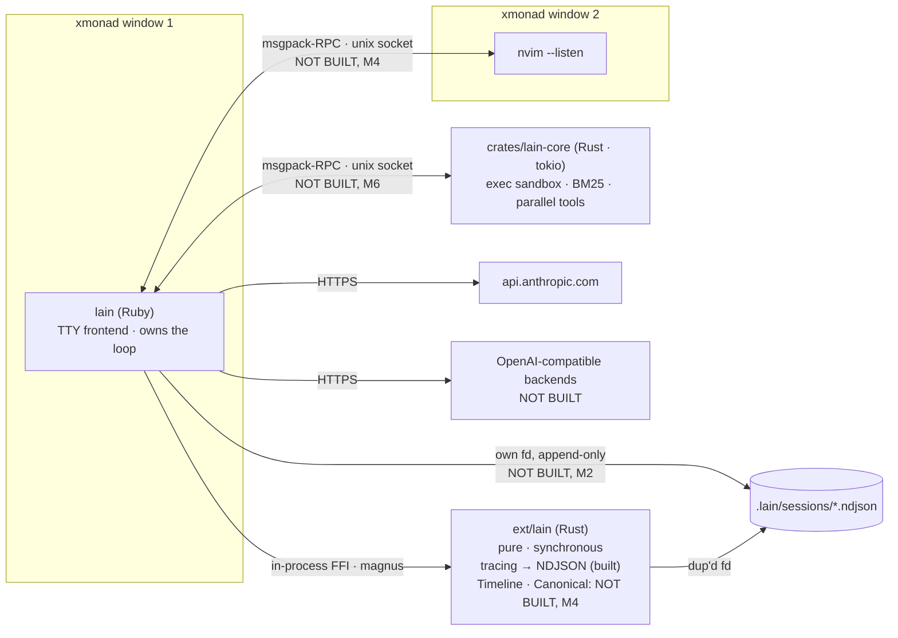
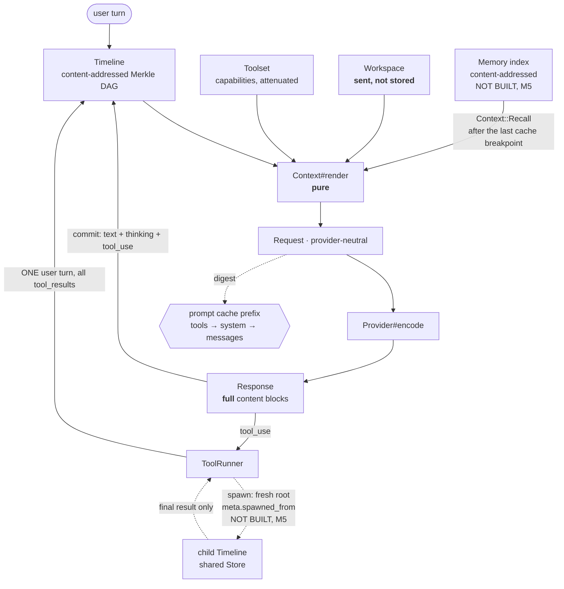

# Lain

Lain is an agent harness for Claude, built as a study bench for LLM orchestration and tool design. It is a hand-rolled agentic loop whose distinguishing property is not that it drives a coding agent well, but that its context strategies, tool designs, and orchestration tactics are swappable, observable, and comparable against one another.

## What Lain is, and what it is not

Lain is a bench. The agent is the vehicle; the bench is the deliverable. A conventional agent optimizes for completing a task. Lain optimizes for making the *strategies behind* the task first-class objects you can substitute, journal, replay, and diff. If the agent itself is only mediocre but you can demonstrate which tool description raised the correct-call rate, or which context strategy survived a provider swap, the project has done its job.

Lain is **not** a competitor to Claude Code. Feature parity is irrelevant here, and it is not a goal. Lain also does not use either provider SDK's built-in agentic loop (`tool_runner`, `Chat#complete`). Those loops work, but they own the loop, and the loop is precisely the object of study. Lain owns its own loop so that every turn passes through seams it can measure.

The motivating context is worth stating plainly, because it explains every design choice below. The author already knows how to judge correctness in Ruby software development, so it is a domain where a mediocre-but-measurable agent teaches something real: you can eyeball whether the agent was right, and then trust the mechanical numbers the bench reports alongside that judgement. The intent is that the intuition transfers to a domain where correctness *cannot* be eyeballed, namely LLM tool-call systems that synthesize medical literature. The bench exists to make that transfer possible.

## Status

**M0 and M1 are done.** 317 examples, RuboCop clean at default metrics, `cargo test` 6/6. The
agent loop is complete and provably correct against `Provider::Mock` — all seven correctness
gates ship as specs — but **it has no tools to call and no way to be typed at**. There is no
`lib/lain/tools/`, no `Handler::Approving`, no `lib/lain/frontend/`, and no `exe/lain`.
`mixlib-shellout`, `thor`, and `state_machines` are declared dependencies with no code using
them yet. Those land in **M1b**, in progress now.

Where this README shows an API, for example `Lain.agent(tools: [...])`, treat it as the target
design rather than behavior you can run today. Nothing in "Core design" or "The bench" should
be read as a description of code you can currently execute unless the Status table below says
otherwise.

| Built (M0 + M1) | Notes |
|---|---|
| `Canonical` | Deterministic bytes. Serves turn hashing **and** prompt-cache stability. |
| `Turn` / `Store` / `Timeline` | Lossless content-addressed Merkle DAG. `commit`, `fork`, `checkout`, `rewind`, `meet`, `diverge_at`. Meet-semilattice laws property-tested over a random forest. |
| `Request` / `Response` / `Usage` | Provider-neutral value objects. `Usage` is a property-tested commutative monoid. |
| `Tool` / `Toolset` / `Tool::Input` / `Contracts` | Capabilities, not permissions. ActiveModel input: one declaration yields both JSON Schema and validation. |
| `Effect` / `Handler` / `Middleware` | Rack idiom over a property-tested monoid. `Handler::Live` is where correctness gate 3 lives. |
| `Provider` / `::Anthropic` / `::Mock` | One round trip, never a loop. |
| `Workspace` / `Context` | Sent-not-stored. `#render` is pure. |
| `Agent` / `Budget` / `ToolRunner` | Explicit state machine. All seven correctness gates as specs. |
| `Channel` / `Sink` / `Event` | Attributed event bus. Only the frontend touches the terminal. |
| `ext/lain` | `tracing` → NDJSON to a **dup'd** caller fd. Pure, synchronous, no tokio. |

The milestone plan, in brief:

- **M0 — done.** Gemspec, dependency posture, `ruby-4.0.5` pinned, pre-commit, CI, `CLAUDE.md`.
- **M1 — done.** The spine: canonical serialization, `Turn`/`Store`/`Timeline`, the
  provider-neutral request/response value objects, the `Provider` interface with
  `Provider::Anthropic` and `Provider::Mock`, tools and toolsets, effects, the model and tool
  middleware phases, the live handler, and the agent state machine.
- **M1b — in progress.** The agent's hands: `Tools::ReadFile`, `Tools::ListFiles` (tier 1,
  structured, no subprocess), `Tools::Bash` (tier 3, `Mixlib::ShellOut`), `Handler::Approving`
  gating tier 3 by default, `Frontend::TTY`, and `exe/lain`. This is the first point at which
  the thing can be used. Also this README rewrite and `docs/concurrency.md`.
- **M2.** Observability: the `Journal` as an NDJSON event bus, per-turn usage and dollar cost,
  and a recording handler. Measurement comes before the seams, because a seam you cannot
  measure is decoration.
- **M3a/b/c.** Test infrastructure (VCR, shared example groups); the transport fork described
  below; the algebra with property-tested laws, composable `Context` combinators, all four
  middleware phases, machine-checked provider capabilities, and the bench (`DryReplay`,
  `LiveReplay`, `Grader`, `Compare`).
- **M4.** The Timeline reimplemented in Rust behind the same interface with the same property
  tests, plus a Neovim frontend.
- **M5.** Orchestration (subagents, todos), cross-session memory, and code mode.
- **M6.** A second round of Rust work and a sweep of retrieval strategies through the bench.

## Architecture, in one breath

`Canonical` gives deterministic bytes, which serve turn hashing *and* prompt-cache stability —
one function, two invariants. `Turn`/`Store`/`Timeline` form a lossless content-addressed
Merkle DAG, so `fork` is O(1) and `diverge_at` localizes a cache break. `Context#render` is a
**pure** function `(Timeline, Toolset, Workspace) → Request`; purity and cache-hit are the same
constraint. Tool calls are `Effect`s interpreted by a `Handler`; `Middleware` is the Rack-idiom
public API over that, and it is a property-tested monoid. Tools are capabilities, not
permissions. `Provider` is one round trip, never a loop — Lain owns the loop, because the loop
is the object of study.

`Workspace` is **sent, not stored**: it renders into the Request and is never appended to the
Timeline. Subagents get a fresh Timeline root whose `meta["spawned_from"]` names the parent's
head, so causal lineage survives while the child never inherits the parent's prompt.

## Topology

`lain` is one Ruby process that owns the loop. It talks to Neovim and to `lain-core` over the
*same* transport — msgpack-RPC on a Unix socket — which is why they appear symmetric below.
**`crates/lain-core` and the Neovim frontend are not built yet** (M4/M6); `ext/lain` is the only
Rust that exists today, and it is in-process.



## Data flow

What is *sent* to the model versus what is *stored* in the Timeline is the distinction the
whole design turns on. `Workspace` renders into the `Request` and is never appended to the
Timeline. A subagent gets a **fresh root** over the shared `Store` — `meta["spawned_from"]`
names the parent's head for causal lineage, but the child's prompt chain never includes the
parent's conversation. Only the child's final result re-enters the parent's Timeline, as an
ordinary `tool_result`.



See [`docs/concurrency.md`](docs/concurrency.md) for how threads, fibers, and Ractors would
each sit on the topology diagram above, and why the concurrency model is deliberately deferred
to M5.

## Requirements

- Ruby `>= 3.2.0`.
- `ANTHROPIC_API_KEY` in the environment. Anything that talks to the Claude API reads it. Without it, only offline paths (for example, dry replay over a recorded session, once that exists) can run.

## Core design

The load-bearing idea is that tool design, context management, and orchestration are not three separate subsystems. They interlock. A tool's result shape *is* context, because the result lands in the message log and is then cached, pruned, and compacted. A context strategy decides which tool results survive, which changes what the model believes it has already done. A subagent is a tool whose result is a compressed context, which makes orchestration a form of context management. Lain treats these as three views of one pure function that renders a `Context`, a `Timeline`, and a toolset into a provider request, and it makes that function a first-class, composable object so that a recorded session can be replayed under a different strategy and diffed.

### The Timeline is a lossless content-addressed Merkle DAG

The conversation history is stored the way git stores commits. A `Turn` is a frozen node carrying a role, its content blocks, and the hash of its parent. Its own hash is the SHA-256 of a canonical serialization of those fields. Crucially, hashing is used for *identity, not storage*: the hash is a derived name, and the full content lives in a store keyed by that name. Nothing is discarded.

Because names are hashes, comparison, deduplication, and cache-break detection are cheap pointer-level operations, while inspection reads the store. Branches share the hashes of their common prefix, so the store holds a single copy of any shared history. Four properties fall out of this one structure: forking is O(1), time-travel operations (checkout, rewind, branch listing) are natural, prompt-cache-break localization is free (walk two chains and the first differing hash is where the cache died), and deduplication across branches is automatic.

One concrete payoff illustrates why the structure is worth the trouble. Naively summing token usage across a branched timeline double-counts the shared prefix. Aggregating over the set of *unique reachable hashes* is correct by construction, with no special-casing.

The canonical serializer (sorted keys, stable ordering) serves two masters at once: it backs turn hashing, and it backs deterministic tool-schema serialization for prompt-cache stability. One function, two invariants. The Timeline is also the honest first home for the Rust extension, because Ruby has no good persistent, structurally-shared DAG and Rust's ownership model is exactly the right tool for one. The Timeline ships as pure Ruby first, behind the same interface, so the eventual Rust version is a swap rather than a rewrite.

### Tool calls are effects interpreted by a middleware stack

Tool dispatch, middleware, and journal replay are collapsed into a single idea. A tool call is an *effect*, and an effect is interpreted by a *handler*. The public API is the familiar Rack, Sidekiq, and Faraday middleware idiom (`#call(env) { |env| ... }`), the effects are the implementation story underneath, and the composition law is what gets verified: middleware composition is associative, and a pass-through is the identity. In that framing, middleware is handler composition, and **deterministic replay is simply a recorded handler** rather than a live one.

There are four middleware phases, all sharing one protocol: a model stack wrapping each provider completion (retry, cost accounting, cache instrumentation, request logging), a tool stack wrapping each tool call (approval gate, timeout, contract checking, result truncation, journaling), a turn stack wrapping each agent turn (budget, iteration ceiling, interrupt, speculative fork), and a REPL stack wrapping each REPL command. Because middleware ordering is the classic Rack footgun, the stacks are inspectable and mutable in the Sidekiq style, with `to_a`, `insert_before`, and `insert_after`.

The model middleware phase is load-bearing rather than decorative, for a transport reason. Lain runs two transports that do not share an HTTP stack: the official `anthropic` gem — kept as the correctness oracle (`Provider::Anthropic`) — uses `net/http` and `connection_pool`, while the forked transport that will become the default Claude path is Faraday-based. Faraday middleware can wrap the latter but not the former, so it cannot be the layer where cross-transport instrumentation lives. The model phase is therefore the single layer at which both transports look identical to the bench, which is why retries, cost accounting, and cache instrumentation live there rather than in any provider's own HTTP stack.

### Context is a monoid of message transformations

Pruning, compaction, cache-breakpoint placement, and reminder injection are not rival subclasses to choose between. Each is an endomorphism on the message list, and they compose associatively with pass-through as the identity:

```ruby
# Target design, not shipped behavior.
ctx = Prune.new(keep: 3) >> Compact.new(at: 150_000) >> CacheBreakpoints.new
```

Because composition is associative and lawful, the bench can sweep the entire lattice of combinations rather than a fixed menu of hand-written strategies. The associativity is property-tested, because a `Context` combinator that is not associative silently produces different prompts depending on composition order, which is exactly the class of bug ordinary unit tests miss.

### Tools are capabilities, not permissions

A subagent holds the tools it was handed, attenuated at construction time (for example, `toolset.only(:read_file, :grep)`). The answer to "what can this subagent do" is one line of code you can read, not a policy engine you have to audit. There is no permission layer to consult; possession of the tool *is* the authorization.

### Putting it together

The agent is an explicit state machine, not a while-loop with a stack of conditionals. Its states (awaiting model, awaiting tools, awaiting approval, awaiting user, done, failed) make `stop_reason` handling total: refusals, token exhaustion, paused turns, and context-window-exceeded conditions are transitions rather than branches someone might forget to write, and each provider normalizes its own stop reasons into this shared set. Everything a frontend shows is a projection of the `Journal` event stream; the TTY, Neovim, and the bench all subscribe, and editor code never reaches into the agent.

## Providers, and the transport

`anthropic` (the official SDK) is a hard dependency. It is declared in the gemspec, and it is
kept as a **correctness oracle**, not the default path: the forked transport described below is
byte-diffed against `Provider::Anthropic#encode`, and one live differential run must produce an
identical `Lain::Response`. It is retired only once the forked path has held.

**`ruby_llm` is not a dependency of any kind — not required, not optional.** There is no
`Lain::Provider::RubyLLM`, and there never will be. This reverses an earlier plan (own the loop
on the official SDK, keep `ruby_llm` behind a provider seam) after three findings:

- Auth is neutral. The API supports exactly two auth methods — a Console `x-api-key` and
  Workload Identity Federation — and Claude Code's subscription OAuth is, per Anthropic's
  credential-use policy, exclusive to Claude Code and claude.ai. So the SDK buys nothing on the
  auth axis; a Console key is required either way.
- `RubyLLM::Provider#complete` is already a stateless single-shot with no loop — `Chat#complete`
  owns the loop, not the provider beneath it. That is the correct seam, and Lain never touches
  `Chat`.
- But their message model is **lossy** for this project. `parse_completion_response` joins every
  text block into one String, joins every thinking block, and keeps only the **first** thinking
  block's signature — the original content array is destroyed. Correctness gate 1 requires
  committing the full block list, and extended-thinking signatures must be echoed back verbatim.
  That cannot be satisfied through their `Message`.

So instead of depending on `ruby_llm`, Lain **vendors a slice of its HTTP layer** — the Faraday
connection stack, the SSE stream accumulator, error mapping — into `lib/lain/provider/http/`
(MIT, © 2025 Carmine Paolino), namespace-rewritten and stripped of the lossy `Message`/`Content`
model in favor of `Lain::Response`. **This is a transport plan, not shipped code**: `lib/lain/provider/http/`
does not exist yet. It is being built in parallel on the `vendor` branch, following the plan's
TDD sequence — vendor verbatim, port their non-VCR unit specs unchanged, bootstrap cassettes,
then mutate red-green until the lossy parts are gone. The official `anthropic` SDK remains the
oracle throughout, and the eventual second provider axis (OpenAI-compatible backends) rides the
same forked transport rather than a `ruby_llm` dependency.

The seam between Lain and any provider is a single HTTP round trip with no loop: a provider
declares its `capabilities`, encodes a provider-neutral request into a wire payload (so the
payload can be byte-diffed and reasoned about for caching), and completes a request into a
provider-neutral response. `Lain::Request` and `Lain::Response` are provider-neutral value
objects that each provider translates to and from. This anti-corruption layer is what makes
both deterministic dry replay and honest cross-provider comparison possible.

### The honest asymmetry

Providers will not offer the same capabilities once a second one exists, and that matters more
than it might first appear. If you were to A/B a medical prompt across two providers and half of
your context tactics silently became no-ops on one of them, the comparison would be a lie.

Lain therefore makes capabilities machine-checked rather than merely documented. A `Context` combinator declares what it requires, and a provider declares what it has:

```ruby
# Target design, not shipped behavior.
class CacheBreakpoints < Lain::Context
  requires :prompt_caching
end

class Compact < Lain::Context
  requires :server_compaction   # Prune requires nothing; it works everywhere.
end
```

When a run mounts a strategy the provider cannot support, the policy is explicit and set per run: `:strict` raises, `:degrade` turns the tactic into a no-op but warns and records the degradation in the journal, and `:simulate` approximates it client-side. Bench runs default to `:degrade` so a sweep never dies mid-flight, while anything real defaults to `:strict`. Unsupported tactics degrade *loudly*, never silently, and the comparison tooling refuses to compare two runs whose degraded-capability sets differ unless you explicitly opt in. This turns "which of my context tactics survive a provider swap" from a footnote into a question the bench answers, which is why the provider is a swept axis alongside context rather than an afterthought.

## The bench

Once the spine and the seams exist, the bench replays recorded sessions under different strategies and reports distributions rather than anecdotes. There are two replay modes, and conflating them is the mistake to avoid. *Dry replay* re-renders requests under a different context or provider encoding from a recorded timeline; it is free, instant, deterministic, and byte-diffable, and it is the unit test for context strategies. *Live replay* re-runs against the API; it costs money and is nondeterministic, and it is the experiment. Comparisons report distributions over many runs, because a single-run A/B is noise.

The grader is load-bearing, not a nice-to-have. Mechanical metrics (tokens, cache-hit ratio, turn count, tool-call histogram, wall time, cost) say nothing about whether the agent was actually *right*. In Ruby you can eyeball correctness and then trust those numbers; in medical synthesis you cannot, which is the entire reason the bench exists. The intended grading surfaces are a fixture grader with hard, deterministic assertions and a rubric grader that uses an LLM judge in a separate context window against explicit, independently-gradeable criteria.

## Development

After checking out the repo, run `bin/setup` to install dependencies. Then run `rake spec` to run the tests. You can also run `bin/console` for an interactive prompt that will let you experiment.

To install this gem onto your local machine, run `bundle exec rake install`. To release a new version, update the version number in `version.rb`, and then run `bundle exec rake release`, which will create a git tag for the version, push git commits and the created tag, and push the `.gem` file to [rubygems.org](https://rubygems.org).

## Contributing

Bug reports and pull requests are welcome on GitHub at https://github.com/joeljohnson/lain. This project is intended to be a safe, welcoming space for collaboration, and contributors are expected to adhere to the [code of conduct](https://github.com/joeljohnson/lain/blob/main/CODE_OF_CONDUCT.md).

## License

The gem is available as open source under the terms of the [MIT License](https://opensource.org/licenses/MIT).

## Code of Conduct

Everyone interacting in the Lain project's codebases, issue trackers, chat rooms and mailing lists is expected to follow the [code of conduct](https://github.com/joeljohnson/lain/blob/main/CODE_OF_CONDUCT.md).
