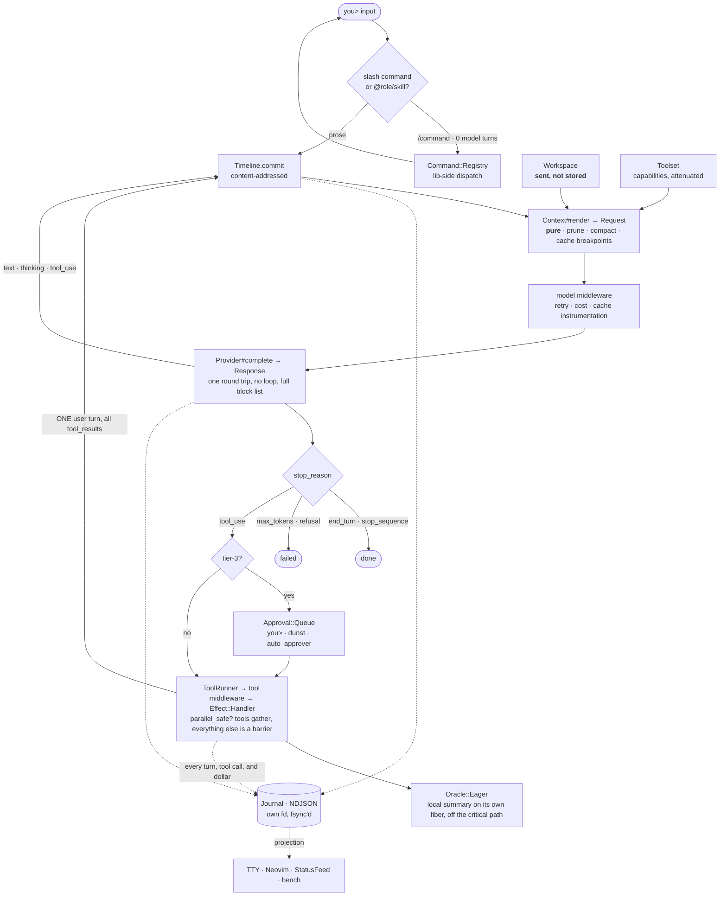

# Lain

Lain is an agent harness built for experiments on LLM orchestration, tool design, and the agent
life-cycle. It runs its own agentic loop, and the parts of that loop you would normally hard-code
sit behind seams instead.

**Swappable.** An orchestration topology, a provider, a context strategy, an isolation backend, an
oracle, and a grader are each one interface with several shipped implementations. Substituting one
is a constructor argument.

**Observable.** Every turn, tool call, degradation, and dollar lands in an
[NDJSON](docs/GLOSSARY.md#ndjson) journal on its own fd. Both frontends and the bench are
projections of that one stream, and the agent knows about none of them.

**Comparable.** `Compare` folds n runs into a per-metric
[distribution](docs/GLOSSARY.md#distribution-variance) and refuses to run on fewer than 2, because
one run of each tells you nothing about whether a difference is the tactic or the variance.

## Scope

Lain is built to make the *strategies behind* a task into first-class objects you can substitute,
journal, replay, and diff. If the agent itself is only mediocre, but you can
demonstrate which tool description raised the correct-call rate, or which context strategy
survived a provider swap, the project has done its job.

Feature parity with Claude Code is not a goal. Lain also skips both provider SDKs' built-in
agentic loops (`tool_runner`, `Chat#complete`). Those loops work fine, and they own the loop. The
loop is the object of study, so Lain owns its own and every turn passes through seams it can
measure.

Ruby development is the target domain because I can already judge correctness in it by eye, which
makes the mechanical numbers beside that judgement trustworthy. The intent is that the intuition
transfers to a domain where correctness cannot be eyeballed: LLM tool-call systems that synthesize
medical literature.

## Setup

Required:

- Ruby `>= 3.2.0`.
- `ANTHROPIC_API_KEY` for anything that talks to the Claude API.

```bash
git clone https://github.com/joeljohnson/lain && cd lain
bin/setup                 # bundle install
bundle exec rake compile  # builds ext/lain into lib/lain/lain.so
export ANTHROPIC_API_KEY=sk-...
exe/lain                  # or `lain` once installed
```

Everything below is optional, and lain runs without any of it.

| Optional | What you get without it | What it adds |
|---|---|---|
| **tmux** | A plain TTY chat in your terminal. | `lain up`, the status HUD, `/fork` into a sibling window, `/btw` popups, `--windows` subagent viewers. |
| **Neovim** | No editor integration. | `lain up --nvim`, live `lain://` buffers, the editable `lain://request` buffer that round-trips a hand-edited prompt back to the provider. |
| **Ollama** | Compaction still fires, but drops tool results to an elision line instead of a summary. | Local tool-result summarization, and `--provider ollama` as a free offline arm. |
| **`dunstify`** | Approvals wait at the `you>` prompt. | Desktop notification approvals, racing the terminal surface. |
| **AWS Bedrock creds** | Anthropic and Ollama. | `--provider bedrock`. Reads `AWS_BEARER_TOKEN_BEDROCK` and `AWS_REGION`. |
| **`rake core:build`** | `bash` runs in-process. | `crates/lain-core`, the out-of-process exec daemon, for the bench's exec-comparison arm. |

Without an API key the offline paths still run: dry replay, the sweeps, `lain friction`,
`lain bench variance`, and local Ollama.

## Usage

`lain` is one Ruby process that owns the loop, and it runs tmux-native. `lain up` creates (or
reattaches to) a tmux session with a `chat` window and a session-scoped status HUD. `lain up
--nvim` splits that window into an `nvim --listen` pane and a `chat` pane pinned to one cwd and one
deterministic socket, so the editor and the chat that attaches to it can never diverge.

```bash
lain up                       # the cockpit
lain up --nvim                # cockpit + editor
lain                          # just the chat, no tmux
```

You drive a conversation from the `you>` prompt. Prose, a `@role/skill` line, or a `/command` all
go in there.

### Session commands

Typed at `you>`. Each dispatches lib-side, ahead of the skill middleware, with zero model turns.

* [/help](docs/commands.md#help): list the registered commands and loaded skills.
* [/status](docs/commands.md#status): cache warmth, fleet size, inbox count.
* [/sessions](docs/commands.md#sessions): recorded sessions, newest first.
* [/model](docs/commands.md#model): show the model in force, or switch the next turn's model.
* [/rewind](docs/commands.md#rewind): move back N turns, or to a recorded digest.
* [/fork](docs/commands.md#fork): branch this session at its head into a new tmux window.
* [/btw](docs/commands.md#btw): ask an ephemeral side-question in a popup, journalled then reaped.
* [/keep](docs/commands.md#keep): promote the ephemeral `--btw` session into a durable one.
* [/inbox](docs/commands.md#inbox): list and answer pending human questions.
* [/approve](docs/commands.md#approve): answer each pending tool approval.
* [/yolo](docs/commands.md#yolo): auto-approve gated tool calls, or restore the approval queue.
* [/goal](docs/commands.md#goal): drive the agent toward a standing goal until it signals done.
* [/ruby](docs/commands.md#ruby): inspect live state, as a console, an expression, or a file.
* [/meta](docs/commands.md#meta): generate a customized harness script, then run it by slug.
* [/quit](docs/commands.md#quit): end the session.

### Shell commands

Offline and deterministic unless noted.

* [lain chat](docs/commands.md#lain-chat): start an interactive session. The default subcommand.
* [lain up](docs/commands.md#lain-up): create or reattach to the tmux cockpit.
* [lain sessions](docs/commands.md#lain-sessions): this project's recorded sessions, newest first.
* [lain watch](docs/commands.md#lain-watch): read-only live tail of one actor's lineage.
* [lain friction](docs/commands.md#lain-friction): knob guidance from a session's friction signals.
* [lain consolidate](docs/commands.md#lain-consolidate): distill completed subagent lineages into memory.
* [lain improve](docs/commands.md#lain-improve): record what would make lain itself better.
* [lain improvements](docs/commands.md#lain-improvements): the accumulated cross-project dogfood queue.
* [lain bench variance](docs/commands.md#lain-bench-variance): determinism and divergence across recorded runs.
* [lain bench sweep](docs/commands.md#lain-bench-sweep): 5-arm retrieval eval, [recall@k](docs/GLOSSARY.md#bm25-recallk) over the gold corpus.
* [lain bench plan-sweep](docs/commands.md#lain-bench-plan-sweep): shape x density sweep over a fixture plan.
* [lain bench record](docs/commands.md#lain-bench-record): N live runs of a task file. Spends real API money.

### The turn lifecycle

One turn, end to end. `Context#render` is pure, the Provider is a single round trip, and the loop
lives in `Agent`.


```mermaid
flowchart TB
  IN(["you&gt; input"]) --> DISP{"slash command<br/>or @role/skill?"}
  DISP -->|"/command · 0 model turns"| CMD["Command::Registry<br/>lib-side dispatch"] --> IN
  DISP -->|prose| TL

  TL["Timeline.commit<br/>content-addressed"] --> CTX
  WS["Workspace<br/><b>sent, not stored</b>"] --> CTX
  TS["Toolset<br/>capabilities, attenuated"] --> CTX
  CTX["Context#render → Request<br/><b>pure</b> · prune · compact · cache breakpoints"] --> MW
  MW["model middleware<br/>retry · cost · cache instrumentation"] --> P
  P["Provider#complete → Response<br/>one round trip, no loop, full block list"] --> SR{"stop_reason"}
  P -->|"text · thinking · tool_use"| TL

  SR -->|"end_turn · stop_sequence"| DONE([done])
  SR -->|"max_tokens · refusal"| FAIL([failed])
  SR -->|tool_use| GATE{"tier-3?"}
  GATE -->|yes| APR["Approval::Queue<br/>you&gt; · dunst · auto_approver"] --> EXEC
  GATE -->|no| EXEC["ToolRunner → tool middleware → Effect::Handler<br/>parallel_safe? tools gather, everything else is a barrier"]
  EXEC -->|"ONE user turn, all tool_results"| TL
  EXEC --> SUM["Oracle::Eager<br/>local summary on its own fiber, off the critical path"]

  TL -.-> J
  P -.-> J
  EXEC -.->|every turn, tool call, and dollar| J[("Journal · NDJSON<br/>own fd, fsync'd")]
  J -.->|projection| UI["TTY · Neovim · StatusFeed · bench"]
```

Tool results come back as **one** user turn carrying every `tool_result`, then the loop returns to
`Context#render`. The agent is an explicit `state_machines` machine, so every `stop_reason` is a
transition rather than a branch someone might forget to write. The full state diagram is in
[`docs/agent-state-machine.md`](docs/agent-state-machine.md).

### Compaction and summarizer tiers

Compaction is on by default in `lain chat`. It runs in three tiers, and only one of them costs a
model call. Each tier only sees what the one before it declined.

**Tier 0, yours, free.** Summarizers you declare in `.lain/summarizers.rb` — pure Ruby, no provider,
no IO, so they cost neither tokens nor latency. Each one answers two questions about **one** tool
result: `suitable?` and `compact`. They live in one object because "can I compress this" and "how"
are the same knowledge.

```ruby
# .lain/summarizers.rb
summarizer "rspec" do
  def suitable?(result) = result.tool_name == "bash" && result.text.include?("examples,")

  def compact(result) = result.text.lines.grep(/examples,|^rspec /).join
end
```

A `Summarizer::Result` carries `tool_name` and `text`, because some kinds are distinguishable by
tool and some only by content (a coverage report and a build log are both `bash`). Declaration order
decides between two suitable summarizers — the first declared wins, which is a lever you can see in
your own file. A typo'd verb, a duplicate name, and a bodyless declaration are each refused by name
at load. A summarizer that raises falls through to tier 1 rather than losing the summary, and one
returning blank is refused loudly. An absent file is an empty catalog, never an error.

`/meta summarizer <prompt>` will draft one for you into `.lain/summarizers/` for review. Nothing
loads that directory — copy the declaration into `.lain/summarizers.rb` yourself once you have read
it.

**Tier 1, eager and model-backed.** When a large tool result lands and no tier-0 summarizer claimed
it, `Oracle::Eager` fires a summary on its own `Async` task and holds the answer against the
result's content address. It fires once per large result, off the turn's critical path. The
summarizer is a **tier chosen independently of the chat**: `--summarizer-provider`,
`--summarizer-model`, `--summarizer-max-tokens`, defaulting to a local Ollama `qwen3:4b`, because
paying frontier-model tokens to compress a tool result usually costs more than resending the result.
When it is a paid tier, its spend lands on the record as a `Telemetry::OracleAnswer` carrying the
model and real usage — a summarizer that spends silently would make the whole ledger a fiction.

**Tier 2, the compacting turn, pure.** When the head grows past the threshold, the run materializes
a **derived context timeline** and collapses the head's span into it, reading the summaries the
tiers above already produced out of a frozen `Compaction::SummarySnapshot`. No model call, no
network, deterministic bytes. A result with no held summary renders as an honest elision line. What
that derived lineage *is* — and why it is a second timeline rather than a rewritten array — is the
next section.

To turn the local tier 1 on:

```bash
ollama serve            # http://localhost:11434
ollama pull qwen3:4b    # Provider::Ollama::DEFAULT_MODEL
```

With Ollama absent or the model unpulled, the fire fails inside its task boundary and nothing
raises. You get elision lines instead of summaries, which is a less useful compaction rather than
an error. `--api-base` moves whichever of the chat and the summarizer is on Ollama.

**Pinned history.** [`/pin`](docs/commands.md#pin) marks a turn the compactor may not touch, and
`/goal`'s objective is pinned automatically once it enters the timeline. A pin is a turn digest
recorded on the `Session`, journalled, and replayed on `--resume`. Both halves of the pipeline honor
the same pin set: the candidate head excludes pinned turns, and the derivation treats a pin as a
**cut point** rather than a shield, so the pinned turn is retained verbatim *in position*, between
the collapses of what preceded and what followed it. Pinning enough can leave a compaction with
nothing worth removing, which the journal records as a decision that would not shrink rather than a
compaction that did nothing.

Compaction prices every decision from its own `PriceBook`, which degrades to zero for a model with
no list price rather than crashing a local chat mid-conversation. `Telemetry::Compaction` records
the model those figures are quoted in, so a zero beside `qwen3:4b` reads as the fallback it is — and
when a run switches models mid-session, the cost fields are **absent** rather than repriced, since a
figure quoted against a model that did not run is worse than no figure. The record still names the
model the compaction actually ran under.

Knobs: `--no-compact`, `--compact-bytes` (default 262144, roughly 64k tokens), `--compact-cap`
(1048576, forces a compaction even while the cache is warm), `--compact-keep` (20 trailing messages
left verbatim), and `--compact-strategy` (below — it swaps the collapse policy, not compaction
itself). The window that triggers a compaction follows the live model, re-derived each turn, so
switching to a larger-window model mid-session widens the runway instead of leaving the old ceiling
in force. `lain friction SESSION` reads a finished journal back and tells you which of these the run
was fighting.

### Two lineages, one render path

Compaction is not a rewrite of the message array. Every compacting turn of every `lain chat` —
flagged or not — builds a **derived context timeline**: a second lineage of `Event`s, materialized in
the session's own content-addressed `Store`, whose replacement events name the source turns they
subsume via `causal_parents`. That derived chain's projection is substituted as the rendered
messages, and it is what the provider sees.

The session timeline stays the **lossless record**. Its head advances only by committed turns; the
derivation never touches it. `Timeline#to_a` follows `render_parent` only, so a replacement can name
every digest it subsumes without the render walking the turns it replaced — and `Ledger` aggregates
over render ancestry, so the causal fan-in double-counts no tokens.

That turns compaction from a behavior into a **comparable artifact**: it has a content address, it is
diffable, and one `context_derived` journal edge per derivation carries `source_head`, `derived_head`,
`strategy`, `spans`, `cut`, `moved` and `keep_last` — enough for `Compaction::DerivationAudit` to
**re-derive** the chain rather than diff a copy of it.

Which edges are re-derivable is narrower than that sounds, and worth knowing before you reach for the
audit. It re-derives an **unpinned `--compact-strategy elide`** run: deterministic, and the edge names
a strategy you can hand it a builder for. It does **not** re-derive the un-flagged default — that edge
names `Source::Derived::Held`, a `private_constant` whose collapse reads a per-turn `SummarySnapshot`
that is never journalled, so nothing shipped can build it. And `ContextDerived` carries no pin set, so
a **pinned** run re-derives different ranges and the audit reports drift that nobody introduced. The
audit is also a library reader today, with no `lain` subcommand in front of it.

**What `--compact-strategy` selects is which policy collapses a span, not whether the derivation
runs.** Unset, the policy is the run's own eager tool-result tier: the tier-1 summaries, read back
through the per-turn `SummarySnapshot`. With nothing pinned it emits the same `user` message, with the
same text, that `Context::Compact` produced through that same snapshot — moving the render onto the
derived chain did not retire the tool-result summarizer ladder. Naming a strategy substitutes an
operator-chosen policy instead. The eager tier is the **control arm**; the flag is the arm under
test. The flag deliberately carries **no Thor default** — a default would materialize the key, so the
reader could never see that no strategy was named, and the control arm would be selectable by nobody.

`Context::Compact` is still in the tree and is now a **bench-only combinator**: nothing on the chat
render path composes it. Its two remaining production callers are `Bench::PlanSweep::Driver` and
`Plan::CompactRewrite`, and those are one caller wearing two names — the rewrite is built only by
`Plan::LinearRewrite`, which is built only by that same driver. It is an arm to compare against, not
the shipped path.

**Pins behave differently on the two**, and the difference is worth knowing before you pin across a
tool call:

| | `Context::Compact` (bench arm) | derived chain (every chat) |
|---|---|---|
| pinned `tool_use` whose answer is collapsed | **ships the 400** — the projection strands a `tool_result`, characterized in `spec/lain/context/compact_spec.rb` as a known defect | **refuses** — validates its own projection through `Context::Conversation`, raises `Derivation::Invalid`, renders the full uncompacted history, journals `derivation_refused`. The chain is judged from the pending writes, so a refusal touches neither the provider nor the `Store`. |
| placement of a pinned turn | one summary, with the pin kept in position around it | pins are **cut points** — one range per contiguous unpinned run, so the pin sits *between* two replacements: `keep_last + 3` messages where `Compact` gave `keep_last + 2` |

Refusing is **not the repair**. A session pinned across a tool pair stops compacting for as long as
the pin stands, which is exactly what the `consecutive` streak on `derivation_refused` is there to
make visible. The real repair is a decision about what a pin *means* — drag the counterpart along, or
drop it with the pin — and that is not a compaction-path fix.

**What a turn costs.** A derivation writes ~22 store objects, constant in history length: the derived
chain is bounded by `keep_last` plus the number of ranges, never by how long the session is. Time is
O(n) — it walks the chain and projects every message before it can find the span — but with a much
smaller constant than the projection it replaced, because it never `Canonical.dump`s the whole
history. Measured on this branch at `keep_last: 20`, it crosses under that projection somewhere
between 100 and 150 messages (1.6 ms vs 1.0 ms at 100; 2.5 ms vs 10.2 ms at 800), with 22 objects at
every size. A **deferring** turn — no signal, bad timing, an empty head — writes zero store objects,
journals no edge, asks the strategy nothing, and returns the base `Context` itself. Two defers are not
free, and both are reached only after the strategy has been asked: `would_not_shrink`, where the
derivation has already run and journalled its edge by the time the rewrite is measured and declined,
and a **refusal**, which under `--compact-strategy summarizing` has already paid a live model call for
a summary it then throws away.

**The failure modes you will actually meet.**

| On the record | What it means |
|---|---|
| `derivation_refused` | This turn rendered **uncompacted**. One is an awkward history. |
| a rising `consecutive` on it | The session has **stopped compacting**. A deterministic strategy over a stable history refuses identically every turn, so the streak is the only thing that tells one awkward turn from forty. Under `--compact-strategy summarizing` it is also a **running bill**: the memo is keyed by span content address, so a session that keeps chatting asks for — and discards — a fresh summary every turn. Watch the `oracle_answer` records beside it. |
| `compaction_decision` with `would_not_shrink: true` | The rewrite was declined because it would not have made the prompt strictly smaller. A byte-neutral rewrite is declined too — it buys nothing and still breaks the cache prefix. |
| a `stderr` line attributed to `lain:compaction` | A `--compact-strategy summarizing` tier was unreachable, so that span was left **uncollapsed**. It costs the span, never the turn. The id is namespaced so a journal or nvim reader can filter it from real tool output. |

**What is deliberately not here.** Derivation is **non-recursive**: every chain is a function of the
session timeline alone, never of a previous derived chain, which is what keeps the derived head a pure
content address of (source head, strategy). There is no incremental extension and no `Derivation#extend`
— the derivation is *not* a functor on the prefix order (`T1 <= T2` does not imply
`derive(T1) <= derive(T2)`, because `Event#payload` folds `render_parent` and the `keep_last` window
slides), and a characterization spec fails if someone "fixes" that. Hierarchical derivation, the
deterministic plan-step collapse, exchange-level grouping, and retiring `Context::Compact` are all
designed and **not built**.

### Slow middleware blocks the reactor

The whole loop runs on one `async` reactor, on one OS thread. Middleware runs inside the fiber
doing the work. A fiber yields only at an IO boundary the scheduler controls, which is what makes
the parallel-tool fan-out safe without a single lock. It is also the constraint on what you may put
in a middleware.

A middleware that does not yield stalls **everything**: sibling tool fibers, the compaction
summarizer, and the fiber draining the `Channel` to the frontend. The symptom is a frozen HUD, a
`lain watch` window that stops updating, and a tool fan-out that quietly serializes. Three things
cause it:

- a tight CPU loop (a big regex over a whole file, a JSON round trip of a huge result),
- an FFI or native call that blocks without the fiber scheduler's hooks,
- blocking IO not routed through a scheduler-aware call.

Shelling out is not one of them. Ruby's fiber scheduler hooks `Mixlib::ShellOut`'s `IO.select` and
`Process.waitpid2`, measured under a 10MB stdout flood, so `bash` runs as an ordinary task.

**`Middleware::Timeout` does not interrupt.** Interrupting arbitrary Ruby would need a watchdog
thread, which the no-threads constraint rules out. It publishes a monotonic `env[:deadline]` a
cooperative downstream can honor and raises `Exceeded` after the fact, which bounds reporting
rather than execution. A middleware that hangs is not stopped by it, and `/quit` or Ctrl-C cannot
stop it either, since cancellation lands only at the next scheduler yield point.

So: keep middleware cheap and non-blocking, and route IO through async-aware calls. The fiber
posture and its measurements are in [`docs/concurrency.md`](docs/concurrency.md).

### The cockpit

`lain up --nvim` is the full setup. One tmux window, split into an editor pane and a chat pane
pinned to the same cwd and the same socket, with a status HUD along the bottom.

```
┌─ nvim ──────────────────┬─ chat ──────────────────┐
│ lain://journal          │ you> refactor the Store │
│  [a3f grep] 12 matches  │                         │
│  [a3f read] store.rb    │ ● read_file store.rb    │
│                         │ ● grep "def fetch"      │
├─ lain://timeline ───────┤ ⚠ bash: rm -rf tmp/     │
│  user   refactor the... │   approve? [y/N]        │
│  asst   tool_use ×2     │                         │
├─ lain://inbox ──────────┤ you> _                  │
│  2m  which Store impl?  │                         │
├─ lain://request ────────┤                         │
│  system: You are...     │                         │
└─────────────────────────┴─────────────────────────┘
  🔥 fleet:2 inbox:1                          14:32
```

**The HUD** is the `🔥 fleet:2 inbox:1` segment. 🔥 means the provider's cached prefix is still
inside its sliding TTL and ❄ means it has gone cold, `fleet` is how many subagents are running,
and `inbox` is how many questions are waiting on you. It reads `.lain/state.json`, which
`Lain::StatusFeed` publishes, so it describes the project the active pane is sitting in. With `jq`
on `PATH` you get that form; without it, the raw JSON. It is never blank and never an error.

**The editor pane** needs nothing installed. `lain chat --nvim` injects its whole runtime into a
bare `nvim --listen` at attach time, so the gem and the editor cannot drift out of sync. Six
buffers exist:

| Buffer | What it shows | Editable |
|---|---|---|
| `lain://journal` | live tool output, attributed `[id stream]` per run | no |
| `lain://timeline` | one line per turn, folded per turn | no |
| `lain://inbox` | pending human questions, newest age first | answer in place |
| `lain://request` | the exact prompt about to be sent | **yes** |
| `lain://workspace` | the workspace projection, on demand | no |
| `lain://diff` | pending edits, in nvim's own diff filetype | no |

`:LainStart` lays them out: journal down the left, timeline over inbox over request on the right.
`]]` and `[[` jump record to record in any of them.

Two gestures matter. On a question in `lain://inbox`, `r` or `<CR>` prompts for your answer and
submits it (`:LainReply <answer>` does the same from anywhere). And `lain://request` is the one
editable buffer: change the prompt by hand, then `:LainResend` sends *your* bytes to the provider
instead of the rendered ones. That is the fastest way to test whether a context tactic was the
thing that mattered.

For your own config, the plugin fires `User LainAttach` and `User LainRender`, marks every buffer
with `b:lain_view`, and ships `lain*` highlight groups. `:help lain` has the full contract.

**Without `lain up`.** The [tmux plugin](plugin/tmux/README.md) puts the same `#{lain_status}`
segment in any status bar and binds `prefix + b` for a `/btw` popup and `prefix + F` to fork the
session into a new window, with no managed session involved. The [Neovim
plugin](plugin/nvim/README.md) owns only the per-project socket convention
(`$XDG_RUNTIME_DIR/lain/nvim-<hash>.sock`, or `.lain/nvim.sock` when the project has a `.lain/`)
and the `:LainStart` layout.

**Watching subagents.** `lain chat --windows` opens a tmux window per subagent spawn, each running
a read-only [`lain watch`](docs/commands.md#lain-watch) on that actor's lineage. It needs `$TMUX`
and a journal.

### When something looks wrong

| Symptom | Cause |
|---|---|
| Cache-hit ratio stays near zero on Claude | Anthropic's minimum cacheable prefix is **4096 tokens**. A short system prompt silently will not cache, with no error and nothing on the wire to tell you. Check the prefix length before anything else. |
| Compaction leaves elision lines instead of summaries | The local summarizer had nothing to answer it. `ollama serve` and `ollama pull qwen3:4b`. The fire fails inside its task boundary, so nothing raises. |
| HUD prints raw JSON, or `lain: no state yet` | `jq` is not on `PATH` (raw JSON), or no session has published `.lain/state.json` in this project yet. Both are degraded states by design, never errors. |
| Bedrock says a model does not exist | Almost always a region or endpoint mismatch, not a bad id. Bare `anthropic.`-prefixed Mantle ids are correct as written. Check `AWS_REGION` first. |
| `--windows` opens no subagent viewers | It needs `$TMUX` and a session journal. It is incompatible with `--no-journal`. |
| HUD freezes, `lain watch` stops updating, tools stop overlapping | Something is blocking the reactor. See [Slow middleware blocks the reactor](#slow-middleware-blocks-the-reactor). |
| Ollama output differs run to run at `--temperature 0` | Greedy decoding is necessary, not sufficient. First-run-after-load divergence and GPU float non-associativity both perturb it; see [docs/providers/ollama.md](docs/providers/ollama.md#determinism-the-honest-version). |

`lain friction SESSION` reads a finished session back and reports which knobs the run was fighting.
It is offline, deterministic, and needs no API key.

## Components

Each row is one interface with several implementations behind it. **[`ARCHITECTURE.md`](ARCHITECTURE.md)**
maps every one of them to the files that implement it, and it wins wherever this prose disagrees
with it. [`docs/GLOSSARY.md`](docs/GLOSSARY.md) defines the math and CS vocabulary.

| Component | What it is | Why it exists |
|---|---|---|
| `Canonical` | Deterministic bytes, [BLAKE3](docs/GLOSSARY.md#blake3) over a sorted-key serialization. | Event hashing and prompt-cache stability are the same problem. One function, two invariants. |
| `Event` / `Store` / `Timeline` | A lossless [content-addressed](docs/GLOSSARY.md#content-addressable-storage) [Merkle DAG](docs/GLOSSARY.md#merkle-tree) of the conversation. | `fork` is O(1), `diverge_at` localizes a cache break, and usage aggregates over unique reachable digests instead of double-counting a shared prefix. |
| `Request` / `Response` / `Usage` | Provider-neutral value objects. `Usage` is a property-tested commutative [monoid](docs/GLOSSARY.md#monoid). | The [anti-corruption layer](docs/GLOSSARY.md#anti-corruption-layer) that makes dry replay and cross-provider comparison honest. |
| `Provider` / `Capability` | One HTTP round trip, no loop. `AnthropicRaw` (default), `Anthropic` (SDK oracle), `Bedrock`, `Ollama`, `Mock`. | Lain owns the loop, because the loop is the object of study. `Capability::Policy` resolves a combinator/provider mismatch loudly. |
| `Context` / `Workspace` | A composable pipeline of message transformations. `#render` is pure. | Purity and cache-hit are the same constraint. `Workspace` is sent, never stored. |
| `Tool` / `Toolset` / `Tool::Input` | 23 tool classes, 20 of them in the live chat toolset. `Tool::Input` (ActiveModel) declares the JSON Schema and the local validation once. | Capabilities, not permissions: a subagent holds what it was handed, and the schema cannot drift from the validation. |
| `Effect` / `Effect::Handler` / `Gate` / `Middleware` | The Rack idiom over a property-tested monoid. | Deterministic replay is a recorded handler rather than a live one. `Gate` is where tier-3 approval lives. |
| `Agent` / `Budget` / `ToolRunner` / `Supervisor` | An explicit `state_machines` machine plus its collaborators. | Every `stop_reason` is a transition, so refusals and ceilings cannot be forgotten. Cancellation is structured, never `Thread#kill`. |
| `Arm` / `Compare` / `Ledger` / `PriceBook` | 4 orchestration topologies on one seam, scored by distribution and priced from the Journal. | Comparing topologies should not mean editing the loop. |
| `Grader` | `Fixture` (deterministic assertions) and `Rubric` (LLM judge in a separate window) behind one `Grade`. | Mechanical metrics say nothing about whether the agent was right. |
| `Memory` / `Embedder` | Content-addressed index with a manifest, a graph, and BM25 retrieval. | Recall is a retrieval problem with a measurable recall@k, so it gets swept like any other axis. |
| `Journal` / `Channel` / `StatusFeed` / `SessionRecord` | One NDJSON file per session on its own fd, crash-resumable via a `.wal`. | The experiment record. Everything a frontend shows is a projection of it. |
| `Skill` / `Role` / `Plan` / `Gherkin` / `Oracle` | Config values, not behavior. | A role is an attenuation plus a prompt slot; `Gherkin` is a content-addressed IR a grader can attest against. |
| `Frontend::TTY` / `Frontend::Neovim` | Two subscribers to the same stream. | Editor code never reaches into the agent. |
| `ext/lain` | In-process Rust (`lain.so`): Canonical/digest, the persistent DAG, in-memory BM25, AST search, `tracing` to NDJSON on a dup'd fd. | Data-structure work Ruby's object model makes asymptotically worse. Pure, synchronous, no tokio. |
| `crates/lain-core` | Out-of-process [msgpack-RPC](docs/GLOSSARY.md#messagepack-rpc) exec daemon. Builds only under `rake core:build`. | Async and isolation-relevant work belongs out of process. An in-process sandbox is not a sandbox. |

## Configuration

There are no config files to write before the first run. Everything below has a working default.

**Project-local, under `.lain/`.** These are project artifacts, like `.git/`, not XDG state.

| Path | What it holds |
|---|---|
| `.lain/slots/*.md` | Prompt slot fills. What lands in the system prompt for this project. |
| `.lain/slots/role/*.md` | Per-role prompt fills, over the shipped role templates. |
| `.lain/slots/skill/*.md` | Per-skill prompt fills. |
| `.lain/skills/*.md` | Your skills, merged over the shipped catalog. Reachable as `@role/skill` at the prompt. |
| `.lain/services.rb` | The isolation services DSL: the per-worker `postgres` / `redis` instances a worker's lease provisions. Read by the `DbIndex` and `Compose` decorators, which layer over whatever `--isolation` resolved. |
| `.lain/summarizers.rb` | Your deterministic tier-0 summarizers, tried before any model call. See [Compaction and summarizer tiers](#compaction-and-summarizer-tiers). |
| `.lain/summarizers/` | Drafts written by `/meta summarizer`, for you to read and copy into `summarizers.rb`. **Nothing loads this directory.** |
| `.lain/meta/` | Scripts generated by [`/meta`](docs/commands.md#meta). |
| `.lain/state.json` | The status HUD's state, read by the tmux plugin. |

**Durable state, under XDG.** `Lain::Paths` resolves `$XDG_STATE_HOME` (falling back to
`~/.local/state`), `$XDG_CONFIG_HOME`, `$XDG_CACHE_HOME`, and `$XDG_RUNTIME_DIR`. A non-absolute
value is invalid per the spec and is refused.

| Path | What it holds |
|---|---|
| `$XDG_STATE_HOME/lain/sessions/<project-hash>/` | Session NDJSON and its `.wal`. One directory per project. |
| `$XDG_STATE_HOME/lain/improvements.ndjson` | The cross-project dogfood queue. |
| `$XDG_STATE_HOME/lain/history` | The TTY prompt's history. |

**Environment.**

| Var | Read by | Meaning |
|---|---|---|
| `ANTHROPIC_API_KEY` | `Provider::AnthropicRaw`, `Provider::Anthropic` | Required for the Claude path. Refused before construction if unset. |
| `AWS_BEARER_TOKEN_BEDROCK`, `AWS_REGION` | `Provider::Bedrock` | Read by the Bedrock client, not by a lain flag. |
| `LAIN_STREAM_DEBUG` | the SSE accumulator | Dumps raw stream frames while debugging a provider. |
| `LAIN_INTEGRATION`, `LAIN_OLLAMA`, `LAIN_SPIKE` | the test suite | Opt in to the specs that cost money, need a local Ollama, or run a spike. |

The library does **not** read `OLLAMA_API_BASE`. The Ollama base is a constructor argument or the
`--api-base` flag; the env var is a convenience for the specs only. Everything else is a CLI flag,
documented in [`docs/commands.md`](docs/commands.md).

## Architecture

`Canonical` gives deterministic bytes, which serve event hashing *and* prompt-cache stability: one
function, two invariants. `Event`, `Store`, and `Timeline` form a lossless content-addressed Merkle
DAG, so `fork` is O(1) and `diverge_at` localizes a cache break. `Context#render` is a **pure**
function `(Timeline, Toolset, Workspace) -> Request`; purity and cache-hit are the same constraint.
Tool calls are `Effect`s interpreted by an `Effect::Handler`, and `Middleware` is the Rack-idiom
public API over that, [property-tested](docs/GLOSSARY.md#property-based-testing) as a monoid. Tools
are capabilities, not permissions. `Provider` is one round trip with no loop, because Lain owns the
loop and the loop is the object of study.

`Workspace` is **sent, not stored**: it renders into the Request and is never appended to the
Timeline. Subagents get a fresh Timeline root whose `meta["spawned_from"]` names the parent's head,
so causal lineage survives while the child never inherits the parent's prompt.

For the process topology and the render-path data flow, see the diagrams in
[`ARCHITECTURE.md`](ARCHITECTURE.md#process-topology).

## Design

Tool design, context management, and orchestration interlock. A tool's result shape *is* context,
because the result lands in the message log and is then cached, pruned, and compacted. A context
strategy decides which tool results survive, which changes what the model believes it has already
done. A subagent is a tool whose result is a compressed context, which makes orchestration a form
of context management.

Lain treats these as 3 views of one [pure function](docs/GLOSSARY.md#pure-function) that renders a
`Context`, a `Timeline`, and a toolset into a provider request. Making that function a first-class
object is what lets a recorded session replay under a different strategy and be diffed.

### History is stored the way git stores commits

Each turn is a frozen node naming its parent by digest, and its own name is BLAKE3 over its
content. Nothing is ever discarded or overwritten.

That is why [`/fork`](docs/commands.md#fork) and [`/rewind`](docs/commands.md#rewind) are instant
and safe: a fork copies a `(head_digest, store)` pair, and a rewind moves a pointer. The old head
stays reachable, branches share one copy of their common prefix, and a prompt-cache break is
located by walking 2 chains to the first differing digest.

It also makes cost reporting correct on a branched session. Summing usage along the branches
double-counts the shared prefix; aggregating over *unique reachable digests* collapses the
duplicates before the sum runs.

### Tool calls run through a middleware stack

A tool call is an `Effect`, interpreted by an `Effect::Handler`. The public API over that is the
Rack idiom, `#call(env) { |env| ... }`, and deterministic replay is just a recorded handler in
place of a live one.

Four stacks, one protocol:

- **model**, wrapping each provider completion: retry, cost accounting, cache instrumentation,
  request logging,
- **tool**, wrapping each tool call: approval gate, timeout, contract checking, result truncation,
  journaling,
- **turn**, wrapping each agent turn: budget, iteration ceiling, interrupt, speculative fork,
- **repl**, wrapping each REPL command.

Ordering is the classic Rack footgun, so the stacks are inspectable and mutable Sidekiq-style with
`to_a`, `insert_before`, and `insert_after`. What you may safely put inside one is bounded by the
fiber model: see [Slow middleware blocks the reactor](#slow-middleware-blocks-the-reactor).

### Context strategies compose

Pruning, compaction, cache-breakpoint placement, and reminder injection are each a transformation
of the message list, and they compose:

```ruby
Context.new(
  system: prelude,
  pipeline: Context::Prune.new(keep_last: 3) >>
            Context::Compact.new(threshold: 150_000, keep_last: 6, summarizer:) >>
            Context::CacheBreakpoints.new
)
```

Composition is associative and property-tested, so a strategy is determined by the sequence of
combinators and not by how you bracket them. The search space is then every sequence over the
combinator set, which the bench can enumerate, instead of a fixed menu of hand-written strategies.
A combinator that broke associativity would silently produce different prompts depending on
composition order, which is the class of bug ordinary unit tests miss.

`Context::Compact` appears above as a combinator, which is what it is — but no chat composes it any
more. A compacting `lain chat` substitutes the derived chain's projection instead, and `Compact`
survives as a bench arm to compare that against. See
[Two lineages, one render path](#two-lineages-one-render-path).

### Tools are capabilities, not permissions

A subagent holds the tools it was handed, attenuated at construction, for example
`toolset.only(:read_file, :grep)`. The answer to "what can this subagent do" is one line of code
you can read. There is no permission layer to consult, and possession of the tool *is* the
authorization. A `Role` packages that attenuation with a prompt slot and a spawn posture.

### Workers can be isolated, and their commits survive the isolation

Isolation is one seam — `acquire(worker_id) -> Lease` — and a `Lease` carries the `WorkerEnv` a
worker resolves its paths against. `--isolation worktree` resolves an `Isolation::Worktree` behind
it, decorated by whatever `.lain/services.rb` declares, so a worker can get its own checkout and its
own `postgres` without the topology knowing that happened.

The checkout is **detached** on purpose, and release **destroys** it. A bare `git worktree add`
would leak a branch per cycle, and a re-acquire after a crash would check out that leaked tip —
bleeding a dead worker's state into its successor, which defeats isolation on exactly the
crash-restart path. Leaving a checkout on disk is worse still, because a leaked worktree silently
defeats the next acquire. So uncommitted work in a worktree is **scratch**.

*Committed* work is not. Before reclaim, `Worktree::Handback` captures the worker's `HEAD` to
`refs/lain/worker/<id>` — outside `refs/heads/`, so it is not a branch and `add --detach` can never
check it out — and then merges into the parent checkout only if that checkout is clean. A dirty
parent is declined, never merged into. A conflict is reported with its paths and its ref, and the
orchestrator spawns a `merge_resolver` subagent over a *fresh* Timeline root, so the conflict
transcript never lands in its own context. That resolver holds `read_file`/`edit_file`/`write_file`/
`grep` and deliberately **not** `bash`: with no tier-3 tool it never reaches the approval gate,
which is what makes an unattended spawn safe. Handback never raises past its caller and never
removes a worktree.

Two honest limits, both recorded as tickets rather than papered over. Bench arms get handback at
worker completion, because all four release per worker mid-run inside a live reactor; a
`Supervisor`-adopted chat actor holds its lease until `Supervisor#stop`, so **`lain chat --isolation
worktree` isolates workers but never hands their commits back** — and no chat path constructs an
actor-mode subagent yet, so today it isolates nothing there either. And the worktree root is keyed
on the repository, so one concurrent isolated run per project is a precondition, not a bug.

### Orchestration topologies are values

The way an agent decomposes work is usually structural: the orchestrator-worker shape is written
into the loop, and comparing it against a flat run means editing the loop. `Lain::Arm` makes the
topology a value instead, returning a graded trajectory: the recorded Timeline, the
`Grader::Grade`, wall-clock seconds, and the journal-priced `Ledger`.

Four arms ship. **Single-thread** is the control every richer topology has to beat.
**Orchestrator-worker** adds a synthesis pass over its workers' results. **Dual-ledger** carries a
Task and a Progress ledger. **Adaptive-router** chooses at spawn time.

### The Journal is the experiment record

One NDJSON file per session, one event per line, on its own fd, fsync'd, crash-resumable through a
`.wal`. Nothing else in `lib/` may write to `$stdout` or `$stderr`, and a spec parses the AST of
every file to enforce it, because one stray warning interleaved into the stream makes `JSON.parse`
fail on that line.

The record is typed: `Telemetry` declares roughly 20 event kinds (`TurnUsage`, `RequestSent`,
`Compaction`, `ContextDerived`, `IsolationLease`, `OracleAnswer`, `GradeRecord`, `SeamDecision`, and
so on), so a reader matches on a kind rather than pattern-matching loose hashes.

Cost reporting reads back out of this file, never out of the turns themselves. `Ledger` aggregates
usage over the turns reachable from a set of heads and `PriceBook` prices the 4 token classes in
`BigDecimal`, never Float, because a cost metric that drifts is worse than none.

## Providers

The seam between Lain and any provider is a single HTTP round trip with no loop. A provider declares
its `capabilities`, encodes a provider-neutral request into a wire payload (so the payload can be
byte-diffed and reasoned about for caching), and completes a request into a provider-neutral
response. `Lain::Request` and `Lain::Response` are the value objects each provider translates to and
from.

Four live backends ship on that seam, plus `Provider::Mock` for specs. Each doc covers setup, that
provider's capability mask, and the wire quirks that cost real debugging.

| Provider | `--provider` | Default model | Doc |
|---|---|---|---|
| Anthropic | `anthropic` | `claude-opus-4-8` | [docs/providers/anthropic.md](docs/providers/anthropic.md) |
| AWS Bedrock | `bedrock` | `anthropic.claude-opus-4-8` | [docs/providers/bedrock.md](docs/providers/bedrock.md) |
| Ollama (local) | `ollama` | `qwen3:4b` | [docs/providers/ollama.md](docs/providers/ollama.md) |

The Anthropic doc covers both implementations behind `anthropic`: `Provider::AnthropicRaw` on
Lain's vendored Faraday transport, which is the default path, and `Provider::Anthropic` on the
official SDK, which stays mounted as the **correctness oracle**. The vendored path is byte-diffed
against `Provider::Anthropic#encode`, and one live differential run must produce an identical
`Lain::Response`. The SDK is retired only once the vendored path has held.

Ollama is worth installing even if you never chat against it, because the compaction summarizer
runs there by default. See [Compaction and summarizer
tiers](#compaction-and-summarizer-tiers).

Porting a fourth provider is documented in
[`docs/porting-providers.md`](docs/porting-providers.md): the 4 wire protocols, the 11 leak sites,
and what would force a redesign.

The default Claude transport is vendored from `ruby_llm`'s HTTP layer (MIT, © 2025 Carmine
Paolino) rather than depending on the gem. Why, and what was stripped, is in
[docs/providers/anthropic.md](docs/providers/anthropic.md#the-vendored-transport).

### Capability asymmetry between providers

Providers do not offer the same capabilities, and that matters more than it might first appear. If
you A/B a prompt across 2 providers and half your context tactics silently became no-ops on one of
them, the comparison would be a lie.

So capabilities are machine-checked. `Provider::CAPABILITIES` is a closed list of 9 (`streaming`,
`prompt_caching`, `strict_tools`, `thinking`, `parallel_tool_use`, `server_compaction`,
`server_context_editing`, `server_tools`, `structured_output`). A context combinator declares what
it requires, a provider declares what it has, and `Capability::Policy` resolves a mismatch under
one of 2 policies you set per run:

- `:strict` raises. Anything real defaults to this.
- `:degrade` no-ops the tactic, records the degradation in the Journal, and reports what the run
  lost. Bench runs default to this, so a sweep never dies mid-flight.

`Capability::Guard` then refuses to compare 2 runs whose degraded sets differ unless you opt in.
That turns "which of my context tactics survive a provider swap" into a question the bench answers,
which is why the provider is a swept axis alongside context.

## The bench

The bench replays your own recorded sessions under different strategies and reports distributions
rather than anecdotes. Every chat you have is a recording, because a bench session and a live chat
are byte-compatible on purpose.

Two replay modes, and conflating them is the mistake to avoid:

- **Dry replay** re-renders requests under a different context strategy or provider encoding from a
  recorded timeline. Free, instant, deterministic, byte-diffable. This is the unit test for context
  strategies.
- **Live replay** re-runs against the API. It costs money and is nondeterministic. This is the
  experiment, and [`lain bench variance`](docs/commands.md#lain-bench-variance) is how you tell a
  real difference from noise.

Five sweeps ship: retrieval (recall@k over a gold corpus), arm, decider, disclosure, and plan.

The grader is the part that matters. Tokens, cache-hit ratio, turn count, wall time, and cost say
nothing about whether the agent was *right*. Two graders ship behind one `Grade` of `score`,
`pass`, and `why`: `Fixture` is deterministic assertions with no model in the loop, and `Rubric` is
an LLM judge in a separate context window against explicit criteria. A `Grade` with a blank `why`
raises at construction, because a judgment you cannot read the reason for is unusable.

## Contributing

Bug reports and pull requests are welcome at https://github.com/joeljohnson/lain.
[`CONTRIBUTING.md`](CONTRIBUTING.md) has the setup, the test-tag opt-ins, the toolchain version
this needs, and the handful of things that will bite you. Contributors are expected to follow the
[code of conduct](CODE_OF_CONDUCT.md).

## License

The gem is available as open source under the terms of the [MIT
License](https://opensource.org/licenses/MIT).
