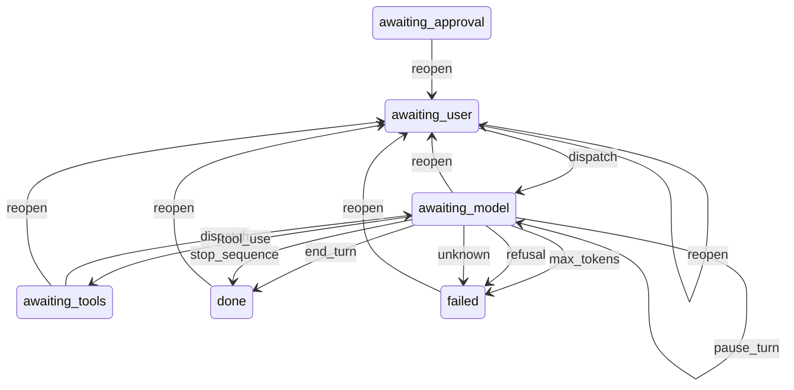

# Agent state machine

<!--
  GENERATED from `Lain::Agent`'s `state_machines` definition by
  spec/lain/agent_state_machine_diagram_spec.rb. Do not edit by hand.
  Regenerate:  LAIN_REGENERATE=1 bundle exec rspec spec/lain/agent_state_machine_diagram_spec.rb
  The same spec fails the build if this file drifts from the code.
-->

