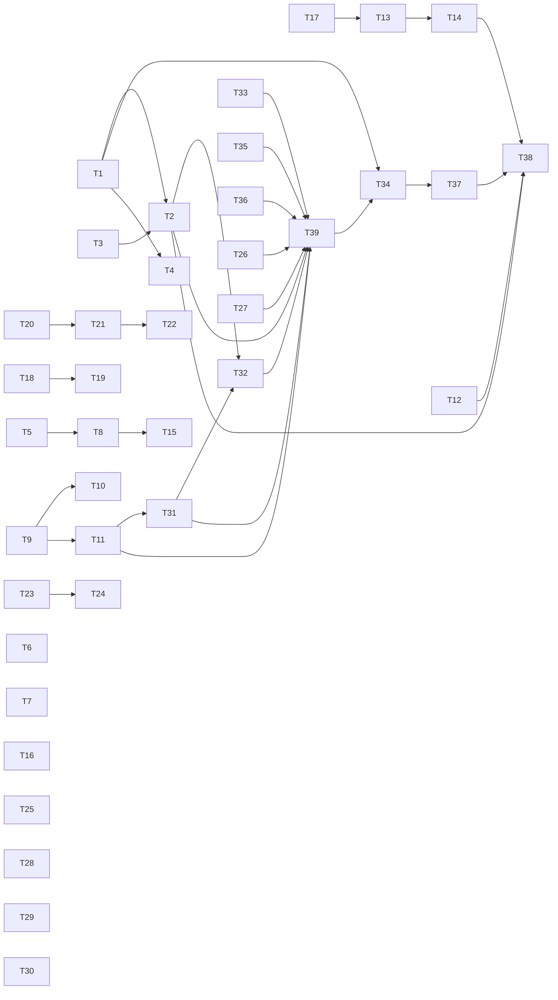

# QA round 20 fixes: where a path lands, what a handoff keeps, and a Ruby config

status: in-progress
commit-mode: orchestrator-commits
language: ruby
panel: Ruby (Linus Torvalds, Jeremy Evans, Sandi Metz, Richard Schneeman, Aaron Patterson)

## Intent

Fix every finding in [`planning/qa-findings-round20-2026-09-29.md`](../qa-findings-round20-2026-09-29.md)
rated LOW-MED or higher: 3 HIGH, 6 MED-HIGH, 12 MEDIUM and 7 LOW-MED. The human widened the scope on
2026-09-29 in 2 ways. LOW-MED is in. H-3 (an unparseable `.lain/config.toml` launches with its
`[shell]` exclusions silently gone) is fixed by **replacing `.lain/config.toml` with a Ruby
`.lain/config.rb`**, evaluated only for a root the user has trusted. The middleware hook points that
motivate a Ruby config are the next plan and are not in this one.

The round's summary names the pattern: 4 families arrived "one route past each fix". This plan closes
the class where the grounding found one, by naming a concept the code was missing:

| Missing concept | Findings it closes | Card |
|---|---|---|
| `Lain::Landing`: where a path really points, 1 copy instead of 3 | D-1/H-2 | T1, T2 |
| `Response#failure`: a failed stop is a property of the answer, not agent state | A-2, I-2 | T12 |
| `Oracle::Handoff::Document`: the state a handoff carries | RB-1 | T9 |
| `CLI::CompactionProfile`: the compaction arm a resume inherits | RB-2 | T11 |
| a question retires when its wait ends, however it ended | C-1 | T17 |
| `Memory::Author`: who wrote a memory row, stamped by lain | E-1, E-2 | T23, T24 |
| `Project::Trust`: consent to run a project's Ruby, keyed on its bytes | H-3 and 2 ungated DSL files | T31, T39 |
| `Supervisor` knows one-shot children | G-3 | T15 |

**39 cards.** Roadmap line: `ROADMAP.md` item 50.

## Grounding

Verified 2026-09-29 at `8c8bcb01` by 7 parallel read-only explorations of the main tree (copies
under `.claude/worktrees/` and `tmp/` ignored) and 1 spike. Fork reports read in full from
`~/tmp/lain-qa-2026-09-29/records/fork-reports/`.

**Where docs and code disagreed, and which won:**

- The findings doc files G-3 and C-2 as 1 family. They have 2 mechanisms. G-3: a docent's answer
  runs as a transient task through `Skill::RoleSpawn` and is never adopted by the `Supervisor`
  (`review/docent.rb:238-247`), so `Command::Stop` (`cli/command/stop.rb:30-45`, reading
  `Supervisor#live`) cannot see it. C-2: while nothing is published, `StdinPump` opens no read, so a
  typed `/stop` waits as terminal typeahead and arrives at the next `you>`. Cards T15 and T13/T14.
- The findings doc says A-1 happens because `Repl#held_line` "only gathers typed-ahead lines". True,
  and incomplete: the cockpit's producer `CLI::InputSocket#sweep` is `nil` (`input_socket.rb:203-204`),
  and the input pane calls `stop_drawing` on `unpublished` (`input_pane.rb:209`), so the line never
  leaves the pane process. Both halves are in T13/T14.
- E-3's mechanism was inferred as "HUP skips the graceful stop so ensures never run". The spike
  showed a child fiber's `ensure` **does** run on HUP under async 2.46. The loss is in what those
  ensures attempt during forced termination. Routing HUP through the TERM path (T16) inherits TERM's
  measured behavior either way.
- `lib/lain/sensitivity/policy.rb:49-53` says "Only the name is judged". T2 makes that false, and
  `ARCHITECTURE.md:763-800` and `planning/project-root-and-secret-boundary.md:208-240` go stale
  with it. `Sensitivity` itself stays lexical; its no-syscall canary and Ripper audit
  (`spec/lain/sensitivity_spec.rb:854-945`) stay green, because resolution happens in `Policy`.
- `Project::Consent` (`project/consent.rb`) is documented as asking an interactive confirmer. Its
  only production caller (`board_build.rb:81`) passes no `confirm:`, so consent today comes only
  from `--root` or a pre-existing mark.
- `Approval::Remembered::Persister` (`approval/remembered.rb:170-412`) writes TOML and has **no
  production caller**. Dead; T36 deletes it.
- `.lain/services.rb` and `.lain/summarizers.rb` already `instance_eval` a cloned repository's Ruby
  with no consent gate (`dsl_catalog.rb`, `ARCHITECTURE.md:1208-1210`). A Ruby config gated by trust
  while these 2 stay open would contradict itself, so T31 gates all 3.
- `.lain/config.toml` classifies ordinary, so the model can write it (`ARCHITECTURE.md:778-779`).
  With Ruby that is code the model can arrange to run at the next launch. T32 gates `.lain/*.rb`.

**Mechanism facts the cards depend on:**

- **D-1/H-2.** `Policy#gates?` (`policy.rb:138-143`) and `#denial` (`:168-182`) classify the
  literal input. `Middleware::Sensitivity#call` (`middleware/sensitivity.rb:67`) and `Gate#judged?`
  (`middleware/gate.rb:176`) are the only callers. Tools resolve paths against
  `session.worker_env` (`tool/file_target.rb:91-92`), so the landing must use the same cwd. The
  release prompt a denied target reaches is `RedactSecretReads` (`redact_secret_reads.rb:230-314`)
  scanning bytes after the read; with the denial moved ahead of the read it is unreachable for a
  denied target. The landing algorithm exists 3 times: `BoardBuild::Classifiers::Landing.of`
  (`board_build.rb:390-404`), `Session::Confined#landing` (`session.rb:598-605`),
  `ComposedTerm#ordinary_landing?` (`composed_term.rb:505-511`).
- **H-1.** Names are case-sensitive `File.fnmatch?` basename globs (`sensitivity.rb:129-133`).
  `.netrc` is DENIED (`:503`), `.pgpass` GATED (`:529-531`). Backup variants match only where an
  entry is itself a glob. `Regions` knows `CredentialPatterns.for(:content)`
  (`credential_patterns.rb:72-103`) plus entropy; netrc, pgpass, htpasswd and msmtprc shapes fall
  through. `ComposedTerm#plain_content?` passes a 0644 file of 64 KiB or less with no region.
- **D-2.** `Review::Session#annotate` (`review/session.rb:406-416`) journals
  `anchor.anchor_text` from `Source#line_at` (`review/source.rb:293-296`), raw for a git source.
  `Survey::Projection#line` (`survey/projection.rb:135-145`) is the masker to reuse.
- **G-2.** Survey hunks number the projected (masked) text while the buffer and the anchor number
  raw lines (`review/source/corpus.rb:198`, `review/docent.rb:651-663`). Every line below a
  multi-line region is shifted, which is why only line 1 worked.
- **D-3.** `Oracle::SecretRead::TEMPLATE` (`oracle/secret_read.rb:117-134`) ends with a JSON example
  reading `"confidence": 0.0`. `SecretSurface#judges?` is `outstanding.any?`
  (`approval/secret_surface.rb:92`), so path-gate pendings never reach it.
- **RB-1.** `Oracle::Handoff::LINE_CHARS = 200` (`oracle/handoff.rb:47`); `Budget#take`
  (`:230-237`) sends every slot, `held` included, through `Handoff.line`, which collapses
  whitespace and cuts to 200 chars. The byte budget (39,907 at a 32,768 window) was not binding;
  the QA request was 1,554 bytes. `HeldCut#replacements` (`held_cut.rb:293-296`) drops the cut's
  kind, so a previous handoff document is indistinguishable from a summary.
- **RB-2.** `RunProfile::FIELDS` (`cli/run_profile.rb:21`) is the inherited list; compaction is
  not on it. `HeldCut.holds?` needs `cut.strategy == arm` (`held_cut.rb:81-84`), so a resume
  without the flag holds no recorded cut at all. `exe/lain:872-880` gives Thor defaults to
  `compact_keep`, `compact_bytes`, `compact_cap`, `compact_fallback`, so a typed value cannot be
  told from a default; only `compact_strategy` defaults to nil.
- **RB-3.** `Source#stuck?` (`compaction/source.rb:512`) is `!droppable? || holds_newest?`.
  `summarize-conversation` proposes nothing for a run of 1 (`tool_messages.rb:44-53`), the
  derivation reports `would_not_shrink` (`source.rb:666-669`), and `Reporting` forgets it. The
  refusal then says "Make room with compaction" (`middleware/request_budget.rb:147-161`).
- **A-2/I-2.** `Repl::Ask#settle` (`cli/repl/ask.rb:61`) splits on type only and never reads
  `Agent#failure_reason`, which nothing outside `agent.rb` reads (`agent.rb:58-63, 606-609`).
  `FAILURE_REASONS` is keyed by stop reason alone, so failure is a pure function of the Response.
  `Repl::Outcome::SETTLED` (`cli/repl/outcome.rb:160-188`) and `Subagent#refusing_malformed`
  (`tools/subagent.rb:331-341`) each classify the same thing again.
- **C-1.** A stop commits no turn, and `AskHuman#withdraw` (`tools/ask_human.rb:757-774`) "retires
  nothing". 3 inbox models: `StatusFeed::Inbox`, `Neovim::InboxView` (both retire on
  `Telemetry::QuestionsConsumed`), `HumanReplies::Pending` (`cli/human_replies.rb:1117-1143`,
  retired only by its own calls). `Approval::Gate#retired` (`approval/gate.rb:500-520`) already
  writes `QuestionsConsumed` from an `ensure`.
- **B-1/B-2.** `__lain.review_settled` (`runtime/47_diff.lua:860-868`) never touches the note store
  in `48_annotate.lua:60-87`. The runtime is 1 concatenated chunk (`runtime_loader.rb:8-45`), so 47
  and 46 reach 48's locals only through a `_G.__lain` export. The verdict policy sees only journaled
  `AnnotationPlaced` (`review/verdict/policy.rb`).
- **BA-1.** `Arm::Driver#distributions_for` (`arm/driver.rb:166-169`) has no rescue and memoizes
  the report. `Agent::Budget::Exceeded` (`agent/budget.rb:12-30`) raises. `RunRecorder#ask_each`
  (`bench/cli/run_recorder.rb:161-165`) already rescues it as "a measurement of the run". Kept
  checkouts: `Worktree::Release#call` (`isolation/worktree/release.rb:31-44`) retains any dirty
  tree 7 days, and arm tasks never commit. The refused run's journal: `journaled_provider`
  (`bench/cli.rb:237`) writes `capability_degraded` before `refuse_unroutable!`
  (`bench/live_arms.rb:148-162`) runs.
- **E-3.** `Signals::MAP` (`cli/signals.rb:24`) traps INT, TERM, QUIT; HUP is untrapped.
- **E-1/E-2.** `ProjectStore#append` (`memory/project_store.rb:191-197`) lets any writer supersede
  any id. Rows are `{id, description, body, digest}`; 4 reconstruction sites hard-code the keys
  (`project_store.rb:240-241`, `memory/writes.rb:63-66`, `bench/session/memory_replay.rb:221-223`,
  `bench/sweep.rb:213-215`). The clerk's session renders the project manifest
  (`consolidation.rb:124`).
- **I-1.** 5 retired rows at `context_window.rb:113, 114, 133, 134, 164`, pinned as published by
  `spec/lain/context_window_spec.rb:264-300`. HTTP 410 has no handling (`error_middleware.rb:52-60`).
- **G-1.** `CLI::Epic#apply` (`cli/epic.rb:474-490`) checks ids on the pre-edit graph and writes the
  revised one unchecked. `Issue#emittable_failures` (`epic/issue.rb:111-119`) is the combined rule.
- **G-4.** `Fleet#launched` (`status_feed/fleet.rb:84-91`) ignores a digest it has seen. A failed
  attempt writes no anchor, so `Factory#next_attempt` hands the retry attempt 1 again, and the
  spawn digest (`tools/subagent/lineage.rb:66-73`) repeats.
- **B-3.** `Intake#answered` (`frontend/intake.rb:245-260`) prints the closing line on the chat
  fiber while Reline still owns the `[y/N]` row; `Notes#write` (`tty.rb:960-970`) never ends that
  row.
- **B-4.** `Reading#fleet_rows` (`status_feed/reading.rb:157-161`) takes the first 2 rows of an
  arrival-ordered tree.
- **E-5.** `CLI::Improve#report` (`cli/improve.rb`) prints the model's last text only.
- **config.** 6 tables and `root =`. `Config::Resolved` (`config/resolved.rb:47-54`) re-reads on
  every stat change, and the resolver reads it directly (`project/resolver.rb:342`). 16 call sites
  across `lib/` use 4 entry points: `Config.load`, `.sensitivity`,
  `.shell_exclusions`, `.test_layout`, all `(root:)`. About 238 spec lines in 36 files write TOML
  through `spec/support/lain_config_file.rb`, and 5 committed fixtures are files named
  `.lain/config.toml` (4 bench altitude subjects, `projects/layout_mini`), which a content grep
  misses. `bench/altitude.rb:197` reads config at a leased worker's cwd. `Lain::DslCatalog` (`dsl_catalog.rb:50-69`) is the
  Ruby-file loader to extend.

**What the panel review changed (2026-09-29, verdict REQUEST-CHANGES, every blocker applied):**

- **T33 would have landed a tree that cannot load.** It deleted `Config::Resolved` while the resolver
  still called it (`project/resolver.rb:342`). T35 now runs first and independently, and T33 split
  into an unwired builder (T33) and the reader switch (new T39).
- **Trust keyed on the root broke bench altitude**, which reads config at a leased worktree
  (`bench/altitude.rb:197`) over 4 committed `.lain/config.toml` subjects a content grep missed.
  Trust is now keyed on the bytes of the `.lain/*.rb` set.
- **`Summarizer::Catalog.load` passes `Dir.pwd`** (`cli/backend.rb:748-749`) despite a comment
  claiming an explicit root; T31 fixes it and so depends on T11.
- **T2 named no call-time cwd.** It now reads the Session from the middleware env, answers gated on
  an unresolvable landing instead of raising, re-spells a landing under the lexical home and root,
  and classifies listing rows by landing, because a probe showed `grep` on `keys -> ~/.ssh` lists a
  denied key as ordinary.
- Deletions (Persister, Consent, Resolved) now land before or with the migration, so about 119
  fixture lines are not migrated only to be deleted. T6's fixture, T12's and T34's structural
  criteria, T14's missing `/goal off` path and 5 unlisted spec files were corrected.

## Compatibility

`lain.gemspec` is unpublished; no tags, no CHANGELOG, no consumers outside this repo found by grep
across `~/dev`. The human's standing ruling (memory `harness-vs-own-dev`, and the request for this
plan): nothing in lain is production facing, so no back-compat.

| Surface | Verdict | Evidence |
|---|---|---|
| `.lain/config.toml` format | free to break | no `.lain/` in this repo or `~`; QA sandboxes are throwaway; user direction 2026-09-29 |
| `root =` resolver rung | free to break | read only by `project/resolver.rb:311-362`; replaced by the `.lain/` marker rung and `--root` |
| `Project::Consent` marks in XDG state | free to break | never written in production without `--root` (`board_build.rb:81` passes no confirmer); T31 moves `Record` under `Trust`, T39 deletes `Consent` |
| Memory store rows (`store.ndjson`) | keep readable | user's own stores under `~/.local/state/lain`. Costs nothing: `author` is omitted from the digest payload when absent, the `resumed_from` idiom (`session_record.rb:63-68`) |
| Session header keys | free to break | read by `--resume` and `bench/session/loader.rb:80`; both updated in T11 |
| CLI flags `--compact-*` | free to break | defaults move from Thor into `Backend`; spelling unchanged |
| `Agent#failure_reason` | free to break | no reader outside `agent.rb` |
| `Sensitivity::Policy#gates?`/`#denial` signatures | free to break | 2 callers, both in T2 |
| `Approval::Remembered::Persister` | free to break | no production caller |
| journal record shapes (`annotation_placed`, `grade_record`, `compaction_cut`) | free to break | bench replays read them; T5, T20 and T9 update readers in the same card |

No trade report was needed: no must-keep surface blocked a simplification.

## Spike findings

| Question | Result | Evidence |
|---|---|---|
| Does SIGHUP skip async child fibers' `ensure` blocks (E-3's inferred mechanism)? | No. Under async 2.46 and Ruby 4.0.6 a child's `ensure` runs on HUP and on INT alike; HUP escapes `Sync` as `SignalException`, INT as `Interrupt`. The loss is in work those ensures do during forced termination. | scratchpad `hup_spike.rb`: `HUP: child ensure ran, escaped: SignalException`; `INT: child ensure ran, escaped: Interrupt`. Run outside the repo, so no worktree was created |

## Shared files

The orchestrator owns these; cards hand back diffs.

- `exe/lain`: T11 hands back the removal of 4 Thor defaults in `CompactionFlags` and the help line for
  `RECORDED`; T31 hands back the `trust` subcommand registration.
- `lain.gemspec` and `Gemfile.lock`: T39 hands back the removal of `tomlrb`.
- `.rubocop.yml`, `spec/spec_helper.rb`, `lib/lain.rb`: no card expects to touch them.
- `README.md`, `ARCHITECTURE.md`, `CLAUDE.md`: T2, T31, T35 and T37 hand back paragraphs.

## Rejected options

- **A journal-wide redaction layer for D-2's class.** Turns are content-addressed; masking a record's
  bytes on write would change digests the bench replays and `Canonical` pins. Records stay
  responsible for what they carry; T5 masks at the one source that fed raw text in.
- **Resolving symlinks inside `Sensitivity`.** Its no-syscall contract has a runtime canary and a
  Ripper audit, and the survey classifies thousands of paths through it. `Policy` is the 1 place that
  may ask the filesystem, and T2 puts it there.
- **Pulling `simplify-12-ask.md` forward for C-1.** The register merge is a month of work and is
  deferred as a whole. C-1 needs only the retirement carrier that already exists.
- **Namespacing clerk memory ids.** The human chose refusal on 2026-09-29: a namespace stops the clerk
  from refining its own items.
- **Masking the review NEW window (D-2).** The human ruled journal only: the window is the human's own
  editable file.
- **Folding `.lain/services.rb` and `.lain/summarizers.rb` into `config.rb`.** 1 trust decision
  already covers all 3 files (T31); merging 3 DSLs is churn with no finding behind it.
- **Interactive first-run trust prompt.** `Consent`'s confirmer was never wired in production. `lain
  trust` is 1 explicit place, works headless, and the refusal names it.
- **Re-evaluating `config.rb` on a stat change mid-session.** Running Ruby is not idempotent the way
  parsing TOML is. It is evaluated once per process; a change takes a restart, and T31's digest makes
  a changed file a new trust decision anyway.
- **Keying trust on the project root.** A leased worktree and the bench altitude subjects are other
  roots holding the same bytes, so root keying breaks bench grading and asks twice for 1 decision.
  Keying on the digest of the `.lain/*.rb` set is smaller and covers both (panel, 2026-09-29).
- **Keeping the Thor defaults and inheriting only `compact_strategy` (RB-2).** Leaves `--compact-keep`
  impossible to inherit, the same bug 1 flag over.
- **Reopening an ended fleet member when its digest relaunches (G-4).** Weakens the no-resurrection
  rule `Fleet` documents. T27 makes the relaunch a new spawn instead.
- **Widening `PROSE_TOOL_CALL` for B-6.** LOW, and `ollama_spec.rb:431-463` pins its narrowness on
  purpose.

## Open decisions

1. **User middleware hooks in `config.rb`** (provider HTTP/Faraday, the tool `Middleware::Stack`,
   compaction) are the next plan, per memory `extension-direction-2026-09`. T33's builder is where
   they will attach. No card here depends on it.
2. **A user-level `config.rb`** (`$XDG_CONFIG_HOME/lain/config.rb`) is not in this plan. Nothing reads
   a user-level config today.
3. **LOW findings** (A-4, A-5, B-5, B-6, B-7, C-3 to C-8, D-4 to D-6, E-6 to E-8, G-5, G-6, H-4 to H-7,
   I-3, RB-4, RB-5, the `epics_home` nit) are out of scope by the human's ruling.

Nothing here gates a card.

## Dependency graph



Waves, by the graph: wave 1 is every card with no dependency (T1, T3, T5, T6, T7, T9, T12, T16, T17,
T18, T20, T23, T25, T26, T27, T28, T29, T30, T33, T35, T36). T39 waits on every card that edits a spec
file its fixture sweep rewrites (`chat_launch_spec`, `epic_spec`, `factory_spec`, `sensitivity_spec`,
`board_build_spec`, `wiring_spec`).

## Tasks

### Secret boundary

### T1: Resolve a path's landing in one place          [risk: medium]

**Depends on:** none
**Files:** `lib/lain/landing.rb` (new), `lib/lain/cli/wiring/board_build.rb`, `lib/lain/session.rb`, `lib/lain/approval/composed_term.rb`, `spec/lain/landing_spec.rb` (new), `spec/lain/approval/composed_term_spec.rb`, `spec/lain/session_spec.rb`
**Reuse:** `BoardBuild::Classifiers::Landing.of` (`board_build.rb:390-404`) as the body; delete it, `Session::Confined#landing` (`session.rb:598-605`) and the resolving half of `ComposedTerm#ordinary_landing?` (`composed_term.rb:505-511`)
**Shared-file wiring:** none
**Reachable from:** `CLI::Wiring::BoardBuild` (the `Confinement` it builds for `ComposedTerm`) and `Session::Confined#holds?` under plan scope; T2 adds `Sensitivity::Policy`

**Acceptance criteria**

```gherkin
Scenario: a link lands where it points
  Given a project with ".netrc" and a symlink "plain.txt -> .netrc"
  When Landing.of("plain.txt", cwd: root) is asked
  Then it answers the real path of ".netrc"

Scenario: a path that does not exist yet lands under its longest real prefix
  Given "dir -> elsewhere" and no "dir/new.txt"
  When Landing.of("dir/new.txt", cwd: root) is asked
  Then it answers "<realpath of elsewhere>/new.txt"

Scenario: a dangling link is refused by name
  Given "gone -> missing"
  When Landing.of("gone", cwd: root) is asked
  Then Landing::Dangling is raised naming "gone"

Scenario: a landing is also spelled against the real anchors
  Given $HOME is itself a symlink and "k -> ~/.kube/config"
  When Landing.of("k", cwd: root) is asked
  Then its spellings include the path under the lexical $HOME, so a home-anchored rule matches

Scenario: the shell rule keeps its verdicts
  Given the existing ComposedTerm symlink rows
  When the ComposedTerm spec runs
  Then every row answers as before
```
Spec file: `spec/lain/landing_spec.rb`, `spec/lain/approval/composed_term_spec.rb`

**Interface**

```ruby
module Lain
  module Landing
    class Dangling < Error; end
    # @return [Array<String>] the absolute real path of the longest existing prefix joined to
    #   the rest, then the same path re-spelled under the lexical home and root when the real
    #   ones differ (ComposedTerm#ordinary_landing? classifies both today for this reason)
    def self.of(path, cwd:, home:, root:) = ...
  end
end
```

**Stop and report if:**
- the 3 copies disagree on a dangling link or a missing prefix, and a spec pins each disagreement
- `session_spec.rb`'s plan-scope confinement rows change verdict

### T2: Judge a path where it lands          [risk: high]

**Depends on:** T1, T3
**Files:** `lib/lain/sensitivity/policy.rb`, `lib/lain/sensitivity/filter.rb`, `lib/lain/middleware/sensitivity.rb`, `lib/lain/middleware/gate.rb`, `lib/lain/middleware/withhold_secret_paths.rb`, `spec/lain/sensitivity/policy_spec.rb`, `spec/lain/sensitivity/filter_spec.rb`, `spec/lain/middleware/sensitivity_spec.rb`, `spec/lain/middleware/withhold_secret_paths_spec.rb`, `spec/lain/sensitivity_spec.rb` (the `gates?` call at `:387`), `spec/lain/cli/tool_guard_spec.rb`, `spec/lain/cli/wiring/board_build_spec.rb`, `spec/lain/cli/wiring_spec.rb`, `spec/lain/seams/survey_classifier_agreement_spec.rb`, `spec/lain/seams/symlink_boundary_spec.rb` (new, `:seam`)
**Reuse:** `Lain::Landing.of` (T1); `Policy#path_in` and `#unwrapped` unchanged; `Policy::Null` (`policy.rb:90-91`) takes the new keyword; `Sensitivity::Verdict` levels
**Shared-file wiring:** `ARCHITECTURE.md` secret-boundary section (`:763-800`): replace "tier-1 tools check nothing themselves" paragraph's claim that only names are judged with 1 paragraph saying `Policy` classifies the literal path and its landing, strictest wins
**Reachable from:** `exe/lain` chat -> `ChatLaunch` -> `Wiring#switchboard` -> `BoardBuild.for` (1 `Policy`, `board_build.rb:233-235`) -> `ToolGuard.stack` -> `ToolGuard.layered` (`cli/tool_guard.rb:241-253`), which builds `Middleware::Sensitivity` and `Middleware::Gate`; children reach `layered` through `child_stack`/`working` (`:225-235`)

**The base cwd comes from the call, not the stack.** The middleware env carries `context:`, the Session (`agent/tool_runner.rb:416`); the base is `Tool#session_of(context).worker_env.cwd`, the object `FileTarget#target` resolves against (`tool/file_target.rb:91-92`), with `Session::Null`'s fallback. A cwd captured when the stack is built is wrong under `/mode plan`, where `Session#worker_env` is `@scope.env_over(@worker_env)` (`session.rb:79`).

**A landing that cannot be resolved never raises out of `Policy`.** `Landing::Dangling`, `ELOOP`, `EACCES` and `ENOTDIR` answer gated with reason malformed: a raise here invites a rescue that fails open (`policy.rb:170-174`).

**Listings are judged by landing too.** `Dir.glob` follows a symlinked base (`tools/grep.rb:127`): `keys -> ~/.ssh` lists `keys/id_qa`, which the filter calls ordinary. `Policy` owns `Filter` (`policy.rb:124`), so the filter classifies each row's landing the same way, still in 1 place.

**Acceptance criteria**

```gherkin
Scenario: a link to a denied file is refused, not released
  Given a real chat stack with "notes.txt -> ~/.ssh/id_qa"
  When the model calls read_file on "notes.txt"
  Then read_refused is journaled with reason protected
  And no approval_pending is parked

Scenario: a link to a gated file asks a human
  Given "readme2.txt -> .env.local" with no detectable region in its bytes
  When the model calls read_file on "readme2.txt"
  Then approval_pending is parked before any byte is read

Scenario: the same holds for writing through a link
  Given "cfg.txt -> config/master.key"
  When the model calls write_file on "cfg.txt"
  Then approval_pending is parked

Scenario: the worker's cwd is the base
  Given a worktree worker whose cwd differs from the project cwd
  When it reads a relative link
  Then the landing is resolved against the worker's cwd

Scenario: under /mode plan the base is the plan scope's cwd
  Given /mode plan and a relative link inside the plan checkout
  When the model reads it
  Then its landing is resolved against the plan checkout

Scenario: a dangling or looping link is gated, never an exception
  Given "loop -> loop"
  When the model reads "loop"
  Then approval_pending is parked with reason malformed

Scenario: a linked directory does not list a denied file as ordinary
  Given "keys -> ~/.ssh" holding "id_qa"
  When the model calls grep or list_files on "keys"
  Then "keys/id_qa" is withheld from the result

Scenario: an ordinary link stays ordinary
  Given "a.txt -> b.txt" with ordinary content
  When the model reads "a.txt"
  Then the bytes return with no prompt
```
Spec file: `spec/lain/seams/symlink_boundary_spec.rb` (production stack via the same construction `spec/lain/seams/child_tool_guard_spec.rb` uses), `spec/lain/sensitivity/policy_spec.rb`

**Interface**

```ruby
class Sensitivity::Policy
  # strictest of classify(literal) and classify(Landing.of(literal, cwd:))
  def gates?(effect, cwd:) = ...
  def denial(effect, cwd:) = ...
end
```

**Stop and report if:**
- classifying every listing row's landing costs a syscall per row that `spec/lain/survey/walk_spec.rb`'s timing cannot absorb (then land only the base-directory check and report)
- `spec/lain/tools/read_file_spec.rb:545-557` ("a symlink to an ordinary file") goes red
- a caller of `gates?`/`denial` exists besides `middleware/sensitivity.rb:67` and `middleware/gate.rb:176`

### T3: Recognise credential file variants by name          [risk: high]

**Depends on:** none
**Files:** `lib/lain/sensitivity.rb`, `spec/lain/sensitivity_spec.rb`
**Reuse:** the DENIED and GATED tables (`sensitivity.rb:495-589`); `Rule.named`
**Shared-file wiring:** none
**Reachable from:** `Sensitivity.new` in `BoardBuild` feeds `Policy` and `ComposedTerm`'s classifier

**Acceptance criteria**

```gherkin
Scenario: a variant of the netrc name stays denied
  When "_netrc", "netrc", ".netrc.bak" and ".netrc.old" are classified
  Then each level is denied

Scenario: a variant of the pgpass name stays gated
  When ".pgpass.bak", "pgpass" and ".pgpass2" are classified
  Then each level is gated

Scenario: named credential stores are gated
  When ".authinfo", ".msmtprc", ".fetchmailrc", ".htpasswd", ".vault_pass", ".vault-password" and "passwords.txt" are classified
  Then each level is gated

Scenario: the canary still sees no syscall
  When the sensitivity spec's runtime canary and Ripper audit run
  Then both pass
```
Spec file: `spec/lain/sensitivity_spec.rb`

**Interface**

```ruby
# a basename's stems: itself, then with 1 backup suffix (.bak .old .orig .save ~ or trailing digits)
# stripped, then with a leading "_" read as "." and a missing leading dot added
Sensitivity::Name.stems("_netrc.bak") # => ["_netrc.bak", "_netrc", ".netrc"]
```

**Stop and report if:**
- a stem rule makes an ordinary row in `sensitivity_spec.rb` classify gated (for example `Gemfile.lock` or `notes.txt`), or the leading-dot rule gates `env`, `gitconfig` or `npmrc` in a way the card did not intend (add each as an explicit row either way)
- `survey` walk timing in `spec/lain/survey/walk_spec.rb` regresses measurably

### T4: Detect netrc, pgpass, htpasswd and msmtprc secrets in bytes          [risk: medium]

**Depends on:** T1
**Files:** `lib/lain/credential_patterns.rb`, `lib/lain/sensitivity/regions.rb`, `spec/lain/credential_patterns_spec.rb`, `spec/lain/sensitivity/regions_spec.rb`, `spec/lain/approval/composed_term_spec.rb`
**Reuse:** `CredentialPatterns.for(:content)` shape list; `Regions.detect`
**Shared-file wiring:** none
**Reachable from:** `Regions.detect` is called by `ComposedTerm`'s content predicate (`board_build.rb:485-508`), `RedactSecretReads` and `Survey::Projection`

**Acceptance criteria**

```gherkin
Scenario: a credential line is a region
  Given file bytes of each line "machine h login u password hunter2hunter2", "db.example:5432:app:alice:s3cretpass", "alice:$apr1$abc$0123456789abcdefghijk" and "password s3cretpass"
  When Regions.detect runs on each
  Then 1 region covers each secret value

Scenario: a shell cat of such a file under an unknown name is not auto-approved
  Given "notes.cfg" holding a netrc machine line, mode 0644
  When ComposedTerm judges "cat notes.cfg"
  Then it abstains
```
Spec file: `spec/lain/sensitivity/regions_spec.rb`, `spec/lain/approval/composed_term_spec.rb`

**Stop and report if:**
- a new grammar matches any line in `spec/fixtures/` that a spec asserts is region-free
- `Survey::Projection`'s netrc residual comment (`survey/projection.rb:24-33`) is the only place that names this gap (T8 owns that file; hand the comment fix to T8)

### T5: Mask a note's anchor text before it is journaled          [risk: medium]

**Depends on:** none
**Files:** `lib/lain/review/source.rb`, `lib/lain/survey/projection.rb`, `lib/lain/review/session.rb`, `spec/lain/review/source_spec.rb` (new), `spec/lain/review/changeset_spec.rb`, `spec/lain/seams/review_masked_note_spec.rb` (new, `:seam`)
**Reuse:** `Survey::Projection#line` (`projection.rb:135-145`); `Masking.render`; the release ledger
**Shared-file wiring:** none
**Reachable from:** `Review::Session#annotate` (`review/session.rb:406-416`), reached from nvim's `\LN` through `rpc_thread.rb`

**Acceptance criteria**

```gherkin
Scenario: a note on a masked line journals the mask
  Given a changeset whose NEW side holds "API_KEY=sk-live-0000000000000000"
  When a note is placed on that line
  Then annotation_placed.anchor_text holds "<redacted:1>" in place of the value
  And the journal holds 0 lines containing "sk-live-"

Scenario: a released region journals as released
  Given the same line after an approved read_released for that file
  When a note is placed
  Then anchor_text holds the released text
```
Spec file: `spec/lain/seams/review_masked_note_spec.rb`, `spec/lain/review/source_spec.rb`

**Stop and report if:**
- `Projection#line` needs the survey's walk state that a changeset source does not have
- drift detection (`48_annotate.lua:182-184` compares the editor's text to `anchor_text`) starts refusing notes on masked lines

### T6: Let the secret oracle judge path-gate prompts          [risk: medium]

**Depends on:** none
**Files:** `lib/lain/oracle/secret_read.rb`, `lib/lain/approval/secret_surface.rb`, `spec/lain/oracle/secret_read_spec.rb`, `spec/lain/approval/secret_surface_spec.rb`
**Reuse:** `SecretSurface` threshold 0.9 and `DECLINED`; `AutoSurface#judges?`
**Shared-file wiring:** none
**Reachable from:** `CLI::Wiring` builds `SecretSurface` when `--secret-oracle` is set (`cli/wiring.rb:219-226, 1038-1042`)

**Acceptance criteria**

```gherkin
Scenario: a gated path's pending reaches the oracle
  Given --secret-oracle with an oracle answering approve at 0.95
  When read_file of ".env.local" (gated) parks
  Then the oracle is asked once with the path and tool
  And the call runs

Scenario: a denied path never reaches the oracle
  When read_file of ".netrc" is attempted
  Then the oracle is never asked

Scenario: the template anchors no confidence value
  When the prompt is rendered
  Then it holds no numeric confidence literal
```
Spec file: `spec/lain/approval/secret_surface_spec.rb`, `spec/lain/oracle/secret_read_spec.rb`

**Stop and report if:**
- `AutoSurface` and `SecretSurface` would both claim a path-gate pending under `/mode auto` and the surface order is not declared in 1 place

### T7: Name /mode ask in the withheld-output refusal          [risk: low]

**Depends on:** none
**Files:** `lib/lain/middleware/withhold_automatic_output.rb`, `spec/lain/middleware/withhold_automatic_output_spec.rb`
**Reuse:** `Approval::Escalation::Remainder::TOLD` wording (`approval/escalation.rb:631-634`)
**Shared-file wiring:** none
**Reachable from:** `CLI::ToolGuard#stack` builds `WithholdAutomaticOutput`

**Acceptance criteria**

```gherkin
Scenario: under /mode auto the refusal says how a human gets asked
  Given approval mode auto
  When output is withheld
  Then the tool result names "/mode ask"
```
Spec file: `spec/lain/middleware/withhold_automatic_output_spec.rb`

**Stop and report if:**
- the middleware cannot see the approval mode without a new constructor argument from `ToolGuard`

### T8: Map a docent anchor through masking          [risk: medium]

**Depends on:** T5
**Files:** `lib/lain/survey/projection.rb`, `lib/lain/review/source/corpus.rb`, `lib/lain/review/docent.rb`, `lib/lain/review/submit.rb`, `spec/lain/survey/projection_spec.rb`, `spec/lain/review/docent_spec.rb`
**Reuse:** `Projection#span`, `#crosses?`, `#clipped`; `Corpus#line_at`
**Shared-file wiring:** none
**Reachable from:** `Review::Docent::Threads#hunk_at` (`docent.rb:651-663`), reached from `:LainThread` in a survey

**Acceptance criteria**

```gherkin
Scenario: a raw line inside a masked region anchors to the region's line
  Given a surveyed file with a 6-line PEM on lines 1 to 6 and code on line 8
  When a thread is opened on raw line 4
  Then it anchors to the projected line holding "<redacted:1>"

Scenario: a raw line below a region is shifted by the swallowed lines
  When a thread is opened on raw line 8
  Then it anchors to projected line 3

Scenario: a git changeset maps lines unchanged
  When a thread is opened on a changeset line
  Then the anchor line is the raw line
```
Spec file: `spec/lain/survey/projection_spec.rb`, `spec/lain/review/docent_spec.rb`

**Interface**

```ruby
Survey::Projection#projected_line(path, content, raw_line) # => Integer
```

**Stop and report if:**
- `Submit::Placer` (`submit.rb:255-282`) receives anchors already projected, so converting there would shift twice

### Compaction

### T9: Carry the previous handoff document whole          [risk: high]

**Depends on:** none
**Files:** `lib/lain/oracle/handoff.rb`, `lib/lain/oracle/handoff/document.rb` (new), `lib/lain/compaction/source/held_cut.rb`, `spec/lain/oracle/handoff_spec.rb`, `spec/lain/oracle/handoff/document_spec.rb` (new), `spec/lain/compaction/source_spec.rb`, `spec/lain/seams/handoff_spec.rb`
**Reuse:** `Handoff::SCHEMA`, `HEADINGS`, `#document`; `Handoff.budget_for`
**Shared-file wiring:** none
**Reachable from:** `CLI::Backend#fallback` builds `Fallback`, called by `Agent#handed_off` (`agent.rb:655`) through `Compaction::Source#handoff`

**Acceptance criteria**

```gherkin
Scenario: a second handoff sees the first document whole
  Given a session that has handed off once with a 980-byte document
  When it hands off again
  Then the summarizer's request contains the first document byte for byte

Scenario: turns since are whole until the budget binds
  Given 3 turns of 900 bytes since the last handoff and a 39,907-byte budget
  When the question is built
  Then each turn appears whole

Scenario: over budget the oldest turns are stubbed, never the document
  Given turns totalling twice the budget
  When the question is built
  Then the document is whole, the newest turns are whole, and the oldest carry "bytes in full"
```
Spec file: `spec/lain/oracle/handoff_spec.rb`, `spec/lain/seams/handoff_spec.rb`

**Interface**

```ruby
Oracle::Handoff::Document = Data.define(:goal, :progress, :files_and_decisions, :open_todos, :next_step)
Document.from_answer(hash)   # the oracle's JSON
Document#to_s                # what Handoff.document renders today
HeldCut#previous_document    # => Document, nil (the newest held cut of kind handoff)
```

**Stop and report if:**
- a held handoff cut's collapse cannot be read back into fields (then carry its text whole and drop `Document.parse`)
- `handoff_spec.rb:244`'s "held before span" order contradicts document-first

### T10: Hand off when compaction would not shrink          [risk: medium]

**Depends on:** T9
**Files:** `lib/lain/compaction/source.rb`, `lib/lain/middleware/request_budget.rb`, `spec/lain/compaction/source_spec.rb`, `spec/lain/middleware/request_budget_spec.rb`
**Reuse:** `Reporting#record`; `Source#stuck?`; `RequestBudget::MOVES`
**Shared-file wiring:** none
**Reachable from:** `CLI::Backend#compaction_source` (`backend.rb:662-670`)

**Acceptance criteria**

```gherkin
Scenario: 1 lone conversational turn in the head does not block the handoff
  Given keep_last 4, strategy elide-tools+summarize-conversation, and an over-window ask
  And the only droppable message is 1 conversational turn
  When the provider refuses the request
  Then a compaction_cut of kind handoff is recorded and the ask is answered

Scenario: the refusal never advises compaction that cannot help
  Given a derivation that reported would_not_shrink
  When RequestBudget refuses
  Then the message does not say "Make room with compaction"
```
Spec file: `spec/lain/compaction/source_spec.rb`, `spec/lain/middleware/request_budget_spec.rb`

**Stop and report if:**
- `source_spec.rb` around line 2683 ("declines while an ordinary compaction still has something to drop") describes a case this change must keep declining; report the distinguishing condition

### T11: Resume the compaction arm the session recorded          [risk: high]

**Depends on:** T9
**Files:** `lib/lain/cli/compaction_profile.rb` (new), `lib/lain/cli/backend.rb`, `lib/lain/cli/chat_launch.rb`, `lib/lain/cli/resume.rb`, `lib/lain/cli/resume/mismatch_notices.rb`, `lib/lain/session_record.rb`, `lib/lain/bench/session/loader.rb`, `spec/lain/cli/compaction_profile_spec.rb` (new), `spec/lain/cli/backend_spec.rb`, `spec/lain/cli/chat_launch_spec.rb`, `spec/lain/seams/handoff_spec.rb`
**Reuse:** `RunProfile#over` and `.from_header` as the pattern; `Backend#knob`
**Shared-file wiring:** `exe/lain` `CompactionFlags` (`:872-880`): drop `default:` from `compact_keep`, `compact_bytes`, `compact_cap`, `compact_fallback`; `ModelFlags::RECORDED` help text (`:387`) names the compaction flags as inherited
**Reachable from:** `ChatLaunch#profile` (`chat_launch.rb:217`) and `Backend.new` at its 4 call sites

**Acceptance criteria**

```gherkin
Scenario: a resume renders under the recorded arm
  Given a session run with --compact-strategy elide-tools+summarize-conversation --compact-keep 4 that recorded a handoff cut
  When it is resumed with no compaction flags
  Then the first resumed request holds the handoff document and not the full history

Scenario: a typed flag wins over the recorded one
  Given the same session
  When it is resumed with --compact-keep 8
  Then keep_last is 8 and a mismatch notice names --compact-keep

Scenario: an unset flag and a default are different things
  When lain chat runs with no --compact-keep
  Then the header records no compact_keep and Backend uses 20
```
Spec file: `spec/lain/cli/compaction_profile_spec.rb`, `spec/lain/seams/handoff_spec.rb`

**Interface**

```ruby
CLI::CompactionProfile = Data.define(:strategy, :keep, :bytes, :cap, :fallback)
CompactionProfile.typed(options)        # nil for a flag not typed
CompactionProfile.from_header(record)
CompactionProfile#over(recorded)        # typed wins, field by field
CompactionProfile#to_header             # only the fields that are set
```

**Stop and report if:**
- `bench/session/loader.rb` needs the arm name in a key other than `compact_strategy`
- a spec asserts Thor's default values appear in `options`

### Asks and their endings

### T12: Make a failed stop a property of the response          [risk: medium]

**Depends on:** none
**Files:** `lib/lain/response.rb`, `lib/lain/response/failure.rb` (new), `lib/lain/agent.rb`, `lib/lain/cli/repl/ask.rb`, `lib/lain/cli/repl/outcome.rb`, `lib/lain/tools/subagent.rb`, `spec/lain/response_spec.rb`, `spec/lain/cli/repl/ask_spec.rb`, `spec/lain/cli/repl/outcome_spec.rb`, `spec/lain/agent_spec.rb`, `spec/lain/agent_state_machine_spec.rb`, `spec/lain/provider/ollama_spec.rb`, `spec/lain/tools/subagent_spec.rb`
**Reuse:** `Agent::FAILURE_REASONS` text (moves); `TTY#render_error`; `Subagent::MalformedAnswer`
**Shared-file wiring:** none
**Reachable from:** `Repl#respond` (`cli/repl.rb:322`) through `Repl::Ask#settle`; `Tools::Subagent#run_child`

**Acceptance criteria**

```gherkin
Scenario: a prose tool call is an error, not an answer
  Given a provider returning "<function=write_file>..." decoded as malformed
  When the human asks in lain chat
  Then the pane shows "error: " and the malformed reason
  And the raw envelope is not printed as the answer

Scenario: max_tokens before any text says so
  Given a response with stop_reason max_tokens and empty text
  When the human asks
  Then the pane shows "error: model hit max_tokens before finishing"

Scenario: max_tokens after some text keeps the text
  Given a response with stop_reason max_tokens and text "partial"
  Then "partial" is printed, then the error line

Scenario: the exit status and a child's answer agree with the pane
  Given the same malformed response
  When it ends a --non-interactive ask, and separately a subagent's child turn
  Then the process exits unfinished, and the parent receives MalformedAnswer carrying the same message the pane printed
```
Spec file: `spec/lain/cli/repl/ask_spec.rb`, `spec/lain/response_spec.rb`

**Interface**

```ruby
Response::Failure = Data.define(:stop_reason, :message) do
  def withholds_text? = stop_reason == StopReason::MALFORMED
end
Response#failure # => Failure, nil
```

**Stop and report if:**
- `Response` is constructed with a stop reason `StopReason.normalize` rewrites, so `failure` would read the normalized value (see round 19's `response.rb:21` trap)
- `GoalDriver` or `EpicDriver` read `Agent#failure_reason` after all

### T13: Act on a control line when it arrives          [risk: high]

**Depends on:** T17
**Files:** `lib/lain/frontend/intake.rb`, `lib/lain/cli/repl.rb`, `lib/lain/cli/goal_driver.rb`, `spec/lain/frontend/intake_spec.rb`, `spec/lain/cli/repl_spec.rb`, `spec/lain/cli/goal_driver_spec.rb`
**Reuse:** `Intake#stops_a_run?` and `Signal(:stop)`; `HumanReplies#goal_off`'s call to `@goal.stop`
**Shared-file wiring:** none
**Reachable from:** `CLI::Conductor` builds the `Intake`; `Repl#next_text` (`repl.rb:162-177`)

**Acceptance criteria**

```gherkin
Scenario: /goal off typed during a goal stops it after the current iteration
  Given a goal driving with cap 5 and a producer delivering "/goal off" during iteration 1
  When iteration 1 ends
  Then no iteration 2 starts and the goal reports stopped by the human

Scenario: /stop typed during an ask stops the ask
  Given an ask in flight and a producer delivering "/stop"
  Then run_interrupted reason=stopped is journaled before the ask would have finished

Scenario: an ordinary line typed during an ask waits for you>
  Given an ask in flight and a producer delivering "hello"
  Then "hello" is the next prompt after the ask ends
```
Spec file: `spec/lain/frontend/intake_spec.rb`, `spec/lain/cli/repl_spec.rb`

**Stop and report if:**
- `Intake` needs a reference to `GoalDriver` that `Conductor` cannot inject without a cycle
- `spec/lain/seams/stop_ask_spec.rb` pins that a `/stop` at `you>` answers `no ask is running` in a case this changes

### T14: Deliver lines typed while nothing is published          [risk: high]

**Depends on:** T13
**Files:** `lib/lain/frontend/input_pane.rb`, `lib/lain/cli/input_socket.rb`, `lib/lain/frontend/stdin_pump.rb`, `spec/lain/frontend/input_pane_spec.rb`, `spec/lain/cli/input_socket_spec.rb`, `spec/lain/frontend/stdin_pump_spec.rb`, `spec/lain/seams/typed_during_ask_spec.rb` (new, `:seam`)
**Reuse:** `StdinPump#sweep`; the input pane's `TICK` loop
**Shared-file wiring:** none
**Reachable from:** `lain up` launches `lain input` (the pane) against `CLI::InputSocket`; `lain chat --no-nvim` builds `StdinPump`

**Acceptance criteria**

```gherkin
Scenario: a cockpit line typed mid-ask reaches the chat at once
  Given a real input pane and input socket with an ask in flight
  When "/stop" is typed in the pane
  Then the chat's Intake receives it before the ask ends

Scenario: a cockpit /goal off mid-drive stops the goal
  Given a real input pane and a goal driving with cap 5
  When "/goal off" is typed in the pane during iteration 1
  Then no iteration 2 starts

Scenario: the TTY path does the same
  Given lain chat --no-nvim with an ask in flight
  When "/stop" and Enter are typed
  Then the ask is stopped

Scenario: a line typed during an ask is not lost or doubled
  When "hello" is typed mid-ask
  Then it is the next prompt, once
```
Spec file: `spec/lain/seams/typed_during_ask_spec.rb`

**Stop and report if:**
- reading stdin while unpublished conflicts with the countdown's raw-mode bindings (`tty.rb` `Countdown`) or with `prompt_composer.rb:251-264`'s rules against a WINCH trap and polling
- the pane's `stop_drawing` exists to keep the chat pane's output unscrambled, and reading requires drawing

### T15: Let the supervisor stop one-shot children          [risk: medium]

**Depends on:** T8
**Files:** `lib/lain/supervisor.rb`, `lib/lain/review/docent.rb`, `lib/lain/cli/command/review.rb`, `lib/lain/cli/command/stop.rb`, `spec/lain/supervisor_spec.rb`, `spec/lain/review/docent_spec.rb`, `spec/lain/cli/command/stop_spec.rb`
**Reuse:** `Supervisor#live`, `#stop`; `Docent::Asked#task`
**Shared-file wiring:** none
**Reachable from:** `CLI::Command::Review` builds the docent reactor (`review.rb:375`) with the command env's supervisor

**Acceptance criteria**

```gherkin
Scenario: /stop stops a running docent
  Given a survey whose docent is answering a thread
  When the human types /stop at you>
  Then the docent's task stops, its completion is journaled, and /stop names what it stopped

Scenario: shutdown stops one-shots before the chronicle closes
  Given a docent running
  When the session closes
  Then the docent's completion record precedes session_closed
```
Spec file: `spec/lain/cli/command/stop_spec.rb`, `spec/lain/supervisor_spec.rb`

**Interface**

```ruby
Supervisor#track(task, role:) # a one-shot the fleet can stop; untracked when the task ends
```

**Stop and report if:**
- `Supervisor#stop`'s drain ordering assumes every registration is an `Actor`

### T16: Treat SIGHUP as SIGTERM          [risk: low]

**Depends on:** none
**Files:** `lib/lain/cli/signals.rb`, `spec/lain/cli/signals_spec.rb`, `spec/lain/seams/hangup_spec.rb` (new, `:seam`)
**Reuse:** `Shutdown#request_grace` path for `:sigterm`
**Shared-file wiring:** none
**Reachable from:** `CLI::Signals#install`, called by `ChatLaunch`

**Acceptance criteria**

```gherkin
Scenario: a hangup mid-spawn ends like a terminate
  Given a lain chat child process with a subagent spawn parked on a hanging provider
  When the process receives SIGHUP
  Then the journal holds the spawn's completion (or ending_not_recorded) and session_closed
  And the spawn's lease is released
```
Spec file: `spec/lain/seams/hangup_spec.rb`

**Stop and report if:**
- `signals_spec.rb:40` pins the map for a reason written in the code, not just the current value

### T17: Retire a question when its wait ends          [risk: medium]

**Depends on:** none
**Files:** `lib/lain/tools/ask_human.rb`, `lib/lain/cli/human_replies.rb`, `spec/lain/tools/ask_human_spec.rb`, `spec/lain/cli/human_replies_spec.rb`, `spec/lain/seams/stop_ask_spec.rb`
**Reuse:** `Approval::Gate#retired` (`approval/gate.rb:500-520`); `Telemetry::QuestionsConsumed.new(turn: nil, digests:)`
**Shared-file wiring:** none
**Reachable from:** `ToolsetBuild` builds `AskHuman` for the chat; `HumanReplies` is built by `CLI::Wiring`

**Acceptance criteria**

```gherkin
Scenario: a stopped ask takes its question with it
  Given an ask parked on ask_human
  When the human stops the ask
  Then QuestionsConsumed names the question
  And the HUD reads inbox:0, lain://inbox is empty, and /inbox offers nothing

Scenario: an answered question retires once
  When the question is answered
  Then exactly 1 QuestionsConsumed names it
```
Spec file: `spec/lain/seams/stop_ask_spec.rb`, `spec/lain/tools/ask_human_spec.rb`

**Stop and report if:**
- `HumanReplies::Pending` cannot subscribe to `QuestionsConsumed` without a second journal reader

### T18: Clear the note store when a review settles          [risk: medium]

**Depends on:** none
**Files:** `lib/lain/frontend/neovim/runtime/48_annotate.lua`, `lib/lain/frontend/neovim/runtime/47_diff.lua`, `spec/lain/frontend/neovim/annotate_spec.rb`, `spec/lain/frontend/neovim/runtime/47_diff_spec.rb`
**Reuse:** 48's `forget()` (`:409-418`)
**Shared-file wiring:** none
**Reachable from:** `Review::Surface::Neovim#settle` and `#refuse` (`review/surface/neovim.rb:209-231`) call `__lain.review_settled`

**Acceptance criteria**

```gherkin
Scenario: a settled review leaves no notes behind
  Given 3 notes placed and handed back, then the review approved
  When the same file is surveyed again and 1 note is placed and handed back
  Then exactly 1 annotation_placed is journaled for the second review
  And no note mark from the first review is drawn
```
Spec file: `spec/lain/frontend/neovim/annotate_spec.rb`

**Stop and report if:**
- `reserved` claims (`48:455`, `assert_placed` `:331`) must survive a settle for a reason the Lua states

### T19: Refuse a verdict over a blocker not handed back          [risk: medium]

**Depends on:** T18
**Files:** `lib/lain/frontend/neovim/runtime/46_sidebar.lua`, `lib/lain/frontend/neovim/runtime/48_annotate.lua`, `lib/lain/frontend/neovim/runtime/51_thread.lua`, `spec/lain/frontend/neovim/runtime/46_sidebar_spec.rb`
**Reuse:** `review_notes.marked(buf,row)` (`48:109`) and 51's "not handed back yet" wording (`51_thread.lua:763-766`)
**Shared-file wiring:** none
**Reachable from:** `:LainReviewVerdict` defined in `46_sidebar.lua:214-219`

**Acceptance criteria**

```gherkin
Scenario: approve waits for a drawn blocker
  Given a blocker note drawn and not handed back with \LN
  When :LainReviewVerdict approve runs
  Then no review_verdict is sent and the message names the blocker's file and line

Scenario: with every note handed back approve proceeds
  Then review_verdict is sent
```
Spec file: `spec/lain/frontend/neovim/runtime/46_sidebar_spec.rb`

**Stop and report if:**
- a drafted note (before `:LainNoteDone`) is stored somewhere 48 does not own

### Bench

### T20: Report an arms run whose task hits the ceiling          [risk: medium]

**Depends on:** none
**Files:** `lib/lain/arm/driver.rb`, `lib/lain/bench/cli.rb`, `spec/lain/arm/driver_spec.rb`, `spec/lain/bench/cli_spec.rb`, `spec/lain/bench/arms_report_spec.rb`
**Reuse:** `RunRecorder#ask_each`'s rescue (`run_recorder.rb:161-165`); `Driver::Unmeasured`; `Grader::Journaling`
**Shared-file wiring:** none
**Reachable from:** `exe/lain` `arms` -> `Bench::CLI#arms_report` -> `Arm::Driver#report`

**Acceptance criteria**

```gherkin
Scenario: 1 over-ceiling task is a failed run, the report still renders
  Given 2 tasks, 2 arms, and a provider that loops past the iteration ceiling on 1 task for 1 arm
  When lain bench arms runs
  Then it exits 0 with the header, grade table, token table and cost column
  And that cell shows the task failed with reason ceiling
  And a grade_record with pass false and why naming the ceiling is journaled
```
Spec file: `spec/lain/bench/cli_spec.rb` (with a looping provider modelled on `InterruptingProvider`, `:68-75`)

**Stop and report if:**
- a failed run's missing token counts would make `Compare` refuse the whole distribution rather than mark 1 cell

### T21: Refuse an arms run before anything is journaled          [risk: low]

**Depends on:** T20
**Files:** `lib/lain/bench/cli.rb`, `lib/lain/bench/live_arms.rb`, `spec/lain/bench/arms_command_spec.rb`
**Reuse:** `LiveArms.refuse_unroutable!`; `Journal#close` discarding an unwritten file
**Shared-file wiring:** none
**Reachable from:** `Bench::CLI#arms_report`

**Acceptance criteria**

```gherkin
Scenario: a run with no cheap model leaves no journal file
  When lain bench arms runs with no --cheap-model
  Then it exits 1 naming the problem and no session file is left

Scenario: a run whose cheap model is the model leaves no journal file
  When lain bench arms runs with --cheap-model equal to --model
  Then it exits 1 naming the problem and no session file is left
```
Spec file: `spec/lain/bench/arms_command_spec.rb` (through the real entry point, not a stub)

**Stop and report if:**
- the cheap-model check needs the provider's serving answer, which exists only after `journaled_provider`

### T22: Discard a bench lease's checkout on release          [risk: medium]

**Depends on:** T21
**Files:** `lib/lain/isolation/worktree/release.rb`, `lib/lain/isolation/worker_handoff.rb`, `lib/lain/bench/live_arms.rb`, `spec/lain/isolation/worktree/release_spec.rb` (new), `spec/lain/bench/live_arms_spec.rb`
**Reuse:** `Release#call`'s clean path; `WorkerHandoff::Null`
**Shared-file wiring:** none
**Reachable from:** `LiveArms.build` passes the handoff to every arm's `Arm#leased`

**Acceptance criteria**

```gherkin
Scenario: an arms run leaves no retained worktrees
  Given lain bench arms --isolation worktree over tasks that write files and never commit
  When the run ends, passed or failed
  Then lain worktrees gc lists 0 retained checkouts for it

Scenario: a chat worker's dirty checkout is still retained
  When a chat subagent's lease releases dirty
  Then it is retained as before
```
Spec file: `spec/lain/isolation/worktree/release_spec.rb`, `spec/lain/bench/live_arms_spec.rb`

**Interface**

```ruby
WorkerHandoff::Discarding # releases every lease with discard: true; the grade is already journaled
```

**Stop and report if:**
- a grader reads the worktree after the arm's lease is released

### Memory

### T23: Stamp every memory row with its author          [risk: high]

**Depends on:** none
**Files:** `lib/lain/memory/author.rb` (new), `lib/lain/memory/item.rb`, `lib/lain/memory/project_store.rb`, `lib/lain/memory/writes.rb`, `lib/lain/bench/session/memory_replay.rb`, `lib/lain/bench/sweep.rb`, `lib/lain/tools/memory_write.rb`, `lib/lain/tools/memory_read.rb`, `lib/lain/consolidation.rb`, `lib/lain/cli/wiring/toolset_build.rb`, specs mirroring each
**Reuse:** `session_record.rb:63-68`'s omit-when-absent idiom; `Canonical.digest`
**Shared-file wiring:** none
**Reachable from:** `ToolsetBuild` constructs `MemoryWrite` for the chat with `Author.chat`; `Consolidation` constructs it with `Author.clerk(spawn:)`

**Acceptance criteria**

```gherkin
Scenario: the chat's writes are the human's
  When a chat's memory_write stores "suite"
  Then the row's author is {"kind":"chat"}

Scenario: the clerk's writes cite the lineage
  When lain consolidate stores an item
  Then the row's author is {"kind":"clerk","spawn":"<spawn digest>"}
  And memory_read shows the author on a line above the body

Scenario: an old row without an author still loads
  Given a store.ndjson row with only id, description, body and digest
  Then it loads with no Corrupt and reads as authored by the chat

Scenario: the model cannot set the author
  Then memory_write's schema has properties id, description, body only
```
Spec file: `spec/lain/memory/project_store_spec.rb`, `spec/lain/cli/consolidate_spec.rb`, `spec/lain/tools/memory_write_spec.rb`

**Interface**

```ruby
Memory::Author = Data.define(:kind, :spawn) # kind in %w[chat clerk]; spawn nil for chat
Memory::Item.new(id:, description:, body:, author: Memory::Author.chat)
Tools::MemoryWrite.new(recorder:, author:)
```

**Stop and report if:**
- `Memory::Manifest`'s line format has to change to show the author (cache bytes; leave the manifest as is and report)

### T24: Refuse a clerk write over the human's memory          [risk: high]

**Depends on:** T23
**Files:** `lib/lain/tools/memory_write.rb`, `lib/lain/consolidation.rb`, `lib/lain/prompt/templates/role/court_clerk.md`, `spec/lain/tools/memory_write_spec.rb`, `spec/lain/cli/consolidate_spec.rb`
**Reuse:** `ProjectStore::Loaded#heads`
**Shared-file wiring:** none
**Reachable from:** `CLI::Consolidate#clerk_over` (`cli/consolidate.rb:81-85`)

**Acceptance criteria**

```gherkin
Scenario: the clerk cannot overwrite a chat-authored id
  Given the store holds "suite" authored by the chat
  When the clerk's memory_write targets "suite"
  Then the tool result refuses, says the id belongs to the human and to pick a new id
  And a fresh chat's memory_read of "suite" returns the human's body

Scenario: the clerk may refine its own item
  Given "lineage-a" authored by the clerk
  When the clerk rewrites "lineage-a"
  Then it is stored

Scenario: the chat may correct a clerk item
  When the chat writes "lineage-a"
  Then it is stored with author chat
```
Spec file: `spec/lain/cli/consolidate_spec.rb`, `spec/lain/tools/memory_write_spec.rb`

**Stop and report if:**
- `Consolidation::Outcome#wrote` counts a refused write as a write

### Providers, epics, status

### T25: Remove retired cloud tags and name a retirement          [risk: low]

**Depends on:** none
**Files:** `lib/lain/context_window.rb`, `lib/lain/provider/http/error_middleware.rb`, `lib/lain/provider/ollama.rb`, `spec/lain/context_window_spec.rb`, `spec/lain/provider/http/error_middleware_spec.rb`, `spec/integration/provider/ollama_cloud_spec.rb`
**Reuse:** F126's precedent (commit `5154d819`); `Provider::Ollama#serves?`
**Shared-file wiring:** none
**Reachable from:** `CLI::Backend::WindowBook#lookup` reads `ContextWindow.default`; the HTTP stack is built by `Connection::MiddlewareStack`

**Acceptance criteria**

```gherkin
Scenario: a retired tag has no published window
  When ContextWindow resolves "glm-5.1:cloud"
  Then provenance is guessed

Scenario: a 410 is a retirement, not a generic error
  Given the server answers 410 "glm-5.1 was retired at 2026-09-25"
  Then the error says the model was retired and names the tag, and serves? answers not served

Scenario: every shipped cloud key is live (opt-in tier)
  Given LAIN_OLLAMA_CLOUD=1 and OLLAMA_API_KEY
  When each CLOUD_WINDOWS key is sent to /api/show
  Then none answers 410
```
Spec file: `spec/lain/context_window_spec.rb`, `spec/integration/provider/ollama_cloud_spec.rb`

**Stop and report if:**
- `OllamaTier::CLOUD_DEFAULT_MODEL` is 1 of the 5 retired tags

### T26: Validate an issue id where the issue is built          [risk: medium]

**Depends on:** none
**Files:** `lib/lain/epic/issue.rb`, `lib/lain/epic/home.rb`, `lib/lain/cli/epic.rb`, `spec/lain/epic/issue_spec.rb`, `spec/lain/cli/epic_spec.rb`
**Reuse:** `Issue#emittable_failures` (`issue.rb:111-119`); `Home::NAME`
**Shared-file wiring:** none
**Reachable from:** `CLI::Epic#apply` (`cli/epic.rb:474-490`) for add, file, split and merge

**Acceptance criteria**

```gherkin
Scenario: add refuses an id the tier cannot use
  When lain epic add demo late_discovery runs, and separately lain epic add demo a.b
  Then each exits 1 naming the id and the rule, and epic.md is unchanged

Scenario: split and merge cannot mint one either
  When split names a child "x_y"
  Then it is refused the same way
```
Spec file: `spec/lain/cli/epic_spec.rb`, `spec/lain/epic/issue_spec.rb`

**Stop and report if:**
- `Issue.new` is called while parsing an existing file in a path that must still load a bad id to show a repair message

### T27: Give a retried issue its own spawn          [risk: medium]

**Depends on:** none
**Files:** `lib/lain/cli/epic_driver/factory.rb`, `lib/lain/cli/epic_driver/issue_actor.rb`, `lib/lain/tools/subagent/lineage.rb`, `spec/lain/cli/epic_driver/factory_spec.rb`, `spec/lain/tools/subagent/lineage_spec.rb`, `spec/lain/status_feed/fleet_spec.rb`
**Reuse:** `Lineage#adopted`'s adoption counter
**Shared-file wiring:** none
**Reachable from:** `EpicDriver::Factory` launches issues through `IssueActor#adopted` -> `Supervisor#adopt`

**Acceptance criteria**

```gherkin
Scenario: a retry shows as a new running row
  Given an issue whose first attempt failed without an anchor
  When it is retried
  Then its :spawn digest differs from the first attempt's
  And lain://status and state.json list the retry as running

Scenario: the lane and worktree key are unchanged
  Then the retry's lane is the first attempt's lane
```
Spec file: `spec/lain/cli/epic_driver/factory_spec.rb`, `spec/lain/status_feed/fleet_spec.rb`

**Stop and report if:**
- the fleet stays empty during `/implement-epic` even with distinct digests (a second cause; report the journal's `:spawn` records)

### T28: Show running then newest ended children in the header          [risk: low]

**Depends on:** none
**Files:** `lib/lain/status_feed/reading.rb`, `spec/lain/status_feed/reading_spec.rb`
**Reuse:** `Fleet#tree`; `HEADER_ROWS`
**Shared-file wiring:** none
**Reachable from:** `StatusFeed::Reading` is built by `StatusFeed` for the input-pane header

**Acceptance criteria**

```gherkin
Scenario: the newest failure is visible
  Given 3 ended children, the newest failed, and none running
  Then the header's 2 rows are the newest 2 and "+1 more"

Scenario: running rows come first and a child never shows without its parent
  Given 1 running parent with 1 running child and 2 ended siblings
  Then the parent and child are the 2 rows
```
Spec file: `spec/lain/status_feed/reading_spec.rb`

**Stop and report if:**
- `lain://status` shares this ordering through `Fleet::Row.undated` and changes too

### T29: End the drawn prompt row before a closing line          [risk: medium]

**Depends on:** none
**Files:** `lib/lain/frontend/tty.rb`, `spec/lain/frontend/tty_spec.rb`
**Reuse:** `Notes#flush`'s `"\r\n"` for an open row
**Shared-file wiring:** none
**Reachable from:** `Intake#answered` calls `TTY#close_prompt` for every approval prompt

**Acceptance criteria**

```gherkin
Scenario: a timeout's verdict is its own line
  Given a [y/N] prompt drawn
  When it closes by timeout and the model then streams "I apologize"
  Then the output holds "-- decided by timeout: denied\r\n" before "I apologize"
  And the [y/N] row is still in the scrollback
```
Spec file: `spec/lain/frontend/tty_spec.rb`

**Stop and report if:**
- the fix needs `Intake` to defer the closing line (then it touches `intake.rb`, which T13 owns; stop and report)

### T30: Report how many notes improve stored          [risk: low]

**Depends on:** none
**Files:** `lib/lain/cli/improve.rb`, `lib/lain/improvement.rb`, `spec/lain/cli/improve_spec.rb`
**Reuse:** `CLI::Consolidate#summary`'s wording (`cli/consolidate.rb:137-145`)
**Shared-file wiring:** none
**Reachable from:** `exe/lain improve` -> `CLI::Improve`

**Acceptance criteria**

```gherkin
Scenario: improve says what it stored
  Given a pass that stores 2 notes
  Then the report's first line says "stored 2 notes" and the model's text follows

Scenario: improve says when it stored nothing
  Then the report says "stored nothing"
```
Spec file: `spec/lain/cli/improve_spec.rb`

**Stop and report if:**
- `Improvement::Sink#append` can refuse a record after reporting success (the count would overstate)

### Ruby config

Order, set by the panel: the 2 deletions that need no Ruby config (T35, T36) land first, so no
fixture is migrated only to be deleted; T33 adds the builder unwired; T39 switches every reader in 1
commit; T34 then removes the degrade postures.

### T31: Run a project's Ruby only once its bytes are trusted          [risk: high]

**Depends on:** T11
**Files:** `lib/lain/project/trust.rb` (new), `lib/lain/cli/trust.rb` (new), `lib/lain/dsl_catalog.rb`, `lib/lain/cli/backend.rb`, `spec/lain/project/trust_spec.rb` (new), `spec/lain/cli/trust_spec.rb` (new), `spec/lain/dsl_catalog_spec.rb`, `spec/lain/summarizer/builder_spec.rb`, `spec/lain/isolation/services_spec.rb`, `spec/lain/seams/free_summarizer_spec.rb`, `spec/lain/cli/backend/span_summarizer_spec.rb`, `spec/lain/cli/backend_spec.rb`, `spec/lain/bench/cli_spec.rb`, `spec/support/trusted_project.rb` (new)
**Reuse:** move `Project::Consent::Record`'s atomic XDG mark (`consent.rb:116-181`) under `Project::Trust` as `Trust::Record` (T39 deletes `consent.rb`, so nothing may reference it); `DslCatalog#read`'s `path:line` refusal
**Shared-file wiring:** `exe/lain`: `desc "trust [PATH]"` plus 1 line calling `CLI::Trust.new(...).call`; `ARCHITECTURE.md:1208-1210`: replace the "no sandbox" note with 1 paragraph on trust
**Reachable from:** `DslCatalog#read`, loaded by `Summarizer::Catalog` from `cli/backend.rb:748-749` (this card passes `root: @root` there; today it defaults to `Dir.pwd` while the comment at `:745-746` claims an explicit root) and by `Isolation::Services` from `cli/isolation_backend.rb:194`; T39 adds the `Config` readers

**Trust is keyed on content, not on a root.** The mark is `<state_home>/trust/<digest>`, where the digest covers the sorted set of `.lain/*.rb` paths and bytes. Identical bytes are the same consent wherever they sit, so a leased worktree of a trusted project and the bench altitude subjects need no second decision, and a changed byte is a new decision. `Trust` takes its state home from an injected `Paths`; readers that have none use `Paths.new`, the same ambient read every `Paths` consumer makes today, and `spec/support/isolated_state_home.rb:12` already isolates it per example.

**Acceptance criteria**

```gherkin
Scenario: an untrusted project's Ruby does not run
  Given a project with .lain/summarizers.rb and no trust mark
  When lain chat starts from a subdirectory of that project
  Then it exits 1 before evaluating the file, naming the file and "lain trust"

Scenario: lain trust shows the files and records the digest
  When lain trust runs in that project and the human confirms
  Then a mark keyed on the digest of every .lain/*.rb is written
  And lain chat then evaluates the file

Scenario: a changed file is a new decision
  Given a trusted project
  When .lain/summarizers.rb changes by 1 byte
  Then the next launch refuses as untrusted

Scenario: a worktree of a trusted project is trusted
  Given a trusted project and a worker checkout with byte-identical .lain/*.rb
  Then the checkout's summarizers load

Scenario: a project with no .lain/*.rb needs no trust
  Then lain chat starts with no mark
```
Spec file: `spec/lain/project/trust_spec.rb`, `spec/lain/cli/trust_spec.rb`

**Interface**

```ruby
Project::Trust.for(project_dir:, paths: Paths.new) # => Trust
Trust#require!   # raises Trust::Untrusted naming the files and `lain trust`
Trust#grant!     # records the digest
Trust::Record    # moved from Project::Consent::Record
```

**Stop and report if:**
- `lain trust` must work headless in CI and a confirmation read from stdin cannot be injected the way `Frontend::ApprovalPolicy` injects one

### T32: Gate the agent's access to .lain/*.rb          [risk: medium]

**Depends on:** T2, T31
**Files:** `lib/lain/sensitivity.rb`, `spec/lain/sensitivity_spec.rb`
**Reuse:** the GATED table; rooted patterns
**Shared-file wiring:** none
**Reachable from:** `Sensitivity.new` in `BoardBuild`

T31's digest is the control: a model-written `config.rb` is untrusted at the next launch. This card is defence in depth so the human sees the write as it happens. It gates reads of `.lain/*.rb` too, and it does not cover a `bash` redirect into the file; both are accepted and stated in the card's docstring.

**Acceptance criteria**

```gherkin
Scenario: writing the project's Ruby asks a human
  When the model calls write_file on ".lain/config.rb"
  Then approval_pending is parked

Scenario: an exempt entry cannot lift it
  Given a config exempting ".lain/config.rb"
  Then the config is refused
```
Spec file: `spec/lain/sensitivity_spec.rb`

**Stop and report if:**
- rooted patterns cannot express "under the project's `.lain/`" without the root

### T35: Resolve the project root without reading config          [risk: medium]

**Depends on:** none
**Files:** `lib/lain/project/resolver.rb`, `spec/lain/project/resolver_spec.rb`
**Reuse:** the `.lain/` marker and git rungs
**Shared-file wiring:** `ARCHITECTURE.md` Project section: the walk has 2 rungs after the flag
**Reachable from:** `Project::Resolver` from `exe/lain` `default_project` and `--root`

Removes the `config` rung (`WALKED_RUNGS`, `resolver.rb:59`) and `Declarations#root`/`declared_root` (`:311-362`), the last reader of `Config::Resolved` outside `Config`. Its dead `require "tomlrb"` (`:4`) goes too.

**Acceptance criteria**

```gherkin
Scenario: an ancestor's config is never read during the walk
  Given an ancestor directory holding a .lain/config.toml that declares root = "/elsewhere" and a child with no .lain/
  When the root is resolved from the child
  Then the ancestor holding .lain/ is the root and "/elsewhere" is ignored

Scenario: a file that would not parse cannot block the walk
  Given an ancestor .lain/config.toml that is not valid TOML
  When the root is resolved from a child
  Then resolution succeeds
```
Spec file: `spec/lain/project/resolver_spec.rb`

**Stop and report if:**
- a QA scenario or spec depends on `root =` to reach a root neither `--root` nor a `.lain/` marker can

### T36: Delete the unused TOML writer          [risk: low]

**Depends on:** none
**Files:** `lib/lain/approval/remembered.rb`, `spec/lain/approval/remembered_spec.rb`
**Reuse:** none
**Shared-file wiring:** none
**Reachable from:** deletion card; `grep -rn "Persister\|refuse_tool" lib exe` returns 0 after it

**Acceptance criteria**

```gherkin
Scenario: remembered answers still load and match
  Given an [approval] table with 1 allow and 1 deny_tool
  When Approval::Remembered.from reads it
  Then the allow matches its call and the tool is denied
  And Approval::Remembered::Persister is not defined
```
Spec file: `spec/lain/approval/remembered_spec.rb`

**Stop and report if:**
- anything outside its own spec references `Persister`

### T33: Build a Config from Ruby source          [risk: high]

**Depends on:** none
**Files:** `lib/lain/config/builder.rb` (new), `spec/lain/config/builder_spec.rb` (new)
**Reuse:** `Isolation::Services::Builder`'s verbs and `method_missing` refusal (`isolation/services/builder.rb:36-40`); each table's `.from(hash)` semantic checks (`Config::Epics`, `Config::Answers`, `Config::Isolation`, `Sensitivity::Rules`, `Shell::Exclusions`, `TestLayout`)
**Shared-file wiring:** none
**Reachable from:** deferred: unwired until T39 switches the readers (T39 is in this plan and depends on this card; no open decision needed)

The builder produces the same frozen table values the TOML path produces today, through the same `.from` validations, so every semantic refusal survives. Checks that exist only because TOML is untyped ("a single value rather than a list", "must be a table") become Ruby's own `ArgumentError`/`TypeError`, translated to a `Config::Refusal` at the user's line.

**Acceptance criteria**

```gherkin
Scenario: a Ruby config builds every table
  Given source:
    """
    epics home: :repo, width: 3 do
      gate :research, :hands_off
    end
    approval do
      deny_tool "web_fetch"
      allow "bash", command: "bundle exec rspec"
    end
    isolation retain_days: 3
    sensitivity gated: %w[secrets.yml]
    shell exclude: %w[curl]
    tests preset: :rspec
    """
  When Config::Builder.evaluate(source, path: ".lain/config.rb") runs
  Then epics.home is :repo, epics.width is 3, the research gate is hands_off,
    approval denies web_fetch and allows that bash call, isolation.retain_days is 3,
    sensitivity gates "secrets.yml", shell excludes "curl", and tests.preset is rspec
    (literal values, captured from today's TOML twin before this card starts)

Scenario: an unknown verb is refused at its line
  Given "shel exclude: %w[curl]" on line 4
  Then Config::Refusal names ".lain/config.rb:4", the verb, and the known verbs

Scenario: a semantic refusal survives
  Given "isolation retain_days: 0"
  Then Config::Refusal names retain_days and its floor
```
Spec file: `spec/lain/config/builder_spec.rb`

**Interface**

```ruby
Config::Builder.evaluate(source, path:) # => Config::Built (epics, approval, isolation, sensitivity, shell, tests)
```

**Stop and report if:**
- a table's `.from` needs a TOML-shaped hash that the builder cannot produce without re-creating TOML's string keys everywhere (report which)

### T39: Read .lain/config.rb everywhere config is read          [risk: high]

**Depends on:** T2, T11, T26, T27, T31, T32, T33, T35, T36
**Files:** `lib/lain/config.rb`, `lib/lain/config/resolved.rb` (delete), `lib/lain/config/refusal.rb`, `lib/lain/project_dir.rb`, `lib/lain/project/consent.rb` (delete), `lib/lain/cli/wiring/board_build.rb` (the `Consent.for` call at `:81` only), `lib/lain/bench/altitude.rb`, `spec/support/lain_config_file.rb`, `spec/lain/config_spec.rb`, `spec/lain/config/resolved_spec.rb` (delete), `spec/lain/project/consent_spec.rb` (delete), `spec/lain/project_dir_spec.rb`, the remaining spec files that write a config fixture (`grep -rln "config.toml\|write_config" spec`, minus the 4 above and `resolver_spec`/`remembered_spec`, which T35 and T36 already rewrote), and the 5 committed fixture files `spec/fixtures/altitude/subjects/{invoice-lines,order-total,ledger-report,audit-trail}/.lain/config.toml` and `spec/fixtures/projects/layout_mini/.lain/config.toml` (renamed to `config.rb`)
**Reuse:** `Config::Builder` (T33); `Project::Trust` (T31); `spec/support/trusted_project.rb` (T31) grants trust inside `write_config`
**Shared-file wiring:** `lain.gemspec:114-119` and `Gemfile.lock:20,259,415`: remove `tomlrb` (`prompt.toml` is parsed in Rust, `prompt_composer.rb:187`, so nothing else needs it)
**Reachable from:** the 4 readers `Config.load`, `.sensitivity`, `.shell_exclusions`, `.test_layout` keep their `(root:)` signatures, so their 16 call sites across `lib/` are unchanged; each now requires trust and evaluates the file once per process

**Acceptance criteria**

```gherkin
Scenario: chat reads the Ruby config
  Given a trusted project whose .lain/config.rb says "shell exclude: %w[curl]"
  When the model runs "curl example.com" in lain chat
  Then the call is refused by the exclusion

Scenario: approval allow entries need no second consent
  Given a trusted project whose config allows "bash bundle exec rspec"
  Then that call is pre-approved

Scenario: the file is evaluated once per process
  When the 4 readers ask in 1 process
  Then the file is evaluated once

Scenario: bench altitude grades its subjects
  Given the 4 altitude subjects with .lain/config.rb
  When the altitude spec runs
  Then every subject's test layout loads

Scenario: an untrusted file is never evaluated
  Given a .lain/config.rb and no trust mark
  Then Config.load raises Trust::Untrusted
```
Spec file: `spec/lain/config_spec.rb`, `spec/lain/cli/wiring_spec.rb`, `spec/lain/bench/altitude_spec.rb`

**Interface**

```ruby
ProjectDir::CONFIG_FILE # => "config.rb"
```

**Stop and report if:**
- the migrated fixture diff is too large to review in 1 commit; land `write_config` taking a Ruby string first as its own commit inside this card
- a spec asserts a TOML-only refusal message with no Ruby equivalent (delete it and list it in the hand-back)

### T34: Refuse the launch when config will not load          [risk: high]

**Depends on:** T1, T39
**Files:** `lib/lain/cli/wiring/board_build.rb`, `lib/lain/cli/wiring.rb`, `lib/lain/cli/epic_mount.rb`, `spec/lain/cli/wiring/board_build_spec.rb`, `spec/lain/cli/wiring_spec.rb`, `spec/lain/cli/epic_mount_spec.rb`, `spec/lain/cli/chat_launch_spec.rb`
**Reuse:** `Config::Refusal` as the one error
**Shared-file wiring:** none
**Reachable from:** `BoardBuild` (`.rules`, `.shell_verdict`, `.test_layout`) and `Wiring#isolation_settings`, all on `lain chat` and `lain up`

**Acceptance criteria**

```gherkin
Scenario: a config that fails refuses the launch
  Given a trusted .lain/config.rb whose line 2 is each of 'shell exclude: "curl"', 'nosuch_verb 1', 'isolation retain_days: 0', 'tests preset: :nose' and 'raise "boom"'
  When lain chat starts
  Then it exits 1 naming ".lain/config.rb:2" and no session file is written

Scenario: an epic cockpit refuses the same way
  Given the same broken file
  When lain up --epic demo starts
  Then it exits 1 naming the file
```
Spec file: `spec/lain/cli/chat_launch_spec.rb`, `spec/lain/cli/wiring/board_build_spec.rb`

**Stop and report if:**
- `lain up`'s bootstrap reads config before the refusal can reach a terminal

### T37: Document config.rb and retire config.toml from docs          [risk: medium]

**Depends on:** T34
**Files:** `docs/commands.md`, `planning/qa/scenarios/*.md` that name `config.toml`, `planning/qa/README.md`, `planning/qa/method.md`, `.claude/skills/manual-qa/SKILL.md`, `lib/lain/prompt/templates/skill/research-epic/skill.md`
**Reuse:** T33's builder spec as the syntax source
**Shared-file wiring:** `README.md:759`, `ARCHITECTURE.md:775-801, 1133`: replacement paragraphs handed back
**Reachable from:** documentation card; `grep -rn "config.toml" docs planning/qa .claude/skills lib` returns only historical findings files

**Acceptance criteria**

```gherkin
Scenario: every live doc shows the Ruby syntax
  When the docs are grepped for "config.toml"
  Then only dated findings and archived plans match
  And docs/commands.md shows each of the 6 verbs with 1 example and names lain trust
```
Spec file: none (docs); `spec/lain/comment_census_spec.rb` stays green

### T38: Update QA scenarios for this plan's behaviors          [risk: low]

**Depends on:** T2, T12, T14, T37
**Files:** `planning/qa/scenarios/secret-boundary.md`, `shell-term-approval.md`, `rails-blog.md`, `bench-arms.md`, `repl-commands.md`, `cockpit-surfaces.md`, `memory-and-dogfood.md`, `survey.md`, `epic-tier.md`, `ollama-cloud-arm.md`, `failure-injection.md`, `session-and-window.md`, `subagents-and-backends.md`, `shell-terms.md`
**Reuse:** round 20's "Process lessons" list (the 7 stale claims) in the findings doc
**Shared-file wiring:** none
**Reachable from:** documentation card (memory `qa-scenarios-track-features`)

**Acceptance criteria**

```gherkin
Scenario: each fixed finding has a scenario step that would catch its return
  Then D-1, RB-1, BA-1, D-2, H-1, B-1, A-1, E-1, RB-2 and every MEDIUM have a step naming the check
  And the 7 stale claims listed in the round 20 findings are corrected
```
Spec file: none (scenarios)

## Integration checks

After the last card lands, with nothing else running (`pgrep -cf 'mise/installs/ruby/[0-9.]*/bin/parallel_rspec'` and `pgrep -cf '[p]re-commit (hook-impl|run)'` both 0):

1. `bundle exec rake pspec`: 0 failures, and the example count is at least the pre-plan count plus the new examples (a dead worker reads as a pass).
2. `bundle exec rubocop`, `pre-commit run --all-files`.
3. `bin/comment-census --check-tickets` and `--check-load-order`: 0; `bin/zeitwerk-census --check`: 0 (T1, T9, T11, T23, T31 and T33 add constants).
4a. `grep -rn "config.toml\|Tomlrb\|Consent" lib exe` returns only historical text, and `bundle exec lain trust` runs in a scratch project.
4. `bin/spec-census --check` within its ceilings.
5. `grep -rn require_relative lib/` is 0.
6. **Manual QA the human owes:** `/manual-qa` over `secret-boundary`, `shell-term-approval`, `rails-blog`, `bench-arms`, `repl-commands`, `cockpit-surfaces`, `memory-and-dogfood`, `survey`, `epic-tier` and `ollama-cloud-arm`, run with at most 4 concurrent forks (round 20's OOM). T6's anchoring fix and T14's typing path are only provable there.

## Execution log

- 2026-09-29: start. Base `main` at `8c8bcb01`. `git worktree list`: `/home/tara/dev/lain 8c8bcb01 [main]` only. Branches: `main`, `flake/review`.
- Hooks: pre-commit runs stock checks (shebangs, merge-conflict, yaml, eof, whitespace), shellcheck, cargo fmt/clippy/test and cargo-deny on Rust or Cargo files, `rake compile check` (rubocop plus the full parallel suite, about 100s at 12 workers) on any Ruby or Rust file, `yard-lint --staged` on Ruby, `bin/lint-gherkin-docs` on `planning/specs/*.md`, and `bin/lint-commit-msg` at commit-msg. A docs-only commit takes seconds. The suite cannot run beside another suite (shared `TMPDIR`), so cards land in windows.
- Models: Sonnet 5.5 for every implementer and reviewer, except Opus 5.5 for the T2, T31 and T39 implementers and for every high-risk review (user direction 2026-09-29: use Sonnet 5.5 more aggressively).
